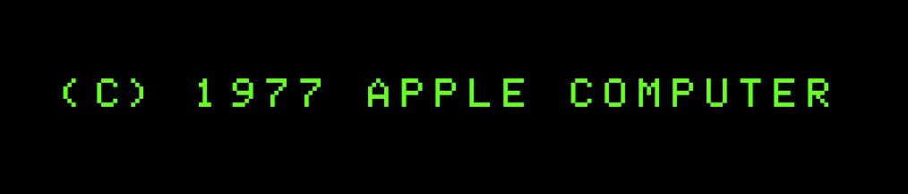
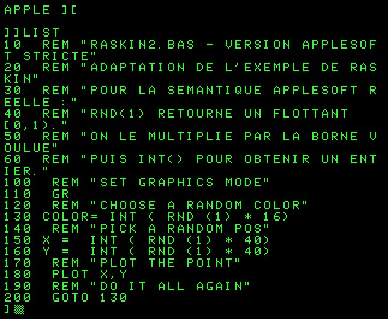
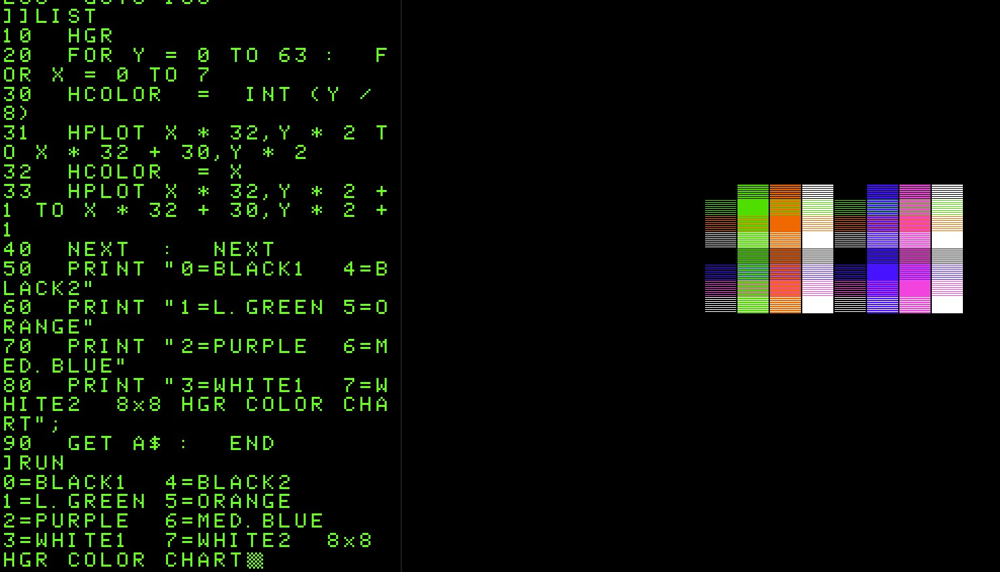

# Applesoft BASIC Emulator

Émulateur du langage **Applesoft BASIC** de l'Apple II, exécutable en ligne de commande Python ou dans un navigateur web via Brython.

Projet de démonstration de la méthodologie **Spec Driven Development (SDD)** : la spécification est la source de vérité unique, le code en découle et toute évolution est tracée par cas d'utilisation (UC).

---

## Aperçu

| Phase | Périmètre | Lancement |
|---|---|---|
| **1 — CLI Python** | Interpréteur complet en ligne de commande, REPL fidèle Apple II, modes texte et graphique (rendu ANSI), persistance fichier | `make run` |
| **2 — Navigateur** | Portage Brython, REPL web look Apple II authentique (pavé clignotant, toolbar keycap, RESET avec bannière `APPLE ][`), canvas graphique avec rendu différentiel | `make web` puis ouvrir `http://localhost:8000` |

### Captures d'écran

<table>
  <tr>
    <td align="center">
      <br>
      <em>REPL web : bannière de boot <code>APPLE ][</code> et pavé clignotant inverse-vidéo</em>
    </td>
    <td align="center">
      <br>
      <em>Mosaïque aléatoire (<code>RASKIN2.BAS</code>) — canvas LoRes 40×48</em>
    </td>
  </tr>
  <tr>
    <td colspan="2" align="center">
      <br>
      <em>Exemple graphique HGR (<code>HGRDEMO.BAS</code>) — canvas HiRes 280×192</em>
    </td>
  </tr>
</table>

## Démarrage rapide

```bash
make install     # Installer les dépendances
make test        # Lancer les tests (707 tests)
make run         # REPL CLI Python
make web         # Serveur web local sur le port 8000
make help        # Liste complète des commandes
```

## Programmes d'exemple

Quelques classiques pédagogiques sont fournis dans `examples/` :

| Fichier | Description |
|---|---|
| `RASKIN1.BAS` | Mosaïque aléatoire originale de Jeff Raskin (sémantique Integer BASIC) |
| `RASKIN2.BAS` | Adaptation Applesoft stricte (`INT(RND(1)*N)`) qui produit la mosaïque colorée attendue |
| `SIEVE.BAS` | Crible d'Ératosthène |
| `HGRCHART.BAS` | Charte 8×8 des couleurs HGR (Apple II Reference Manual) |
| `HGRDEMO.BAS` | Cadre + diagonales avec interaction utilisateur (`devonhubner.org`) |
| `WARGAME.BAS` | War-Game de J.M Rottenberg — gardé comme cas de test différé (utilise des routines 6502 et shape tables via POKE non encore émulées) |

Pour les charger dans le navigateur : bouton **LOAD** ; en CLI : `LOAD "<chemin>"` au prompt.

## Documentation

Le projet suit la méthodologie SDD avec une chaîne de documents structurée :

| Document | Rôle |
|---|---|
| [`docs/SPEC-racine-ApplesoftBasicEmu.md`](docs/SPEC-racine-ApplesoftBasicEmu.md) | Spécification SDD racine — 28 UC, 15 RG, 5 ENF, critères d'acceptation `CA-UC-XXX-YY` (v3.0) |
| [`docs/SPEC-extension-ApplesoftBasicEmu-LookAppleII.md`](docs/SPEC-extension-ApplesoftBasicEmu-LookAppleII.md) | Extension fonctionnelle (préfixe `FID`) — fidélité visuelle web, tolérance lexicale, perf graphique (v1.0) |
| [`docs/GRAMMAR.md`](docs/GRAMMAR.md) | Grammaire EBNF complète d'Applesoft BASIC |
| [`docs/ARCHITECTURE.md`](docs/ARCHITECTURE.md) | Architecture détaillée — 14 composants, 7 ADR, pipeline Lexer→Parser→Interpreter (v1.1) |
| [`docs/DEPLOYMENT.md`](docs/DEPLOYMENT.md) | Procédures de build, déploiement, monitoring |
| [`docs/SECURITY.md`](docs/SECURITY.md) | Modèle de menaces, protections injection / path traversal / XSS |
| [`CLAUDE.md`](CLAUDE.md) | Instructions et processus de travail avec Claude Code |

Toute la documentation est en français, comme les commentaires de code et les messages de commit.

## Méthodologie SDD

```
docs/SPEC-racine-*.md + extensions
       |
       v
[1. Spécification]──────────> sdd-uc-spec-write
       |
       v
[2. Conception technique]──> sdd-uc-system-design
       |                       ├─> ARCHITECTURE.md
       |                       ├─> DEPLOYMENT.md
       |                       └─> SECURITY.md
       v
[3. Planification]──────────> /sdd-plan → plan/<lot>.md
       |
       v
[4. Développement]──────────> /sdd-dev-workflow <lot>
       |
       v
[5. QA]─────────────────────> /sdd-qa-workflow <lot>
       |
       v
[6. Livraison]
```

Tableau de bord à tout moment : `/sdd-brief`.

## Statut

- **Spécification :** racine v3.1 validée, extension `LookAppleII` v1.0 brouillon
- **Conception technique :** ARCHITECTURE v1.1, DEPLOYMENT v1.0, SECURITY v1.0
- **Développement :** 7 lots livrés et QA-validés
- **Tests :** 707/707 OK

## Stack technique

- **Python ≥ 3.10** (langage cœur)
- **Brython** (runtime Python dans le navigateur, embarqué localement, Phase 2)
- **Pillow** (optionnel, export PNG des modes graphiques en CLI)
- **pytest** + **ruff** (tests + lint, dépendances dev)

Aucune dépendance C native, aucun service réseau, aucune base de données — l'émulateur est strictement local.

## Contribuer

Les conventions sont décrites dans [`CLAUDE.md`](CLAUDE.md) : développement sur `main`, pas de commits sans tests verts à 100%, pas de mention `Co-Authored-By: Claude` ni `Generated with Claude Code` dans les commits, documentation en français.

Pour proposer un ajout fonctionnel, suivre la chaîne SDD : modifier la spec ou créer une extension via `sdd-uc-spec-write`, puis bumper les documents techniques via `sdd-uc-system-design`, planifier un lot, implémenter, QA.

## Licence

**GNU General Public License v3.0** — voir le fichier [`LICENSE`](LICENSE).

Vous êtes libre de copier, modifier et redistribuer ce logiciel sous les termes de la GPLv3. Toute redistribution (modifiée ou non) doit conserver la même licence et inclure le code source. Aucune garantie.
