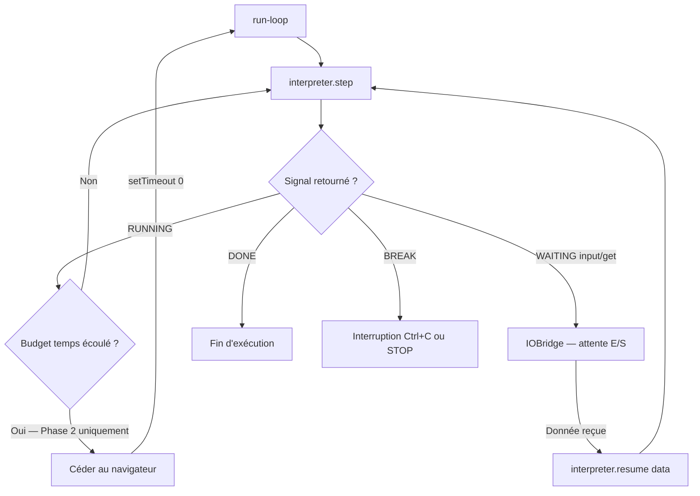
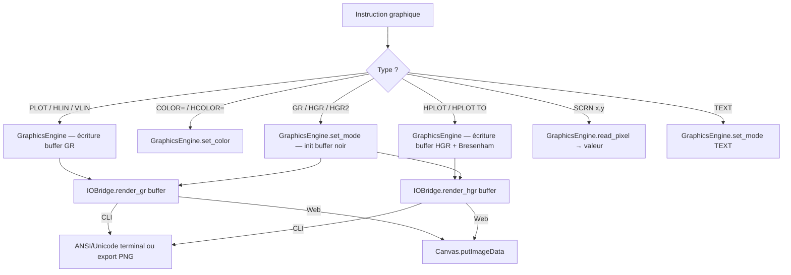
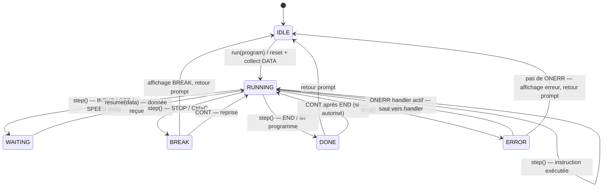
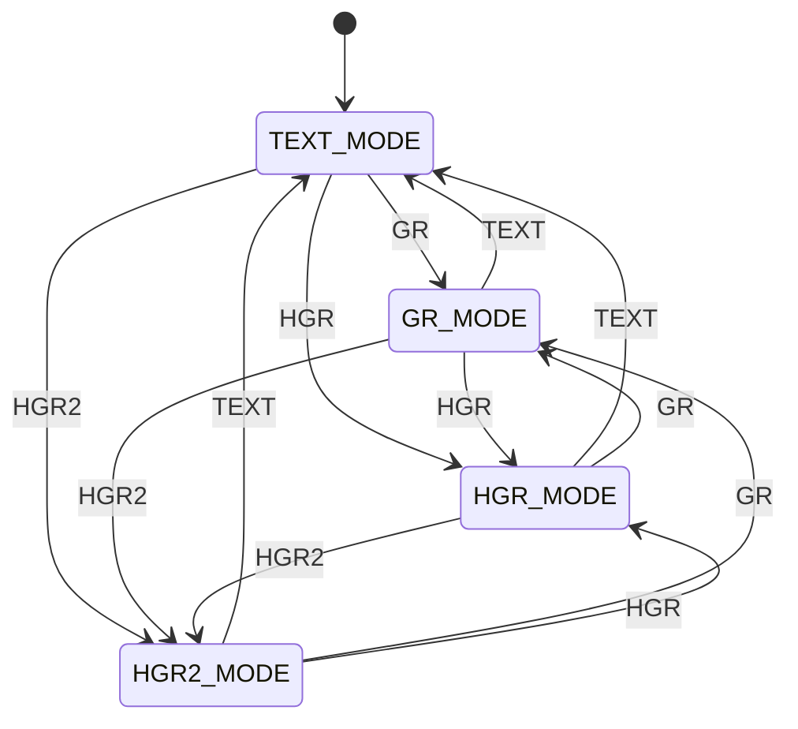

# AppleSoft BASIC Emulator — Architecture

Version : 1.0
Date : 2026-03-15
Auteur : Franz TRIERWEILER / Claude (Anthropic)
Statut : Brouillon
Spec de référence : SPEC.md v1.0

## 1. Vue d'ensemble

L'émulateur Applesoft BASIC est un interpréteur de langage en Python pur, conçu pour s'exécuter en ligne de commande (Phase 1) et dans un navigateur web via Brython (Phase 2). L'architecture suit un pipeline classique d'interprétation : Lexer → Parser → AST → Interpreter step-by-step. L'état d'exécution est centralisé dans un Environment. Les entrées/sorties sont découplées par un IOBridge injectable (CLI ou Web). Le système est autonome, sans serveur, sans base de données, sans dépendance externe.

Le choix structurant est l'Interpreter step-by-step : chaque appel à `step()` exécute une seule instruction et rend la main. En CLI, un run-loop serré appelle `step()` en boucle. En navigateur, un run-loop coopératif cède le contrôle au browser toutes les ~50ms via time-slicing. Ce design, adopté dès la Phase 1, supprime le risque de refactoring majeur lors du portage Phase 2.

## 2. Principes d'architecture

| # | Principe | Description | Justification |
|---|----------|-------------|---------------|
| 1 | **Python pur** | Aucun import de module C natif dans le cœur de l'interpréteur. Seuls `math`, `random`, `time`, `re` sont autorisés. | ENF-001 : compatibilité CPython + Brython |
| 2 | **Step-by-step** | L'Interpreter exécute une instruction par appel à `step()` et maintient son état entre les appels. | EXG-073 : time-slicing navigateur, ENF-002/003 : réactivité Ctrl+C et UI |
| 3 | **IOBridge injectable** | Toutes les E/S passent par une interface abstraite. Deux implémentations : CLI (stdin/stdout) et Web (DOM/Canvas). | ENF-001 : portabilité, ENF-005 : testabilité avec mock |
| 4 | **Séparation des phases** | Lexer, Parser et Interpreter sont des composants indépendants avec des interfaces claires (tokens, AST). | ENF-005 : testabilité unitaire de chaque composant |
| 5 | **Fidélité au comportement Apple II** | Les choix d'implémentation privilégient la conformité au comportement documenté de l'Apple II, pas la "logique moderne". | SPEC.md : vocation rétro-informatique, 63+ exigences avec cas limites fidèles |
| 6 | **État explicite** | Tout l'état de l'interpréteur est dans des objets (Environment, piles, buffers). Pas de variables globales, pas d'état implicite. | Principe 2 (step doit reprendre sans perte) + ENF-005 (testabilité) |
| 7 | **Zéro dépendance externe** | Aucune bibliothèque tierce en runtime. Seuls pytest, ruff, mypy en dev. | SPEC.md : contrainte Python pur, Brython compatible |

## 3. Stack technique

### 3.1 Synthèse

| Catégorie | Technologie | Version | Rôle | Justification | Licence |
|-----------|-------------|---------|------|---------------|---------|
| Langage | Python | 3.10.12+ | Langage principal, cœur de l'interpréteur | Imposé par SPEC.md | PSF / MIT |
| Runtime navigateur | Brython | 3.12+ | Exécution Python dans le navigateur (Phase 2) | Imposé par SPEC.md. Alternative écartée : Pyodide (~20 Mo, chargement > 5s) | BSD |
| Tests | pytest | 8+ | Tests unitaires et d'intégration | Standard Python, `parametrize` idéal pour les CA-xxx massifs. Alternative écartée : unittest (plus verbeux) | MIT |
| Linter / Formatter | ruff | 0.5+ | Lint + formatage en un seul outil | Rapide, remplace flake8+isort+black. Alternative écartée : flake8+black (deux outils, plus lent) | MIT |
| Type checking | mypy | 1.10+ | Vérification statique des interfaces (Token, AST, Environment) | Sécurise les contrats entre composants. Alternative écartée : pyright (convient aussi, mypy plus répandu) | MIT |
| Export image | PNGWriter (custom) | — | Écriture PNG minimal en Python pur pour l'export graphique CLI | Zéro dépendance, suffisant pour 280×192. Alternative écartée : Pillow (module C natif, incompatible Brython) | — |
| Build | Makefile | — | Interface standard pour build, test, run | Imposé par CLAUDE.md | — |
| Hébergement Phase 2 | GitHub Pages | — | Serveur statique pour l'app web | Gratuit, zéro infra. Alternative : tout serveur statique | — |

**Modules Python stdlib autorisés dans le cœur :**

| Module | Usage | Disponible Brython |
|--------|-------|--------------------|
| `math` | Fonctions mathématiques (SIN, COS, LOG, SQR, EXP, ATN) — EXG-034 | Oui |
| `random` | Générateur pseudo-aléatoire (RND) — EXG-035 | Oui |
| `re` | Expressions régulières (Lexer, si nécessaire) | Oui |
| `dataclasses` | Définition des types Token, AST nodes, ForFrame, etc. | Oui |
| `enum` | Énumérations (TokenType, InterpreterState, DisplayMode) | Oui |
| `typing` | Annotations de type | Oui |

**Modules Python stdlib autorisés uniquement dans IOBridgeCLI (hors cœur) :**

| Module | Usage |
|--------|-------|
| `sys` | stdin/stdout |
| `tty`, `termios` | Mode raw terminal pour GET (EXG-013) |
| `os` | Accès fichiers SAVE/LOAD (EXG-007/008) |
| `struct`, `zlib` | PNGWriter (format PNG) |

### 3.2 Stack Phase 2 (web)

| Besoin | Technologie | Justification |
|--------|-------------|---------------|
| Structure | HTML5 sémantique | Page statique, quelques fichiers |
| Styling | CSS vanilla | 4 zones fixes, pas besoin de framework |
| Graphisme | Canvas API via Brython `browser.html` | Imposé par EXG-075/076 |
| Stockage | localStorage | Imposé par EXG-078 |
| Police Apple II | Web font .woff2 | Police bitmap Apple II convertie, ~5 Ko |

### 3.3 Coût de fonctionnement

| Poste | Service | Estimation mensuelle | Type | Hypothèses |
|-------|---------|---------------------|------|------------|
| Hébergement | GitHub Pages | 0 € | Gratuit | Page statique, free tier |
| Domaine | Optionnel | ~1 €/mois | Fixe | Si domaine personnalisé souhaité |
| CI/CD | GitHub Actions | 0 € | Gratuit | Free tier suffisant |

**Coût total estimé : 0 €/mois** (hors domaine optionnel)

Le projet n'engendre aucun coût de fonctionnement récurrent. L'hébergement, le CI/CD et le runtime sont entièrement gratuits.

## 4. Architecture détaillée

### 4.1 Composants

| Composant | Responsabilité | Interfaces exposées | Dépendances | Exigences couvertes |
|-----------|---------------|---------------------|-------------|---------------------|
| **REPL** | Boucle interactive : prompt `]`, dispatch mode direct (exécution immédiate) / mode différé (stockage en mémoire programme), commandes système (RUN, LIST, NEW, DEL, SAVE, LOAD, CONT). Point d'entrée principal. | `start() → None` | Lexer, Parser, Interpreter, Environment, IOBridge | EXG-001 à EXG-010 |
| **Lexer** | Tokenization du code source Applesoft. Correspondance gloutonne des mots réservés, gestion des espaces ignorés, chaînes non fermées, identifiants avec suffixe type. | `tokenize(source: str) → list[Token]` | — | EXG-022, EXG-023, EXG-024, EXG-025, EXG-026 |
| **Parser** | Construction de l'AST à partir des tokens. Validation syntaxique selon GRAMMAR.md. Gestion de la précédence des opérateurs par descente récursive. | `parse(tokens: list[Token]) → Program` | Lexer (types Token) | Toutes les productions de GRAMMAR.md |
| **Interpreter** | Exécution step-by-step de l'AST. Machine à états : RUNNING, WAITING, BREAK, DONE. Évalue les expressions, exécute les instructions, gère le flux de contrôle (GOTO, GOSUB, FOR/NEXT, IF/THEN). Signaux pour opérations bloquantes (INPUT, GET). | `step() → Signal`, `is_done() → bool`, `reset()` | Environment, GraphicsEngine, IOBridge, MemoryMap | EXG-011 à EXG-021, EXG-027 à EXG-047, EXG-065 |
| **Environment** | État d'exécution centralisé : variables (normalisées 2 chars + suffixe), tableaux (DIM), pile GOSUB, pile FOR, DATA list + pointeur (pré-collecté), error state (code, ligne, handler ONERR), curseur (ligne, colonne), mode affichage (NORMAL/INVERSE/FLASH), SPEED. | Lecture/écriture synchrone sur attributs | — | EXG-024, EXG-027 à EXG-030, EXG-039 à EXG-044, EXG-046, EXG-047 |
| **GraphicsEngine** | Buffers graphiques : GR (40×48, palette 16 couleurs) et HGR (280×192, palette 8 couleurs). Opérations de dessin : plot, hlin, vlin, hplot (Bresenham), draw/xdraw (shape tables, différé). Lecture pixel (SCRN). Backend abstrait pour le rendu. | `set_mode(mode)`, `set_color(c)`, `plot(x,y)`, `hlin(x1,x2,y)`, `vlin(y1,y2,x)`, `hplot(x,y)`, `hplot_to(x,y)`, `read_pixel(x,y) → int`, `get_buffer() → array` | Environment (état graphique courant) | EXG-048 à EXG-060 |
| **IOBridge** | Interface abstraite pour les E/S. Définit le contrat : `output(text)`, `input(prompt) → str`, `get() → str`, `home()`, `render_gr(buffer)`, `render_hgr(buffer)`, `save(name, content)`, `load(name) → str`. | Voir contrat ci-dessus | — | ENF-001, ENF-005, EXG-072 |
| **IOBridgeCLI** | Implémentation CLI de IOBridge : stdin/stdout, mode raw terminal (GET), codes ANSI/Unicode (rendu graphique), export PNG, lecture/écriture fichiers (SAVE/LOAD). | Hérite IOBridge | `sys`, `tty`, `termios`, `os`, PNGWriter | EXG-007, EXG-008, EXG-013, EXG-054, EXG-060 |
| **IOBridgeWeb** | Implémentation navigateur de IOBridge (Phase 2) : DOM pour le texte, Canvas pour le graphisme, événements clavier, localStorage pour SAVE/LOAD. Seule couche dépendant de Brython (`browser`). | Hérite IOBridge | `browser.document`, `browser.html`, `browser.timer` | EXG-066 à EXG-082 |
| **MemoryMap** | Espace mémoire Apple II émulé (64K sparse). Dispatch table pour les adresses à effets de bord (soft-switches). PEEK lit, POKE écrit, CALL dispatch vers des fonctions émulées. | `peek(addr) → int`, `poke(addr, val)`, `call(addr)` | Environment (soft-switches lisent/modifient l'état) | EXG-061 à EXG-064 |

**Modules utilitaires :**

| Module | Responsabilité | Exigences couvertes |
|--------|---------------|---------------------|
| **NumberFormatter** | Formatage des nombres selon les conventions Applesoft : 9 chiffres significatifs max, espace réservé au signe positif, notation scientifique au-delà de 9 chiffres, pas de zéros inutiles. | EXG-027, ENF-004 |
| **ErrorTable** | Table centralisée code → message d'erreur Applesoft. Fournit le format `?XXX ERROR [IN linenum]`. Accessible par l'Interpreter (lever l'erreur), le REPL (affichage), et PEEK(222) via MemoryMap. | EXG-065 |
| **DataCollector** | Scan pré-exécution de l'AST : collecte toutes les instructions DATA dans l'ordre des numéros de ligne et construit la liste séquentielle consommée par READ. | EXG-014 |
| **PNGWriter** | Écriture de fichiers PNG minimaux en Python pur (non compressé). Utilisé par IOBridgeCLI pour l'export graphique. | EXG-054, EXG-060 |
| **LineRenderer** | Algorithme de Bresenham pour le tracé de lignes pixel par pixel (HPLOT TO). | EXG-057 |

### 4.2 Diagrammes de flux

#### Flux : Boucle REPL (réf. EXG-001, EXG-003)

```mermaid
flowchart TD
    A[Afficher prompt ']'] --> B[Lire ligne utilisateur]
    B --> C{Ligne vide ?}
    C -->|Oui| A
    C -->|Non| D[Lexer.tokenize]
    D --> E{Commence par LINENUM ?}
    E -->|Oui — mode différé| F[Program.store line]
    F --> A
    E -->|Non — mode direct| G{Commande système ?}
    G -->|RUN| H[Environment.reset + DataCollector.collect + run-loop step]
    G -->|LIST / NEW / DEL / SAVE / LOAD / CONT| I[Exécuter commande système]
    G -->|Non| J[Parser.parse → AST]
    J --> K[Interpreter.step en boucle]
    H --> L{Signal ?}
    K --> L
    L -->|DONE| A
    L -->|BREAK| M[Afficher 'BREAK IN linenum']
    M --> A
    L -->|WAITING| N[IOBridge.input / get]
    N --> L
    L -->|ERROR + ONERR| O[Saut vers handler]
    O --> L
    L -->|ERROR sans ONERR| P[Afficher '?XXX ERROR']
    P --> A
    I --> A
```

**Description :** Le REPL est la boucle principale. Chaque ligne saisie est tokenizée, puis dispatchée selon qu'elle commence par un numéro de ligne (stockage) ou non (exécution). Les commandes système (RUN, LIST, etc.) sont traitées directement par le REPL. Les autres instructions passent par le pipeline Parser → Interpreter. Le run-loop appelle `step()` en boucle et réagit aux signaux (DONE, BREAK, WAITING, ERROR).

#### Flux : Exécution step-by-step (réf. EXG-073, ENF-002)



**Description :** Le run-loop appelle `step()` en boucle. En Phase 1 (CLI), le budget temps est infini — la boucle tourne jusqu'à DONE/BREAK. En Phase 2, le budget est ~50ms : quand il est écoulé, le contrôle est rendu au navigateur via `setTimeout(0)`. Les opérations bloquantes (INPUT, GET) retournent un signal WAITING ; le run-loop délègue à IOBridge et reprend quand la donnée est disponible.

#### Flux : Rendu graphique (réf. EXG-048 à EXG-060)



**Description :** Les instructions graphiques modifient le buffer interne du GraphicsEngine. Le rendu effectif est délégué à IOBridge : en CLI, conversion en caractères ANSI/Unicode ou export PNG ; en Web, transfert du buffer vers le Canvas HTML5. Le buffer interne est la source de vérité (SCRN lit le buffer, pas le rendu).

### 4.3 Diagrammes de transition d'état

#### Entité : Interpreter (machine à états)



**Description :** L'Interpreter est une machine à 5 états. IDLE = en attente d'un RUN. RUNNING = exécution active. WAITING = suspendu en attente d'E/S. BREAK = interrompu (STOP, Ctrl+C), reprise possible par CONT. DONE = terminé (END, fin programme). ERROR = erreur runtime, routée vers ONERR si actif ou affichée sinon. Les transitions sont déclenchées par les retours de `step()`.

#### Entité : Mode d'affichage



**Description :** Le mode d'affichage peut être TEXT (plein écran texte 40×24), GR (basse résolution 40×48 + 4 lignes texte), HGR (haute résolution 280×160 + 4 lignes texte), ou HGR2 (haute résolution plein écran 280×192). Chaque transition efface le buffer graphique correspondant. TEXT ne modifie pas le contenu texte existant.

### 4.4 Inventaire des données

| Entité | Description | Attributs clés | Volume estimé | Sensibilité | Rétention | Stockage |
|--------|-------------|---------------|---------------|-------------|-----------|----------|
| Program | Lignes de programme triées par numéro | `dict[int, list[Statement]]` | 0–63999 lignes, ~1000 typique | Public | Session | Mémoire (Environment) |
| Variables | Variables scalaires numériques et chaînes | `dict[str, float\|int\|str]` — clé normalisée 2 chars + suffixe | Quelques dizaines à centaines | Public | Session (reset par RUN/NEW) | Mémoire (Environment) |
| Arrays | Tableaux déclarés par DIM | `dict[str, Array]` — dimensions + données plates | Quelques tableaux, jusqu'à 11^n éléments | Public | Session (reset par RUN/NEW) | Mémoire (Environment) |
| GOSUB Stack | Pile d'adresses de retour GOSUB | `list[tuple[int, int]]` — (line, stmt_index) | Profondeur ~50 max | Public | Session | Mémoire (Environment) |
| FOR Stack | Pile des boucles FOR actives | `list[ForFrame]` — var, limit, step, return_addr | Profondeur ~20 max | Public | Session | Mémoire (Environment) |
| DATA List | Valeurs DATA collectées par DataCollector | `list[str\|float]` + pointeur courant (int) | Centaines de valeurs max | Public | Session (re-collecté à chaque RUN) | Mémoire (Environment) |
| Error State | État d'erreur ONERR | code (int), line (int), handler_line (int), in_handler (bool) | 1 instance | Public | Session | Mémoire (Environment) |
| Cursor/Display | Position curseur et mode d'affichage | row, col, mode (NORMAL/INVERSE/FLASH), speed (0-255) | 1 instance | Public | Session | Mémoire (Environment) |
| GR Buffer | Écran basse résolution | `list[int]` plat — 40×48 = 1920 valeurs (0-15) | 1 920 octets | Public | Session | Mémoire (GraphicsEngine) |
| HGR Buffer | Écran haute résolution | `list[int]` plat — 280×192 = 53 760 valeurs (0-7) | 53 760 octets | Public | Session | Mémoire (GraphicsEngine) |
| MemoryMap | Espace mémoire émulé 64K | `dict[int, int]` sparse + dispatch table | Quelques dizaines d'adresses actives | Public | Session | Mémoire (MemoryMap) |
| Fichier .bas | Programme sauvegardé (SAVE/LOAD) | Texte source, format LIST | Quelques Ko | Public | Persistant | Fichier local (Phase 1) / localStorage (Phase 2) |
| Export PNG | Image graphique exportée | Fichier PNG non compressé | ~160 Ko max (280×192 RGB) | Public | Persistant | Fichier local (Phase 1) |

### 4.5 Initialisation des données

| Donnée | Source | Format | Procédure de chargement | Fréquence de mise à jour |
|--------|--------|--------|------------------------|-------------------------|
| Table des mots réservés | GRAMMAR.md § 6.4 | Liste ordonnée (longest first) dans le code source Lexer | Codée en dur dans `lexer.py`, triée par longueur décroissante | Jamais (fixée par la spécification Applesoft) |
| Table des erreurs | SPEC.md EXG-065 | Mapping code → message dans ErrorTable | Codée en dur dans `error_table.py` | Jamais (fixée par la spécification Applesoft) |
| Table des adresses mémoire | SPEC.md EXG-064 | Dispatch table dans MemoryMap | Codée en dur dans `memory_map.py` | Extensible si nouvelles adresses émulées |
| Table des CALL émulés | SPEC.md EXG-063 | Mapping adresse → fonction dans MemoryMap | Codée en dur dans `memory_map.py` | Extensible |
| Palette couleurs GR (16 couleurs) | SPEC.md EXG-049 | Liste RGB dans GraphicsEngine | Codée en dur dans `graphics_engine.py` | Jamais |
| Palette couleurs HGR (8 couleurs) | SPEC.md EXG-056 | Liste RGB dans GraphicsEngine | Codée en dur dans `graphics_engine.py` | Jamais |

## 5. Structure du répertoire projet

```
applesoft-basic-emu/
├── docs/                        # Documents de conception SDD
│   ├── SPEC.md                  # Spécification fonctionnelle (63+ exigences)
│   ├── GRAMMAR.md               # Grammaire EBNF complète Applesoft BASIC
│   ├── ARCHITECTURE.md          # Ce fichier
│   ├── DEPLOYMENT.md            # Procédures de build, test, distribution
│   └── SECURITY.md              # Exigences de sécurité
├── src/                         # Code source Python
│   ├── __init__.py
│   ├── main.py                  # Point d'entrée CLI (argument parsing, lancement REPL ou fichier)
│   ├── repl.py                  # Boucle REPL : prompt, dispatch direct/différé, commandes système
│   ├── lexer.py                 # Tokenizer : correspondance gloutonne, table mots réservés
│   ├── tokens.py                # Définition des types Token, TokenType (dataclasses + enum)
│   ├── parser.py                # Parser descente récursive, construction AST
│   ├── ast_nodes.py             # Définition des nœuds AST (dataclasses)
│   ├── interpreter.py           # Interpreter step-by-step, machine à états, évaluation expressions
│   ├── environment.py           # État d'exécution : variables, piles, DATA, curseur, display mode
│   ├── graphics_engine.py       # Buffers GR/HGR, palettes, dessin, lecture pixel
│   ├── memory_map.py            # Espace mémoire 64K sparse, dispatch soft-switches, CALL émulés
│   ├── io_bridge.py             # Interface abstraite IOBridge (Protocol ou ABC)
│   ├── io_bridge_cli.py         # Implémentation CLI : stdin/stdout, raw terminal, ANSI, fichiers
│   ├── number_formatter.py      # Formatage nombres Applesoft (9 chiffres, notation scientifique)
│   ├── error_table.py           # Table codes → messages d'erreur Applesoft
│   ├── data_collector.py        # Scan pré-exécution AST pour collecter les DATA
│   ├── line_renderer.py         # Algorithme de Bresenham pour HPLOT TO
│   └── png_writer.py            # Écriture PNG minimal en Python pur
├── tests/                       # Tests automatisés (pytest)
│   ├── unit/                    # Tests unitaires par composant
│   │   ├── test_lexer.py
│   │   ├── test_parser.py
│   │   ├── test_interpreter.py
│   │   ├── test_environment.py
│   │   ├── test_graphics_engine.py
│   │   ├── test_memory_map.py
│   │   ├── test_number_formatter.py
│   │   ├── test_error_table.py
│   │   ├── test_data_collector.py
│   │   ├── test_line_renderer.py
│   │   └── test_png_writer.py
│   ├── integration/             # Tests d'intégration (pipeline complet Lexer→Interpreter)
│   │   └── test_programs.py     # Programmes Applesoft complets exécutés de bout en bout
│   └── conftest.py              # Fixtures pytest (IOBridge mock, Environment pré-configuré)
├── web/                         # Application web Phase 2
│   ├── index.html               # Page principale, structure 4 zones
│   ├── style.css                # CSS vanilla, thème Apple II (noir/vert)
│   ├── apple2.woff2             # Police Apple II (web font)
│   ├── main.py                  # Point d'entrée Brython, run-loop time-slicing
│   └── io_bridge_web.py         # Implémentation Web de IOBridge (DOM, Canvas, localStorage)
├── examples/                    # Programmes Applesoft d'exemple (.bas)
│   └── *.bas
├── plan/                        # Fichiers de planification EPIC (phase suivante)
├── qa/                          # Fichiers de recette QA par EPIC
├── Makefile                     # Interface standard : make help, make test, make run, etc.
├── Dockerfile                   # Environnement de dev reproductible
├── pyproject.toml               # Configuration projet (pytest, ruff, mypy)
├── CLAUDE.md                    # Instructions Claude Code / SDD
└── README.md                    # Guide de démarrage rapide
```

**Notes :**
- Le répertoire `src/` est plat (pas de sous-packages) : le projet est suffisamment petit pour que la navigation reste simple. Un fichier = un composant.
- Le répertoire `web/` est indépendant de `src/` : il contient uniquement les fichiers spécifiques au navigateur. Les fichiers Python de `src/` sont chargés par Brython via import.
- Le répertoire `examples/` fournit des programmes Applesoft classiques pour les tests manuels et les démonstrations.

## 6. Glossaire technique

| Terme | Définition |
|-------|-----------|
| **AST** | Abstract Syntax Tree — arbre syntaxique abstrait produit par le Parser, consommé par l'Interpreter |
| **Brython** | Implémentation Python en JavaScript, exécutable dans un navigateur web |
| **Correspondance gloutonne** | Longest match — le Lexer reconnaît le mot réservé le plus long possible dans le flux de caractères (ex. `GOTO` avant `GO`) |
| **Descente récursive** | Technique de parsing où chaque règle de grammaire est implémentée par une fonction qui peut s'appeler récursivement |
| **Dispatch table** | Table de correspondance adresse → fonction, utilisée par MemoryMap pour les soft-switches et CALL émulés |
| **ForFrame** | Structure de données représentant une boucle FOR active sur la pile : variable, limite, pas, adresse de retour |
| **IOBridge** | Interface abstraite découplant les E/S de l'interpréteur. Deux implémentations : CLI et Web |
| **Mode différé** | Saisie d'une ligne avec numéro : la ligne est stockée en mémoire programme, pas exécutée immédiatement |
| **Mode direct** | Saisie sans numéro de ligne : l'instruction est exécutée immédiatement |
| **Run-loop** | Boucle appelant `interpreter.step()` de manière répétée. Synchrone en CLI, coopératif (time-slicing) en navigateur |
| **Signal** | Valeur retournée par `step()` indiquant l'état de l'Interpreter : RUNNING, WAITING, DONE, BREAK, ERROR |
| **Soft-switch** | Adresse mémoire Apple II dont la lecture ou l'écriture déclenche un effet de bord matériel (ex. strobe clavier) |
| **Sparse** | Structure de données ne stockant que les valeurs non-nulles (dict au lieu de tableau 64K) |
| **Step-by-step** | Mode d'exécution où l'Interpreter traite une seule instruction par appel et rend la main |
| **Time-slicing** | Découpage de l'exécution en tranches de ~50ms pour maintenir la réactivité de l'UI navigateur |
| **Token** | Unité lexicale produite par le Lexer : mot réservé, identifiant, nombre, chaîne, opérateur, séparateur |

## 7. Documents de référence

| Document | Description | Relation |
|----------|-------------|----------|
| SPEC.md v1.0 | Spécification fonctionnelle SDD — 63+ exigences (EXG-xxx), critères d'acceptation (CA-xxx), cas limites (CL-xxx) | Source des exigences |
| GRAMMAR.md | Grammaire EBNF complète Applesoft BASIC — productions, précédence, tokenization | Référence pour le Lexer et le Parser |
| DEPLOYMENT.md | Procédures de build, test, distribution CLI et web | Consomme l'architecture |
| SECURITY.md | Exigences de sécurité (code, dépendances, exécution) | Contraint l'architecture |
| *Applesoft II BASIC Programming Reference Manual* (Apple, 1978) | Référence pour la sémantique des instructions | Source externe (documentation historique) |
| Joshua Bell — Applesoft BASIC in JavaScript | Référence croisée pour la grammaire et le comportement | Source externe (MIT License) |
| dfgordon/tree-sitter-applesoft | Référence croisée pour la grammaire formelle | Source externe (MIT License) |
