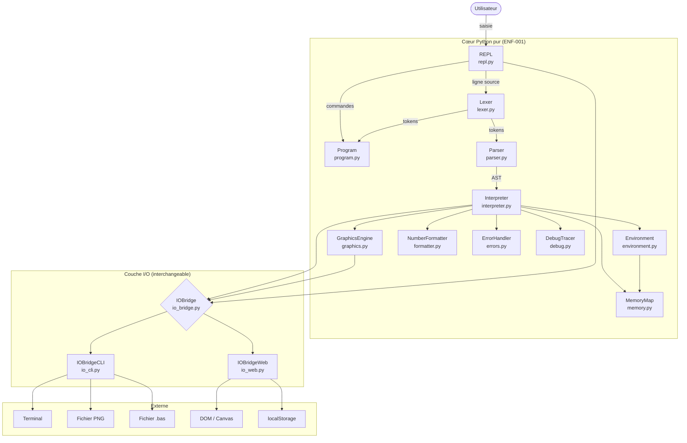
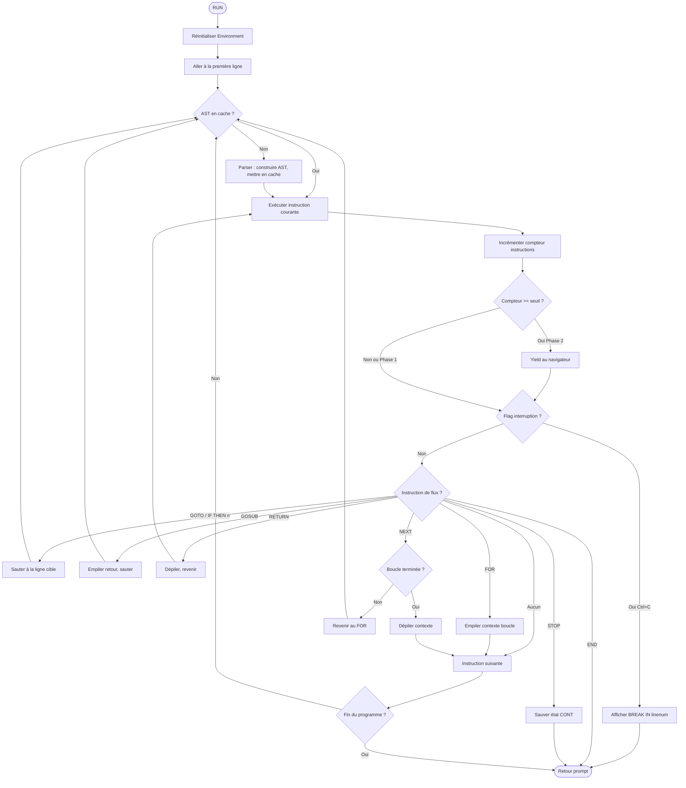
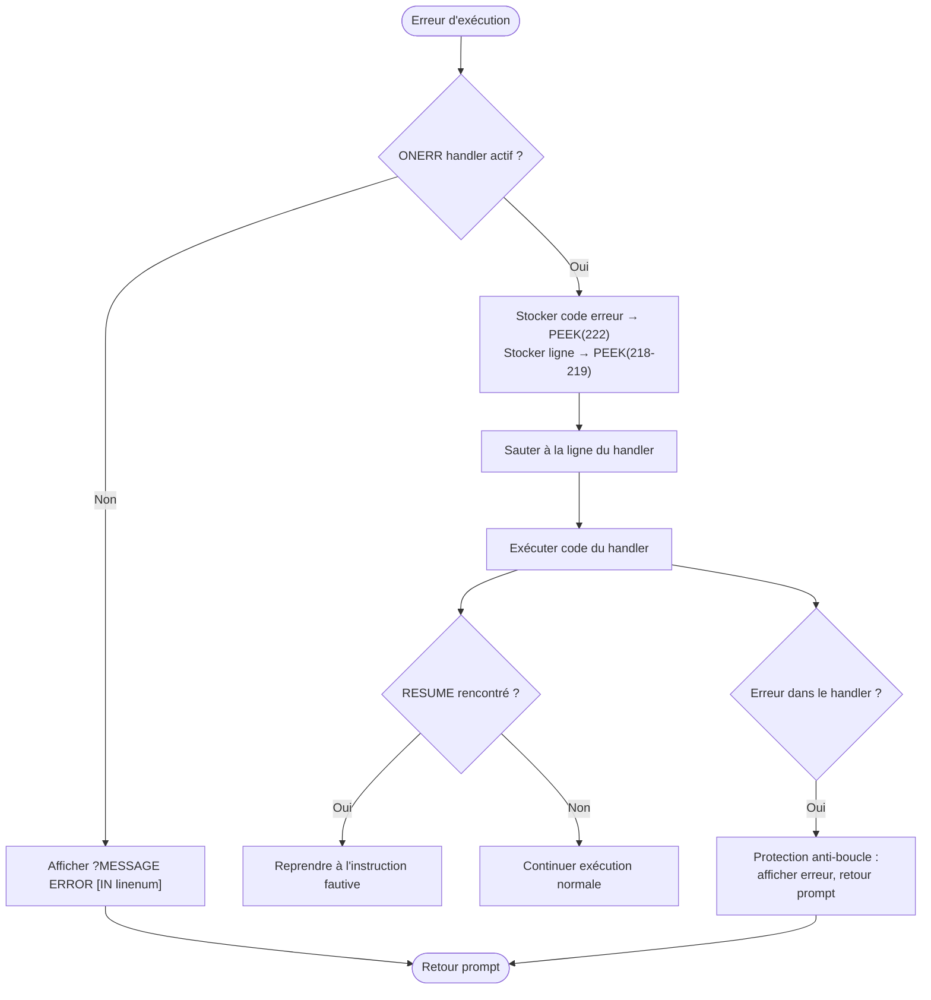
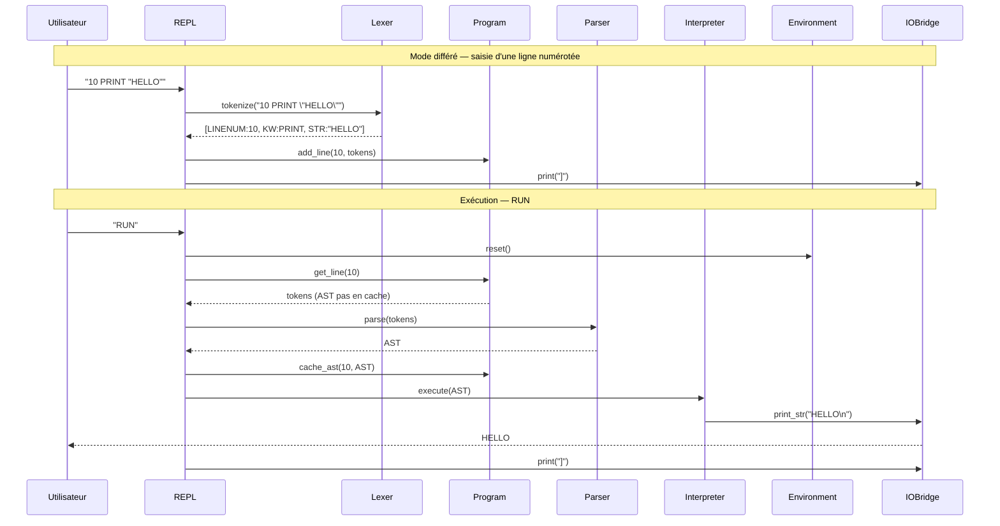
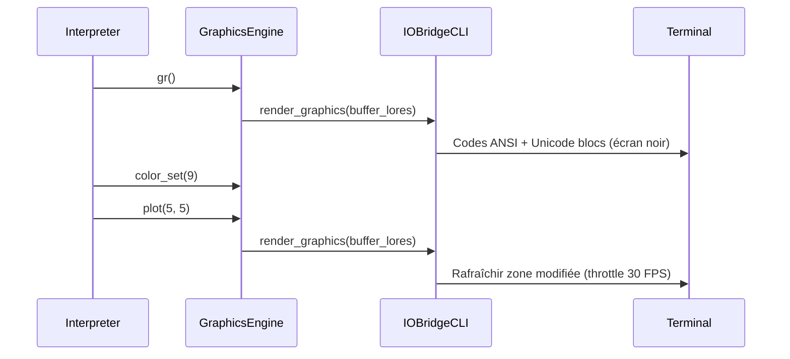
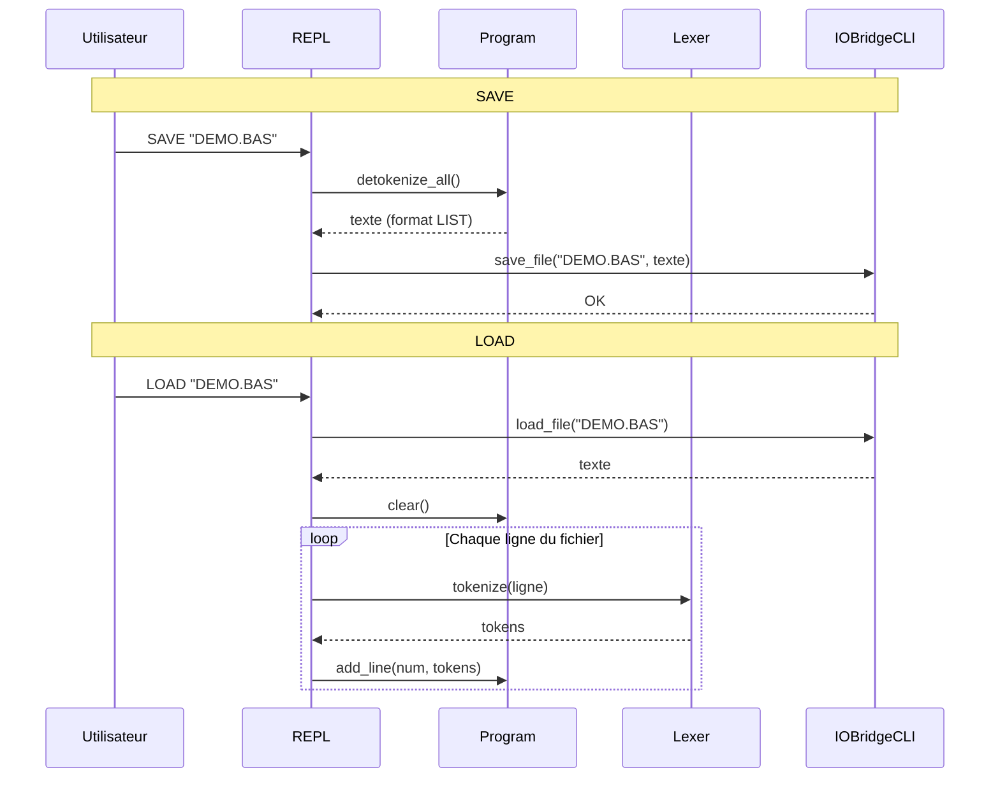
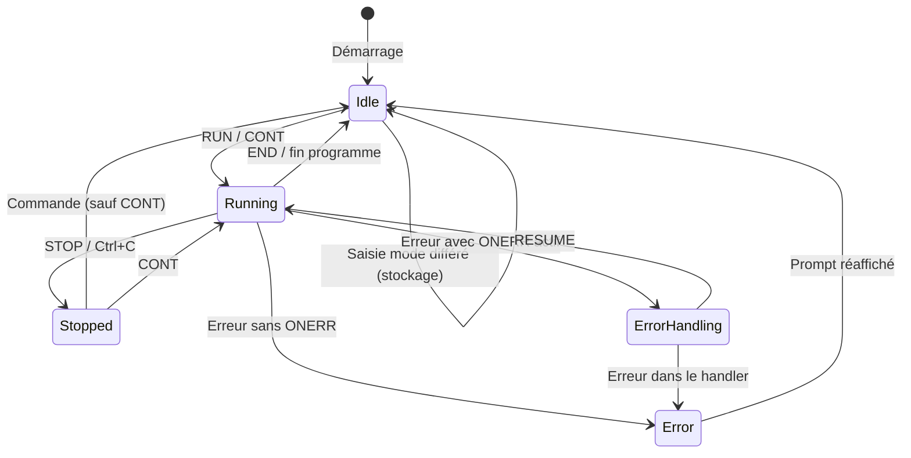
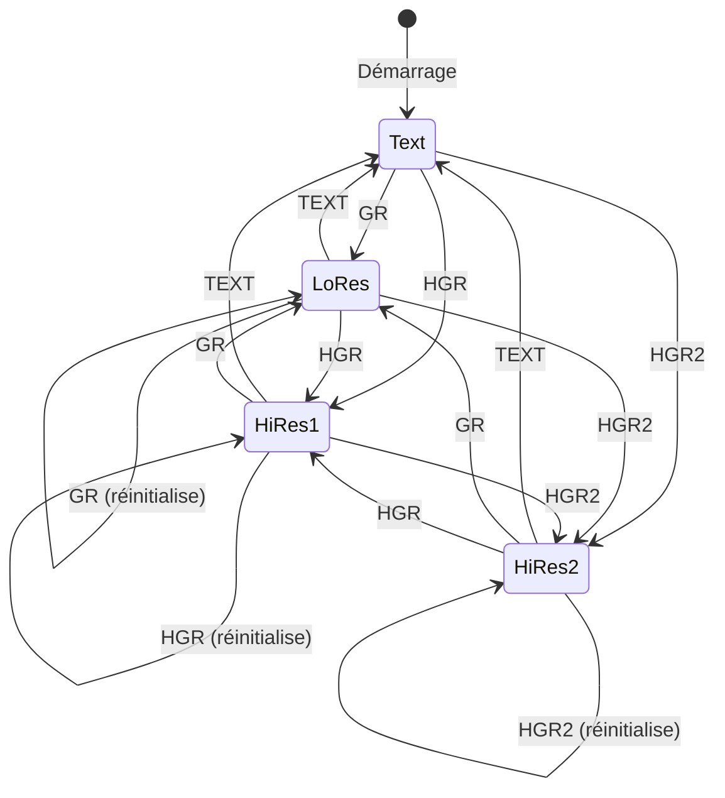
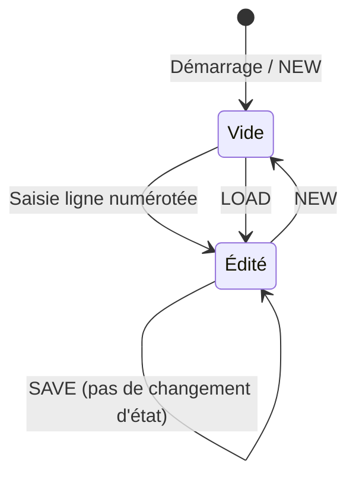

# AppleSoft BASIC Emulator — Architecture

Version : 1.1
Date : 2026-04-30
Auteur : Franz / Claude
Statut : Validé
Spec de référence : SPEC-racine-ApplesoftBasicEmu.md v3.1 + SPEC-extension-ApplesoftBasicEmu-LookAppleII.md v1.0

## 1. Vue d'ensemble

L'émulateur Applesoft BASIC est un interpréteur de langage structuré en pipeline (Lexer → Parser → Interpreter) avec un moteur graphique intégré et une carte mémoire émulée. Le système s'exécute en deux modes : CLI Python (Phase 1) et application web statique via Brython (Phase 2). L'architecture suit un modèle en oignon : un cœur Python pur sans aucune dépendance externe (portabilité CPython/Brython — ENF-001), enveloppé par une couche d'entrées/sorties interchangeable (IOBridge) qui adapte le système aux deux plateformes. Le système est mono-utilisateur, mono-instance, sans serveur ni base de données.

L'acteur unique est l'Utilisateur qui interagit avec l'émulateur pour écrire, exécuter et déboguer des programmes Applesoft BASIC, soit en CLI soit dans le navigateur.

**Hors périmètre architectural :** Émulation du CPU 6502, son (speaker $C030), accès disque (DOS 3.3 / ProDOS), émulation cassette (SHLOAD, STORE, RECALL), réseau et communication série, périphériques de slot, double haute résolution (DHGR), mémoire auxiliaire Apple IIe, internationalisation, accessibilité (WCAG).

## 2. Principes d'architecture

| # | Principe | Description | Justification |
|---|----------|-------------|---------------|
| 1 | **Cœur sans dépendance** | Le cœur de l'interpréteur (Lexer, Parser, Interpreter, Environment, MemoryMap, GraphicsEngine, Program) n'importe aucun module C natif ni module non standard. | ENF-001 — Portabilité CPython / Brython |
| 2 | **IOBridge comme seul point de variation** | Toute interaction avec l'extérieur (écran, clavier, fichiers, DOM) passe par l'IOBridge. Le cœur ne connaît que l'interface, jamais l'implémentation. | RG-0014, ENF-001 |
| 3 | **Fidélité à l'Apple II** | Les comportements documentés de l'Apple II sont reproduits fidèlement : tokenisation gloutonne, messages d'erreur, conventions d'affichage numériques, shape tables via POKE. | Objectif fondamental du projet, RG-0001 à RG-0011 |
| 4 | **Tokenisation à la saisie** | Les lignes sont tokenisées au moment de leur entrée dans le programme (pas à l'exécution), comme sur le vrai Apple II. L'AST est caché au premier RUN. | Fidélité + ENF-002 (performance) |
| 5 | **Suspendabilité de l'exécution** | L'Interpreter intègre dès la Phase 1 un compteur d'instructions permettant la suspension et la reprise, pour le time-slicing de Phase 2. | RG-0015, ENF-003 |
| 6 | **Un fichier par composant** | Chaque composant est un module Python autonome de moins de 500 lignes. | Maintenabilité — projet développé par un pilote + Claude Code |
| 7 | **Testabilité par injection** | Chaque composant est instancié avec ses dépendances en paramètre. Pas de singleton, pas de global mutable. L'IOBridge est injectable pour les tests. | ENF-005 |
| 8 | **Fail-fast avec messages Applesoft** | Les erreurs sont détectées au plus tôt et produisent les messages d'erreur fidèles à l'Apple II (format `?MESSAGE ERROR [IN linenum]`). | RG-0010 |

## 3. Stack technique

### 3.1 Choix technologiques

| Catégorie | Technologie | Version | Rôle | Justification | Alternative écartée | Raison de l'exclusion | Licence |
|-----------|-------------|---------|------|---------------|--------------------|-----------------------|---------|
| Langage | Python | 3.10.12+ | Langage principal | Imposé par SPEC-racine-ApplesoftBasicEmu.md § Contraintes structurantes | — | Imposé | PSF |
| Runtime web | Brython | Dernière stable | Exécution Python dans le navigateur (Phase 2) | Imposé par SPEC-racine-ApplesoftBasicEmu.md § Contraintes structurantes | Pyodide (WASM) | Plus lourd (~10 Mo vs ~1 Mo), chargement plus lent, non imposé | BSD |
| Lexer | Fait maison | — | Tokenisation Applesoft (longest match, sans séparateurs) | Grammaire non standard incompatible avec les générateurs classiques (RG-0002) | PLY, ANTLR | Pas de gestion du flux sans séparateurs ni de longest match natif | — |
| Parser | Recursive descent (fait maison) | — | Construction de l'AST, 9 niveaux de précédence | Contrôle total sur la précédence et les messages d'erreur Applesoft | lark, pyparsing | Dépendances C ou magie interne incompatible Brython | — |
| Export image | Pillow (PIL) | Dernière stable | Export PNG des graphiques (CLI) | Standard de facto pour le traitement d'image Python | matplotlib | Surdimensionné pour du pixel-level drawing | HPND |
| Rendu terminal | Codes ANSI + Unicode | — | Rendu graphique temps réel en CLI (▀▄█ + couleurs) | Zéro dépendance, compatible tout terminal moderne | curses, rich | curses incompatible Windows/Brython ; rich = dépendance lourde | — |
| Tests | pytest | Dernière stable | Tests unitaires et d'intégration | Découverte auto, fixtures, paramétrage | unittest | Plus verbeux, moins ergonomique | MIT |
| Lint + format | ruff | Dernière stable | Linting et formatage du code | Rapide, tout-en-un, remplace flake8+black+isort | flake8 + black | Deux outils au lieu d'un, plus lent | MIT |
| Interface web | HTML + CSS + Brython | — | Interface Phase 2 (console, éditeur, canvas) | Pas de build step, manipulation DOM par Brython via IOBridgeWeb | React, Vue | Surcouche JS inutile, complexité d'intégration avec Brython | — |
| Éditeur web | `<textarea>` + coloration custom | — | Édition de code Phase 2 | Léger, contrôle total, compatible Brython | CodeMirror, Monaco | Dépendances JS lourdes, intégration Brython complexe | — |
| Persistance web | localStorage | — | Sauvegarde/chargement de programmes Phase 2 | Natif navigateur, imposé par UC-028 | IndexedDB | Surqualifié pour du texte brut | — |

### 3.2 Pérennité des choix technologiques

| Technologie | Mainteneur | Fréquence releases | Communauté / Adoption | Risque d'obsolescence | Plan de mitigation |
|-------------|-----------|-------------------|----------------------|----------------------|-------------------|
| Python 3.10+ | PSF — fondation, gouvernance ouverte | Annuelle (majeure), mensuelle (patch) | Top 3 mondial, écosystème massif | Très faible | — |
| Brython | Pierre Quentel + contributeurs | ~trimestrielle | ~7k GitHub stars, communauté restreinte | **Modéré** — mainteneur principal unique | Le cœur est du Python pur standard. Si Brython disparaît, migration vers Pyodide sans toucher au cœur. Seul IOBridgeWeb à réécrire. |
| Pillow | Alex Clark + contributeurs (fork PIL) | ~trimestrielle | ~12k GitHub stars, adoption massive | Très faible | — |
| pytest | Holger Krekel + large communauté | ~mensuelle | Standard de facto Python | Très faible | — |
| ruff | Astral (Charlie Marsh) — entreprise dédiée | ~hebdomadaire | ~35k GitHub stars, adoption rapide | Faible | Retour à flake8+black si nécessaire (même résultat, plus lent) |

### 3.3 Coût de fonctionnement induit

| Poste | Service | Estimation mensuelle | Type | Hypothèses |
|-------|---------|---------------------|------|------------|
| Hébergement CLI | Aucun (script local) | 0 € | — | Exécution sur la machine de l'utilisateur |
| Hébergement web (Phase 2) | GitHub Pages / Netlify free tier | 0 € | Fixe | Site statique, pas de backend |
| Dépendances | Toutes open source | 0 € | — | Pas de licence commerciale |
| Infrastructure | Aucune | 0 € | — | Pas de serveur, pas de BDD |

**Coût total estimé : 0 €/mois.**

**Remarques :** Le projet est entièrement auto-hébergeable. L'hébergement web Phase 2 ne nécessite qu'un serveur de fichiers statiques. Aucun coût variable.

## 4. Architecture détaillée

### 4.1 Diagramme d'architecture



**Description :** L'Utilisateur interagit via le REPL, qui orchestre le pipeline d'exécution. Le Lexer tokenise les lignes à la saisie et stocke les tokens dans le Program. Le Parser construit l'AST à la demande (premier RUN). L'Interpreter exécute l'AST en s'appuyant sur l'Environment (état), le GraphicsEngine (dessin), le MemoryMap (PEEK/POKE/CALL), le NumberFormatter (affichage), l'ErrorHandler (erreurs Applesoft) et le DebugTracer (mode debug). Toute I/O transite par l'IOBridge, implémenté par IOBridgeCLI (terminal, fichiers, PNG) ou IOBridgeWeb (DOM, canvas, localStorage).

### 4.2 Composants

| Composant | Responsabilité | Interfaces exposées | Dépendances | UC couverts | RG implémentées |
|-----------|---------------|---------------------|-------------|-------------|-----------------|
| **REPL** | Point d'entrée CLI. Boucle lecture → dispatch (mode direct / mode différé). Gère les commandes système (RUN, LIST, NEW, DEL, SAVE, LOAD, CONT). | `run()` — lance la boucle interactive | Lexer, Parser, Interpreter, Program, Environment, IOBridge | UC-001, UC-002, UC-003, UC-004, UC-005 | RG-0008 |
| **Lexer** | Tokenise une ligne source selon la correspondance gloutonne Applesoft. Appelé à la saisie (pas à l'exécution). Table de mots-clés étendue pour accepter les pseudo-variables `HCOLOR`, `COLOR`, `ROT`, `SCALE`, `SPEED` (formes nues, en plus des formes collées `KW=`) — fidélité Applesoft réel (ext. LookAppleII). | `tokenize(line) → List[Token]` | Aucune | UC-001 (saisie), UC-FID-004 (ext. tolérance lexicale) | RG-0001, RG-0002, RG-0003, RG-0004, RG-0005, RG-FID-0009 |
| **Parser** | Recursive descent. Construit l'AST depuis les tokens. 9 niveaux de précédence des opérateurs. Pour les pseudo-variables (`COLOR`, `HCOLOR`, `ROT`, `SCALE`, `SPEED`) : dispatch sur les deux variants de keyword (forme collée `KW=` et forme nue `KW` + `OP(=)` séparé), produit la même AST node — fidélité Applesoft réel (ext. LookAppleII). | `parse(tokens) → ASTNode` | Aucune | UC-011 (expressions), UC-FID-004 (ext.) | RG-FID-0010 |
| **Interpreter** | Parcourt l'AST et exécute les instructions. Gère le flux (GOTO, GOSUB, FOR, IF, ONERR). Compteur d'instructions pour yield (time-slicing). | `execute(program, env)`, `step() → bool` | Environment, GraphicsEngine, MemoryMap, IOBridge, NumberFormatter, ErrorHandler, DebugTracer, Program | UC-003, UC-006 à UC-024 | RG-0006, RG-0008, RG-0009, RG-0010, RG-0011 |
| **Environment** | État d'exécution : variables, tableaux, piles GOSUB/FOR, pointeur DATA, définitions FN, état CONT, état d'erreur, état d'affichage. | `get_var()`, `set_var()`, `push_gosub()`, `pop_gosub()`, `push_for()`, `pop_for()`, `read_data()`, `restore()` | MemoryMap (pour PEEK 222, 218-219) | UC-003, UC-007 à UC-017, UC-023 | RG-0003, RG-0006, RG-0007 |
| **Program** | Collection de lignes triées par numéro. Stocke les tokens (post-lexer) et l'AST caché (post-parser) par ligne. Détokenisation pour LIST et SAVE. | `add_line()`, `delete_line()`, `get_line()`, `list_lines()`, `detokenize()`, `clear()` | Aucune | UC-001, UC-002, UC-004, UC-005 | — |
| **GraphicsEngine** | Buffers LoRes (40×48) et HiRes (280×192 × 2 pages). État graphique (mode, couleur, position, ROT, SCALE). Logique de dessin (PLOT, HPLOT, HLIN, VLIN, DRAW/XDRAW). | `gr()`, `hgr()`, `hgr2()`, `plot()`, `hplot()`, `hlin()`, `vlin()`, `draw_shape()`, `xdraw_shape()`, `scrn()`, `text()` | IOBridge (pour le rendu temps réel) | UC-018, UC-019, UC-020, UC-021, UC-027 | — |
| **MemoryMap** | Bytearray 64 Ko. Handlers de soft-switches (RG-0011). Intercept PEEK/POKE/CALL sur adresses documentées. | `peek(addr) → int`, `poke(addr, val)`, `call(addr)` | Environment (accès état pour ERRNUM, ERRLIN) | UC-022 | RG-0011 |
| **IOBridge** | Interface abstraite d'I/O : print, input, get, clear screen, rendu graphique, signaux, persistance fichier. | `print_str()`, `input_str()`, `get_char()`, `clear_screen()`, `render_graphics()`, `check_interrupt()`, `save_file()`, `load_file()` | — (interface) | Tous les UC impliquant des I/O | — |
| **IOBridgeCLI** | Implémentation CLI : stdin/stdout, SIGINT → flag d'interruption, codes ANSI + Unicode blocs pour le rendu graphique temps réel, export PNG via Pillow. | Implémente IOBridge | Pillow (optionnel, export PNG) | UC-001 à UC-005, UC-006, UC-007, UC-009, UC-021, UC-024 | — |
| **IOBridgeWeb** (Phase 2) | Implémentation web : modèle DOM « écran unique » où prompt courant, texte tapé et pavé clignotant inverse-vidéo cohabitent inline avec la sortie programme via `insertBefore` (fidélité Apple II — ext. LookAppleII). Toolbar minimaliste 3 boutons keycap (LOAD, STOP, RESET). RESET déclenche une bannière de boot `APPLE ][`. Canvas HTML5 avec rendu différentiel via snapshot + `requestAnimationFrame` (voir ADR-007). Événements clavier, localStorage, time-slicing via yield. | Implémente IOBridge | Brython (`browser` module) | UC-025, UC-026, UC-027, UC-028, UC-FID-001, UC-FID-002, UC-FID-003 (ext.) | RG-0012, RG-0013, RG-0014, RG-0015, RG-FID-0001, RG-FID-0002, RG-FID-0003, RG-FID-0004, RG-FID-0005, RG-FID-0006, RG-FID-0007, RG-FID-0008 |
| **NumberFormatter** | Formatage des nombres selon les conventions Applesoft : espace pour positif, pas de zéros inutiles, notation scientifique > 9 chiffres. | `format_number(n) → str` | Aucune | UC-006 | RG-0006 |
| **ErrorHandler** | Table des 17 codes d'erreur Applesoft. Formatage des messages (`?MESSAGE ERROR [IN linenum]`). | `raise_error(code, line=None)`, `get_message(code) → str` | Aucune | UC-023, et tout UC produisant une erreur | RG-0010 |
| **DebugTracer** | Mode debug : trace d'exécution (ligne courante, instruction, état des variables). Activable par flag CLI `--debug` ou commande REPL `DEBUG ON`/`DEBUG OFF`. | `trace(line, stmt, env)`, `enable()`, `disable()` | IOBridge (pour l'affichage des traces) | Transversal | — |

#### Matrice de traçabilité UC → Composants

| UC | Intitulé | Priorité | Composant(s) |
|---|---|---|---|
| UC-001 | Interagir via le REPL | Critique | **REPL**, Lexer, Parser, Interpreter, IOBridge, Program |
| UC-002 | Gérer le programme en mémoire | Critique | **REPL**, Program, IOBridge |
| UC-003 | Exécuter un programme | Critique | **REPL**, Interpreter, Environment, Program |
| UC-004 | Sauvegarder un programme | Important | **REPL**, Program, IOBridge |
| UC-005 | Charger un programme | Important | **REPL**, Lexer, Program, IOBridge |
| UC-006 | Afficher des données | Critique | **Interpreter**, IOBridge, NumberFormatter |
| UC-007 | Saisir des données | Critique | **Interpreter**, IOBridge, Environment |
| UC-008 | Utiliser DATA / READ / RESTORE | Critique | **Interpreter**, Environment |
| UC-009 | Contrôler l'affichage | Important | **Interpreter**, IOBridge, Environment |
| UC-010 | Assigner et manipuler des variables | Critique | **Interpreter**, Environment |
| UC-011 | Évaluer des expressions | Critique | **Parser**, Interpreter, Environment |
| UC-012 | Brancher l'exécution | Critique | **Interpreter**, Environment, Program |
| UC-013 | Boucler | Critique | **Interpreter**, Environment |
| UC-014 | Appeler des sous-programmes | Critique | **Interpreter**, Environment |
| UC-015 | Utiliser les fonctions mathématiques | Critique | **Interpreter** |
| UC-016 | Utiliser les fonctions de chaînes | Critique | **Interpreter** |
| UC-017 | Définir une fonction utilisateur | Important | **Interpreter**, Environment |
| UC-018 | Dessiner en basse résolution | Critique | **Interpreter**, GraphicsEngine, IOBridge |
| UC-019 | Dessiner en haute résolution | Critique | **Interpreter**, GraphicsEngine, IOBridge |
| UC-020 | Utiliser les shape tables | Souhaité | **Interpreter**, GraphicsEngine, MemoryMap |
| UC-021 | Rendre les graphiques en terminal | Important | **GraphicsEngine**, IOBridgeCLI |
| UC-022 | Lire/écrire la mémoire | Important | **Interpreter**, MemoryMap, Environment |
| UC-023 | Gérer les erreurs d'exécution | Important | **Interpreter**, Environment, MemoryMap, ErrorHandler |
| UC-024 | Interrompre l'exécution | Important | **IOBridge**, Interpreter |
| UC-025 | Utiliser le REPL dans le navigateur | Critique | **REPL**, IOBridgeWeb |
| UC-026 | Éditer un programme dans l'éditeur web | Critique | **IOBridgeWeb**, Program |
| UC-027 | Afficher les graphiques sur canvas | Critique | **GraphicsEngine**, IOBridgeWeb |
| UC-028 | Sauvegarder/charger via le navigateur | Important | **IOBridgeWeb**, Program |

### 4.3 Diagrammes de flux (flowchart)

#### Flux 1 : Boucle REPL — saisie et dispatch (réf. UC-001)

```mermaid
flowchart TD
    START([Démarrage]) --> PROMPT[Afficher prompt ']']
    PROMPT --> INPUT[Attendre saisie utilisateur]
    INPUT --> EMPTY{Ligne vide ?}
    EMPTY -->|Oui| PROMPT
    EMPTY -->|Non| TOKENIZE[Lexer : tokeniser la ligne]
    TOKENIZE --> HASNUM{Commence par un numéro ?}
    HASNUM -->|Oui — mode différé| NUMONLY{Numéro seul ?}
    NUMONLY -->|Oui| DELETE[Supprimer la ligne du Program]
    NUMONLY -->|Non| STORE[Stocker tokens dans Program, invalider AST]
    DELETE --> PROMPT
    STORE --> PROMPT
    HASNUM -->|Non — mode direct| ISCMD{Commande système ?}
    ISCMD -->|RUN| RUN[Exécuter programme]
    ISCMD -->|LIST| LIST[Afficher programme]
    ISCMD -->|NEW| NEW[Effacer programme + variables]
    ISCMD -->|DEL| DEL[Supprimer plage de lignes]
    ISCMD -->|SAVE| SAVE[Sauvegarder fichier]
    ISCMD -->|LOAD| LOAD[Charger fichier + retokeniser]
    ISCMD -->|CONT| CONT[Reprendre exécution]
    ISCMD -->|Non| PARSE[Parser : construire AST]
    PARSE --> EXEC[Interpreter : exécuter]
    EXEC --> PROMPT
    RUN --> PROMPT
    LIST --> PROMPT
    NEW --> PROMPT
    DEL --> PROMPT
    SAVE --> PROMPT
    LOAD --> PROMPT
    CONT --> PROMPT
```

#### Flux 2 : Exécution d'un programme — RUN (réf. UC-003, UC-012, UC-013, UC-014)



#### Flux 3 : Gestion d'erreurs — ONERR / RESUME (réf. UC-023)



### 4.4 Diagrammes de séquence (intégrations)

#### Intégration : Pipeline Lexer → Parser → Interpreter (réf. UC-001, UC-003)



#### Intégration : Rendu graphique temps réel CLI (réf. UC-018, UC-021)



#### Intégration : Persistance fichier — SAVE / LOAD (réf. UC-004, UC-005)



### 4.5 Diagrammes de transition d'état

#### Entité : Mode d'exécution du REPL



#### Entité : Mode graphique



#### Entité : Programme en mémoire



### 4.6 Inventaire des données

| Entité | Description | Attributs clés | Volume estimé | Sensibilité | Rétention | Stockage |
|--------|-------------|---------------|---------------|-------------|-----------|----------|
| Programme | Collection de lignes BASIC triées | Lignes indexées 0-63999 | ~50-200 lignes (max ~1000) | Public | Session (volatil) | Dict Python en mémoire |
| Ligne de programme | Ligne numérotée avec tokens et AST | Numéro, texte source, tokens, AST caché | ~100-500 octets/ligne | Public | Session | Objet Python dans Programme |
| Token | Unité lexicale | Type, valeur, position | ~10-50 par ligne | Public | Session | Liste Python dans Ligne |
| Variable | Variable nommée typée | Nom (2 chars + suffixe), type, valeur | ~100 max | Public | Session (reset à RUN) | Dict Python dans Environment |
| Tableau | Variable multidimensionnelle | Nom, dimensions, données | ~10 max, quelques Ko chacun | Public | Session | Dict Python dans Environment |
| Buffer LoRes | Grille basse résolution | 40×48 entiers (0-15) | 1 920 octets | Public | Session | Bytearray dans GraphicsEngine |
| Buffer HiRes | Bitmap haute résolution | 280×192 entiers (0-7) | ~54 Ko × 2 pages | Public | Session | Bytearray dans GraphicsEngine |
| MemoryMap | Espace mémoire émulé 64 Ko | 65 536 octets + handlers | 64 Ko fixe | Public | Session | Bytearray |
| Fichier .bas | Persistance programme | Chemin, contenu texte | ~1-50 Ko | Public | Permanent (filesystem) | Fichier texte |
| localStorage (Phase 2) | Persistance programme web | Clé = nom, valeur = texte | ~1-50 Ko par programme | Public | Permanent (navigateur) | localStorage |

### 4.7 Initialisation des données

| Donnée | Source | Format | Procédure de chargement | Fréquence de mise à jour |
|--------|--------|--------|------------------------|-------------------------|
| Table des mots réservés | GRAMMAR.md § 6.4 | Liste Python en dur | Constante dans `lexer.py`, triée par longueur décroissante (longest match) | Jamais (fixe) |
| Table des codes d'erreur | RG-0010 (SPEC-racine-ApplesoftBasicEmu.md) | Dict Python en dur | Constante dans `errors.py` | Jamais (fixe) |
| Table des adresses émulées | RG-0011 (SPEC-racine-ApplesoftBasicEmu.md) | Dict Python en dur | Constante dans `memory.py`, handlers enregistrés à l'init | Jamais (fixe) |
| Palette LoRes (16 couleurs) | Apple II reference | Liste de tuples RGB | Constante dans `graphics.py` | Jamais (fixe) |
| Palette HiRes (8 couleurs) | Apple II reference | Liste de tuples RGB | Constante dans `graphics.py` | Jamais (fixe) |
| Table CALL → routines | RG-0011 (SPEC-racine-ApplesoftBasicEmu.md) | Dict adresse → fonction | Constante dans `memory.py` | Jamais (fixe) |

## 5. Propriétés non-fonctionnelles

| Propriété | Seuil / Objectif | Décision architecturale | Référence SPEC-racine-ApplesoftBasicEmu.md |
|-----------|-----------------|------------------------|-------------------|
| Portabilité Python/Brython | 0 import C natif dans le cœur | Architecture en oignon : cœur Python pur, IOBridge en périphérie. Script CI de vérification des imports interdits. | ENF-001, CA-ENF-001-01 |
| Performance boucle CLI | FOR 10 000 itérations < 2s | Cache AST par ligne. Évaluation d'expressions optimisée (pas d'allocation inutile). | ENF-002, CA-ENF-002-01 |
| Temps de démarrage CLI | Prompt < 1s | Pas de chargement lourd à l'init. Imports lazy si nécessaire (Pillow). | ENF-002, CA-ENF-002-02 |
| Réactivité interruption | Ctrl+C < 500ms | Flag d'interruption vérifié à chaque instruction (pas à chaque token). | ENF-002, CA-ENF-002-03 |
| Réactivité UI web | Bouton STOP toujours cliquable | Time-slicing : compteur d'instructions, yield toutes les ~50ms. INPUT/GET = état « attente I/O » + yield. | ENF-003, CA-ENF-003-01 |
| Chargement web | Prompt < 5s (cache vide) | Brython est le goulot (~2-3s). Code Python de l'émulateur négligeable. | ENF-003, CA-ENF-003-02 |
| Fidélité numérique | 9 chiffres significatifs, conventions d'affichage | Module NumberFormatter dédié. Float IEEE 754 double précision Python. | ENF-004, CA-ENF-004-01, CA-ENF-004-02 |
| Testabilité | Chaque composant testable isolément | IOBridge injectable. Pas de singleton ni de global mutable. Dépendances en paramètre. | ENF-005, CA-ENF-005-01, CA-ENF-005-02 |
| Maintenabilité | Modules < 500 lignes, noms explicites | Un fichier par composant. Docstrings sur classes et méthodes publiques. | Besoin implicite — projet développé par un pilote + Claude Code |
| Portabilité OS | Linux, macOS, Windows Terminal | Cœur OS-agnostique. SIGINT géré par IOBridgeCLI. Codes ANSI supposés supportés. | Besoin implicite |
| Observabilité (dev) | Trace d'exécution activable | DebugTracer intégré, activable par `--debug` ou `DEBUG ON/OFF` dans le REPL. | Besoin implicite |
| Rendu graphique CLI | Temps réel, max 30 FPS | Throttle du rafraîchissement terminal. Export PNG pour la haute résolution (mode principal). | UC-021 |
| Rendu graphique web fluide (≥ 10 fps perçus) | Pas de saccade > 200 ms sur boucle PLOT serrée | Rendu différentiel via snapshot des cellules + planification via `requestAnimationFrame` + `yield_threshold=200` côté interpréteur. Voir ADR-007. | ENF-FID-001 (extension LookAppleII), CA-ENF-FID-001-01 à -03 |

## 6. Décisions d'architecture

### ADR-001 : Tokenisation à la saisie avec cache AST

**Contexte :** L'Apple II tokenise les lignes à la saisie. Notre pipeline ajoute un Parser (absent de l'original) qui construit un AST. La question est : quand tokeniser et quand parser ? (Réf. UC-001, ENF-002)

**Options évaluées :**

| Option | Avantages | Inconvénients |
|--------|-----------|---------------|
| A) Tout à la saisie (tokens + AST) | Performance maximale à RUN | Parsing inutile si la ligne n'est jamais exécutée |
| B) Tokens à la saisie, AST au premier RUN (cache) | Fidèle Apple II + bonne performance | Léger surcoût au premier RUN |
| C) Tout à chaque RUN | Pas de cache | Re-parsing systématique, mauvaise performance |

**Décision :** Option B — Tokenisation à la saisie (fidèle Apple II), AST caché au premier RUN et invalidé si la ligne est modifiée.

**Conséquences :** Le premier RUN d'un programme est marginalement plus lent (parsing). Les RUN suivants sans modification bénéficient du cache. LIST et SAVE détokenisent à partir des tokens stockés. Surcoût mémoire négligeable.

**Statut :** Décidé

### ADR-002 : IEEE 754 double précision au lieu de flottants Apple II

**Contexte :** L'Apple II utilise des flottants 40 bits propriétaires. Python utilise IEEE 754 64 bits. Les résultats numériques divergent au-delà de 9 chiffres significatifs. (Réf. ENF-004, RG-0006)

**Options évaluées :**

| Option | Avantages | Inconvénients |
|--------|-----------|---------------|
| A) Flottants Python natifs (IEEE 754 double) | Simple, performant, suffisant pour 9 chiffres | Divergence possible au-delà de 9 chiffres |
| B) Émulation flottants 40 bits Apple II | Fidélité totale | Complexe, lent, bibliothèque à écrire, incompatible ENF-002 |
| C) Bibliothèque `decimal` Python | Précision configurable | Plus lent, complexité accrue, divergence différente |

**Décision :** Option A — Flottants Python natifs. L'affichage est fidèle grâce au NumberFormatter (9 chiffres max, conventions Applesoft).

**Conséquences :** Les programmes Applesoft produisent les mêmes résultats visibles que l'original dans 99%+ des cas. Les cas extrêmes (arithmétique aux limites de précision) peuvent différer. Documenté dans le SPEC-racine-ApplesoftBasicEmu.md (ENF-004).

**Statut :** Décidé

### ADR-003 : Compteur d'instructions dès Phase 1 pour le time-slicing Phase 2

**Contexte :** La Phase 2 (Brython) nécessite un time-slicing pour ne pas bloquer le thread principal du navigateur (RG-0015, ENF-003). Faut-il anticiper ce mécanisme en Phase 1 ou refactorer plus tard ?

**Options évaluées :**

| Option | Avantages | Inconvénients |
|--------|-----------|---------------|
| A) Compteur dès Phase 1, yield optionnel | Pas de refactoring Phase 2, code prêt | Léger overhead Phase 1 (~1 check/instruction) |
| B) Refactoring à Phase 2 | Phase 1 plus simple | Refactoring profond de l'Interpreter, risque de régression |

**Décision :** Option A — L'Interpreter intègre un compteur d'instructions et un point de yield. En Phase 1, le seuil est infini (pas de yield effectif). En Phase 2, le seuil est calibré à ~50ms d'exécution.

**Conséquences :** L'overhead Phase 1 est négligeable (une comparaison entière par instruction). La Phase 2 s'intègre sans refactoring de l'Interpreter. Le flag d'interruption Ctrl+C utilise le même mécanisme.

**Statut :** Décidé

### ADR-004 : Rendu graphique CLI en temps réel avec throttle 30 FPS

**Contexte :** Le rendu graphique en terminal doit être temps réel (chaque opération visible immédiatement) mais un rafraîchissement par opération peut flood le terminal. (Réf. UC-021, ENF-002)

**Options évaluées :**

| Option | Avantages | Inconvénients |
|--------|-----------|---------------|
| A) Rafraîchissement à chaque opération graphique | Temps réel parfait | Flood terminal, performance dégradée |
| B) Throttle 30 FPS | Temps réel perçu, performance correcte | Perte de granularité visuelle (~33ms) |
| C) Rendu à la demande uniquement (TEXT, END) | Performance maximale | Pas de feedback visuel pendant l'exécution |

**Décision :** Option B — Throttle 30 FPS. Le GraphicsEngine signale les modifications, l'IOBridgeCLI rafraîchit au plus toutes les 33ms. L'export PNG reste le mode principal pour la haute résolution.

**Conséquences :** L'utilisateur voit les graphiques se construire en temps réel avec une fluidité suffisante. Les programmes graphiques intensifs ne bloquent pas le terminal. La haute résolution en terminal est un « best effort » (downscale 280×192 → taille terminal).

**Statut :** Décidé

### ADR-005 : Shape tables chargées via POKE (fidèle Apple II)

**Contexte :** Sur l'Apple II, les shape tables étaient chargées via SHLOAD (cassette, hors périmètre) ou via POKE en mémoire. UC-020 est priorité Souhaité. (Réf. UC-020)

**Options évaluées :**

| Option | Avantages | Inconvénients |
|--------|-----------|---------------|
| A) POKE en MemoryMap uniquement | Fidèle Apple II, pas de commande à inventer | Fastidieux pour l'utilisateur |
| B) Commande d'extension (ex: LOADSHAPE) | Pratique | Pas fidèle, commande non standard |
| C) Les deux | Fidèle + pratique | Plus complexe à implémenter |

**Décision :** Option A — Fidélité à l'original. Les shape tables sont chargées via des séquences de POKE dans la MemoryMap, comme sur l'Apple II.

**Conséquences :** L'utilisateur doit connaître le format binaire des shape tables. Des programmes d'exemple avec les POKE nécessaires seront fournis. UC-020 étant Souhaité, cette limitation est acceptable.

**Statut :** Décidé

### ADR-006 : Mode debug intégré (DebugTracer)

**Contexte :** Le projet est développé par un pilote assisté de Claude Code. La capacité à tracer l'exécution est essentielle pour le développement et le QA.

**Options évaluées :**

| Option | Avantages | Inconvénients |
|--------|-----------|---------------|
| A) DebugTracer intégré, activable dynamiquement | Toujours disponible, pas de recompilation | Léger overhead (check flag à chaque instruction) |
| B) Debug via logs Python standard | Standard | Moins contrôlable, pas activable depuis le REPL |
| C) Pas de debug intégré | Pas d'overhead | Développement et QA plus difficiles |

**Décision :** Option A — DebugTracer intégré, activable par `--debug` (CLI) et `DEBUG ON`/`DEBUG OFF` (REPL). Affiche ligne courante, instruction, et optionnellement l'état des variables.

**Conséquences :** Overhead négligeable (un booléen testé par instruction). Facilite le développement, le QA, et le diagnostic de bugs dans les programmes BASIC.

**Statut :** Décidé

### ADR-007 : Rendu graphique web différentiel avec requestAnimationFrame

**Contexte :** Côté Phase 2 (web), le rendu naïf des modes graphiques (40×48 cellules en LoRes, 280×192 pixels en HiRes) consiste à redessiner intégralement le buffer à chaque appel `on_draw` du `GraphicsEngine`. Sur des programmes en boucle serrée (un PLOT par itération, ex. mosaïque de Raskin), cela génère deux problèmes : (1) chaque tranche d'exécution Brython déclenche des dizaines à des centaines d'appels `fillRect` pour rien (pendant que le thread JS est bloqué, aucun paint navigateur ne survient), (2) la traversée Brython→JS pour chaque appel canvas est coûteuse, ce qui peut faire descendre le rafraîchissement perçu à moins d'une frame toutes les 5 secondes. (Réf. UC-027, ENF-FID-001 ext. LookAppleII)

**Options évaluées :**

| Option | Avantages | Inconvénients |
|--------|-----------|---------------|
| A) Rendu naïf (full repaint) à chaque `on_draw` | Implémentation simple | Saccades de plusieurs secondes en boucle PLOT serrée, CPU gaspillée |
| B) Rendu différentiel (snapshot + diff) à chaque `on_draw` | Réduit les appels `fillRect` aux cellules changées | Toujours appelé à chaque opération graphique, donc toujours bloquant pendant la tranche |
| C) Mark-dirty + `requestAnimationFrame` + rendu différentiel + yield_threshold réduit | Au plus 1 rendu canvas par frame d'affichage navigateur ; aligné sur le paint navigateur ; rendu seulement les cellules changées | Légèrement plus complexe (3 mécanismes coordonnés) |

**Décision :** Option C — combinaison de trois mécanismes coordonnés côté `IOBridgeWeb` et `Interpreter` :

1. **Snapshot du dernier état rendu** (`_lores_snapshot` 40×48 octets, `_hires_snapshot` 280×192 octets, init à `0xFF` sentinelle pour forcer le premier repaint complet). À chaque rendu, on ne fait `fillRect` que sur les cellules dont la couleur diffère du snapshot, puis on met à jour le snapshot. Reset du cache lors d'un changement de mode (TEXT↔GR↔HGR).
2. **Découplage `on_draw` ↔ rendu via `requestAnimationFrame`.** Le callback `on_draw` du `GraphicsEngine` ne déclenche plus directement le rendu canvas : il pose un flag `dirty` et planifie un seul `requestAnimationFrame` (idempotent dans la frame). C'est le callback RAF, exécuté entre tranches BASIC juste avant le paint navigateur, qui appelle effectivement `render_lores`/`render_hires`. Conséquence : au plus 1 rendu canvas par frame affichée, indépendamment du nombre d'opérations graphiques exécutées dans la tranche.
3. **Réduction du `yield_threshold` à 200 instructions** (vs. infini en CLI). Les tranches BASIC plus courtes laissent au navigateur des fenêtres de paint plus fréquentes (≥ 5 par seconde sur les programmes graphiques typiques).

**Conséquences :** Pour `RASKIN2.BAS` (PLOT en boucle infinie), le rafraîchissement perçu passe de < 0,2 fps à ≥ 10 fps (cible ENF-FID-001). Côté CLI, comportement inchangé : le `GraphicsEngine` y conserve son rendu ANSI synchrone. Le snapshot ajoute ~10 Ko de mémoire (40×48 + 280×192 octets) côté web, négligeable. Le découplage RAF n'introduit pas de latence visible : le rendu se produit dans la même frame d'affichage que celle qui aurait eu lieu avec un rendu synchrone, mais sans surcharger le thread.

**Statut :** Décidé (implémenté lot 7, formalisé extension LookAppleII v1.0)

## 7. Structure du répertoire projet

```
applesoft-basic-emu/
├── docs/                        # Documents de conception
│   ├── SPEC-racine-ApplesoftBasicEmu.md                  # Spécification SDD (cas d'utilisation)
│   ├── GRAMMAR.md               # Grammaire EBNF Applesoft BASIC
│   ├── ARCHITECTURE.md          # Ce document
│   ├── DEPLOYMENT.md            # Procédures de déploiement
│   └── SECURITY.md              # Exigences de sécurité
├── src/                         # Code source
│   └── applesoft/               # Package Python principal
│       ├── __init__.py
│       ├── __main__.py          # Point d'entrée : python -m applesoft
│       ├── repl.py              # Boucle REPL
│       ├── lexer.py             # Tokenisation (longest match)
│       ├── parser.py            # Parser recursive descent → AST
│       ├── interpreter.py       # Exécution de l'AST
│       ├── environment.py       # État d'exécution (variables, piles, etc.)
│       ├── program.py           # Programme en mémoire (lignes, tokens, AST cache)
│       ├── graphics.py          # Moteur graphique (buffers LoRes / HiRes)
│       ├── memory.py            # MemoryMap 64 Ko + soft-switches
│       ├── formatter.py         # Formatage nombres Applesoft (RG-0006)
│       ├── errors.py            # Codes et messages d'erreur (RG-0010)
│       ├── debug.py             # Traceur debug
│       ├── io_bridge.py         # Interface abstraite I/O
│       └── io_cli.py            # Implémentation CLI (terminal, ANSI, PNG)
├── web/                         # Interface web Phase 2
│   ├── index.html               # Page principale
│   ├── style.css                # Styles (esthétique Apple II)
│   ├── io_web.py                # IOBridgeWeb (Brython)
│   └── fonts/                   # Police Apple II
├── tests/                       # Tests automatisés
│   ├── unit/                    # Tests unitaires par composant
│   │   ├── test_lexer.py
│   │   ├── test_parser.py
│   │   ├── test_interpreter.py
│   │   ├── test_environment.py
│   │   ├── test_program.py
│   │   ├── test_graphics.py
│   │   ├── test_memory.py
│   │   ├── test_formatter.py
│   │   └── test_errors.py
│   ├── integration/             # Tests d'intégration (pipeline complet)
│   │   └── test_programs.py     # Exécution de programmes BASIC de référence
│   └── fixtures/                # Programmes BASIC de test (.bas)
│       ├── hello.bas
│       ├── fibonacci.bas
│       └── graphics_demo.bas
├── examples/                    # Programmes BASIC d'exemple
│   └── *.bas
├── Makefile                     # Commandes : make test, make lint, make run, etc.
├── pyproject.toml               # Configuration projet (pytest, ruff)
├── CLAUDE.md                    # Instructions Claude Code
└── README.md                    # Guide de démarrage rapide
```

## 8. Glossaire technique

Les termes métier (Applesoft BASIC, Apple II, Brython, REPL, etc.) sont définis dans le glossaire projet du SPEC-racine-ApplesoftBasicEmu.md. Seuls les termes architecturaux spécifiques sont documentés ici.

| Terme | Définition |
|-------|-----------|
| **Architecture en oignon** | Pattern où le cœur métier n'a aucune dépendance vers l'extérieur. Les couches périphériques dépendent du cœur, jamais l'inverse. Ici : le cœur Python pur est entouré par l'IOBridge. |
| **Recursive descent parser** | Technique de parsing où chaque règle de la grammaire est implémentée par une fonction qui s'appelle mutuellement. Permet un contrôle fin sur la précédence et les messages d'erreur. |
| **AST (dans ce projet)** | Arbre syntaxique produit par le Parser. Chaque nœud représente une construction du langage (expression, instruction, bloc). L'Interpreter parcourt cet arbre pour exécuter le programme. |
| **Time-slicing** | Découpage de l'exécution en tranches courtes (~50ms). Après chaque tranche, le contrôle est rendu au navigateur pour maintenir la réactivité de l'UI. Implémenté via un compteur d'instructions dans l'Interpreter. |
| **Throttle** | Limitation de la fréquence d'une opération. Ici : le rafraîchissement du rendu graphique terminal est limité à 30 FPS pour éviter de flood le terminal. |
| **Soft-switch** | Adresse mémoire Apple II dont la lecture ou l'écriture déclenche un effet de bord matériel (changement de mode vidéo, lecture clavier, etc.). Émulé par des handlers dans MemoryMap. Voir SPEC-racine-ApplesoftBasicEmu.md § Glossaire projet. |
| **Longest match** | Stratégie du Lexer : à chaque position dans le flux de caractères, le mot réservé le plus long possible est choisi. Voir SPEC-racine-ApplesoftBasicEmu.md § Glossaire projet. |
| **IOBridge** | Interface abstraite (protocole Python) définissant les opérations d'entrée/sortie. Deux implémentations : IOBridgeCLI (terminal) et IOBridgeWeb (DOM/canvas). |
| **Yield** | Point de suspension dans l'exécution de l'Interpreter. En Phase 2, le yield rend le contrôle au navigateur. En Phase 1, le yield est un no-op mais le mécanisme est en place. |

## 9. Documents de référence

| Document | Description | Relation |
|----------|-------------|----------|
| SPEC-racine-ApplesoftBasicEmu.md v3.1 | Spécification SDD racine — 28 UC, 15 RG, 5 ENF | Source des exigences |
| SPEC-extension-ApplesoftBasicEmu-LookAppleII.md v1.0 | Extension fonctionnelle (préfixe FID) — 4 UC, 10 RG, 1 ENF | Source des exigences additionnelles intégrées en v1.1 |
| GRAMMAR.md | Grammaire EBNF complète Applesoft BASIC | Référence pour le Lexer et le Parser |
| DEPLOYMENT.md | Procédures de déploiement et d'opération | Consomme l'architecture |
| SECURITY.md | Exigences de sécurité | Contraint l'architecture |

## Changelog

| Version | Date | Auteur | Modifications |
|---|---|---|---|
| 1.1 | 2026-04-30 | Franz / Claude | Intégration de l'extension LookAppleII v1.0 : (a) ADR-007 nouveau — stratégie de rendu graphique web différentiel via snapshot + `requestAnimationFrame` + `yield_threshold=200`, traçant ENF-FID-001 ; (b) § 4.2 enrichi — Lexer (RG-FID-0009) et Parser (RG-FID-0010) acceptent les pseudo-variables avec `=` espacé ; IOBridgeWeb (RG-FID-0001 à 0008) intègre le modèle DOM « écran unique », le pavé clignotant inline, le toolbar 3 boutons keycap et la bannière de boot RESET ; (c) § 5 — nouvelle ligne de propriété non-fonctionnelle pour le rafraîchissement web (réf. ENF-FID-001) ; (d) en-tête mis à jour avec la spec d'extension comme référence supplémentaire. Aucune modification du contenu validé v1.0. |
| 1.0 | 2026-04-06 | Franz / Claude | Version initiale — 14 composants, 6 ADR, pipeline Lexer→Parser→Interpreter, architecture en oignon. |
