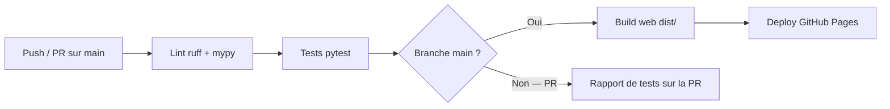

# AppleSoft BASIC Emulator — Déploiement

Version : 1.0
Date : 2026-03-15
Auteur : Franz TRIERWEILER / Claude (Anthropic)
Statut : Brouillon
Spec de référence : SPEC.md v1.0
Architecture de référence : ARCHITECTURE.md v1.0

## 1. Vue d'ensemble du déploiement

L'émulateur Applesoft BASIC se déploie sous deux formes indépendantes : un interpréteur CLI Python (Phase 1) et une application web statique Brython (Phase 2). Il n'y a aucun serveur applicatif, aucune base de données, aucune infrastructure cloud à provisionner.

La distribution Phase 1 repose sur `git clone` + `pip install -e .` (mode développeur), avec Docker en complément pour la reproductibilité. Le Makefile est l'interface unique pour toutes les opérations. La Phase 2 est une page HTML statique déployée automatiquement sur GitHub Pages à chaque push sur `main`.

**Type de solution :** CLI local + Application web statique

## 2. Prérequis

### 2.1 Prérequis infrastructure

| Prérequis | Spécification | Obligatoire | Notes |
|-----------|--------------|-------------|-------|
| Machine locale | Tout OS supportant Python 3.10+ (Linux, macOS, Windows) | Oui | Dev et exécution CLI |
| Connexion Internet | Pour le clone initial, pip install, et GitHub Pages | Non | Hors ligne possible après installation |

### 2.2 Prérequis logiciels

| Logiciel | Version minimale | Rôle | Installation |
|----------|-----------------|------|-------------|
| Python | 3.10.12+ | Runtime CLI, exécution des tests | `apt install python3` / `brew install python` / python.org |
| pip | 22+ | Gestionnaire de paquets Python | Inclus avec Python |
| Git | 2.30+ | Clonage du dépôt, CI/CD | `apt install git` / `brew install git` |
| Docker | 24+ | Environnement reproductible (optionnel) | docs.docker.com |
| Make | 4+ | Interface de build standard | Pré-installé Linux/macOS, `choco install make` Windows |

### 2.3 Prérequis réseau

| Port / Protocole | Direction | Usage | Obligatoire |
|-----------------|-----------|-------|-------------|
| 443/TCP | Sortant | Clone Git, pip install, GitHub Pages | Uniquement à l'installation |

Aucun port entrant nécessaire. Le CLI et l'app web statique ne nécessitent aucune connexion réseau en fonctionnement.

### 2.4 Prérequis secrets et credentials

| Secret | Usage | Source | Rotation |
|--------|-------|--------|----------|
| `GITHUB_TOKEN` | Déploiement GitHub Pages (CI/CD) | Automatique dans GitHub Actions | Géré par GitHub |

Aucun autre secret nécessaire. Pas de clé API, pas de mot de passe, pas de certificat.

## 3. Environnements

| Environnement | Usage | Infra | Données | Accès |
|--------------|-------|-------|---------|-------|
| dev | Développement local | Python local ou Docker | Fichiers .bas d'exemple | Développeur |
| CI | Tests automatisés | GitHub Actions (runner Ubuntu) | Fichiers .bas d'exemple | Automatique (push/PR) |
| production (web) | App web publique | GitHub Pages | localStorage navigateur | Public |

## 4. Procédure de build

### 4.1 Build Phase 1 (CLI)

```bash
# Cloner le dépôt
git clone https://github.com/<user>/applesoft-basic-emu.git
cd applesoft-basic-emu

# Installer en mode développeur
make install        # pip install -e ".[dev]"

# Vérifier l'installation
make test           # pytest
make lint           # ruff check + mypy
```

### 4.2 Build Phase 1 (Docker)

```bash
# Construire l'image
make docker-build   # docker build -t applesoft-basic-emu .

# Lancer le REPL dans le conteneur
make docker-run     # docker run -it applesoft-basic-emu
```

### 4.3 Build Phase 2 (Web)

```bash
# Construire le site statique
make web-build      # Copie src/ + web/ → dist/

# Prévisualisation locale
make web-serve      # python -m http.server --directory dist/ 8000
```

### 4.4 Artefacts produits

| Artefact | Type | Destination | Taille estimée |
|----------|------|-------------|---------------|
| Package Python installé | pip editable | Environnement Python local | ~100 Ko (code source) |
| Image Docker `applesoft-basic-emu` | Image Docker | Registry local | ~150 Mo (Python slim + code) |
| Répertoire `dist/` | Site web statique | GitHub Pages | ~500 Ko (HTML + CSS + Python + font) |

## 5. Procédure de déploiement

### 5.1 Premier déploiement (Phase 1 — CLI)

1. Cloner le dépôt : `git clone <url>`
2. Installer : `make install`
3. Lancer le REPL : `make run`
4. (Optionnel) Exécuter un fichier : `make run FILE=examples/hello.bas`

### 5.2 Premier déploiement (Phase 2 — Web)

1. Activer GitHub Pages sur le dépôt (Settings → Pages → Source: GitHub Actions)
2. Pousser sur `main` → le workflow CI/CD build et déploie automatiquement
3. L'app est accessible à `https://<user>.github.io/applesoft-basic-emu/`

### 5.3 Mise à jour (déploiement courant)

**Phase 1 (CLI) :**
```bash
git pull
make install    # Réinstalle si les dépendances ont changé
```

**Phase 2 (Web) :**
Push sur `main` → déploiement automatique via GitHub Actions. Aucune action manuelle.

**Stratégie :** Déploiement direct sur `main`. Pas de blue-green ni canary — c'est une page statique sans état serveur.

### 5.4 Rollback

**Phase 1 :** `git checkout <commit-précédent> && make install`

**Phase 2 :** Re-déployer le commit précédent via GitHub Actions, ou `git revert` + push.

**Temps estimé de rollback :** < 2 minutes

## 6. Pipeline CI/CD



| Étape | Outil | Déclencheur | Actions | Durée estimée |
|-------|-------|-------------|---------|---------------|
| Lint | GitHub Actions | Push / PR | `make lint` (ruff check + mypy) | ~30s |
| Tests | GitHub Actions | Push / PR | `make test` (pytest) | ~1 min |
| Build web | GitHub Actions | Push sur main | `make web-build` | ~10s |
| Deploy | GitHub Actions (pages) | Push sur main | Upload `dist/` vers GitHub Pages | ~30s |

**Durée totale du pipeline :** ~2 minutes

## 7. Monitoring et observabilité

### 7.1 Métriques

Pas de monitoring applicatif — le système est un CLI local et une page statique. Les seules métriques pertinentes sont celles du pipeline CI/CD :

| Métrique | Source | Usage |
|----------|--------|-------|
| Statut des tests | GitHub Actions | Badge dans le README |
| Couverture de code | pytest-cov + GitHub Actions | Badge dans le README |
| Statut déploiement Pages | GitHub Actions | Vérification visuelle |

### 7.2 Logs

| Source | Destination | Format |
|--------|-------------|--------|
| Pipeline CI/CD | GitHub Actions logs | Texte (stdout pytest, ruff) |
| Erreurs navigateur (Phase 2) | Console développeur du navigateur | JavaScript console |

### 7.3 Alertes

Pas d'alertes configurées. En cas d'échec du pipeline, GitHub notifie l'auteur du commit par email (comportement par défaut).

## 8. Sauvegarde et restauration

| Donnée | Méthode | Fréquence | Rétention | Test de restauration |
|--------|---------|-----------|-----------|---------------------|
| Code source | Git (GitHub) | Chaque commit | Illimitée (historique Git) | `git clone` sur une nouvelle machine |
| Programmes utilisateur (Phase 1) | Fichiers .bas locaux | Responsabilité utilisateur | N/A | N/A |
| Programmes utilisateur (Phase 2) | localStorage navigateur | Automatique (SAVE) | Durée de vie du localStorage | N/A |

**Note :** Le projet n'a pas de données critiques à sauvegarder. Le code est dans Git, les programmes utilisateur sont des fichiers texte locaux ou du localStorage jetable.