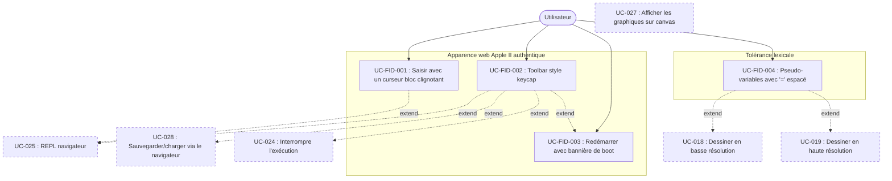

# AppleSoft BASIC Emulator — Extension « LookAppleII »

> | | |
> |---|---|
> | **Document** | SPEC-extension-ApplesoftBasicEmu-LookAppleII.md |
> | **UUID** | `2415cd01-c38c-4c39-b109-95e007b972fa` |
> | **Version** | 1.0 |
> | **Date** | 2026-04-30 |
> | **Auteur** | Franz (Olaqin) / Claude (Anthropic) |
> | **Statut** | Brouillon |
> | **Type** | Document d'extension |
> | **Spec racine** | SPEC-racine-ApplesoftBasicEmu.md |
> | **UUID racine** | `2b869c75-5a70-4d4d-b37a-ea55e40dee02` |
> | **Préfixe** | FID |
> | **Généré par** | sdd-uc-spec-write v2.5.0 |

## Contexte de la fonction

**Ce que la fonction fait :** Affiner l'expérience d'utilisation de l'émulateur pour la rapprocher d'un Apple II authentique, sur trois plans complémentaires : (1) rendu visuel et ergonomie de l'interface web (pavé clignotant inverse-vidéo, écran texte unique avec saisie inline, toolbar minimaliste avec boutons style keycap, touche RESET rouge style Apple ][+ avec bannière de boot `APPLE ][`) ; (2) tolérance lexicale des pseudo-variables comme l'autorise l'Applesoft d'origine (`HCOLOR=`, `COLOR=`, `ROT=`, `SCALE=`, `SPEED=` acceptées avec espaces avant ou après le `=`) ; (3) performance du rafraîchissement de l'écran graphique web (rendu différentiel, fluidité perceptible sur les programmes graphiques courants).

**Pourquoi elle est nécessaire :** La spec racine v3.1 spécifie un émulateur fonctionnel mais reste neutre sur le ressenti utilisateur de la version web (UC-025 décrit un REPL navigateur générique) et sur la tolérance des espaces autour des `=` (RG-0001 et RG-0002 imposent une tokenisation gloutonne stricte). À l'usage, ces deux points créent un écart perceptible avec l'Apple II d'origine : des programmes pédagogiques classiques (charte de couleurs HGR, démonstration cadres + diagonales) qui utilisent `HCOLOR = 5` plantent à la tokenisation, et l'aspect « navigateur web Brython » est trop éloigné du look d'un écran phosphore avec son curseur bloc clignotant. Côté performances, le rendu naïf des modes graphiques (40×48 cellules redessinées intégralement à chaque rafraîchissement) rend les boucles `PLOT` serrées visuellement saccadées dans Brython. L'extension formalise les ajustements correctifs nécessaires pour ramener le projet à une fidélité Apple II de bout en bout, sur le plan visuel, lexical et perceptif.

**Acteurs concernés :**

| Acteur | Rôle dans cette fonction |
|---|---|
| Utilisateur — déjà défini dans la spec racine | Interagit avec l'émulateur web : tape des commandes au prompt avec un curseur bloc clignotant, charge un programme via le bouton LOAD, interrompt l'exécution via STOP, redémarre l'émulateur via RESET. Saisit des programmes contenant des pseudo-variables avec ou sans espaces autour du `=`. Lance des programmes graphiques et observe le canvas se rafraîchir fluidement. |

**Contraintes structurantes :**

- Le rendu fidèle ne doit **pas** modifier la sémantique de l'interpréteur Applesoft. Les ajustements visuels sont strictement présentationnels (pavé clignotant, keycaps, bannière de boot) ; les ajustements lexicaux sont des assouplissements conformes au comportement de l'Apple II d'origine, pas des extensions du langage.
- Aucun nouveau composant côté core (`src/applesoft/`) n'est introduit en dehors d'ajustements ciblés du Lexer et du Parser. L'essentiel des ajouts vit dans le bridge web (`web/io_web.py`) et le HTML/CSS associé.
- L'extension reste compatible avec la CLI : tous les UC de la racine continuent de fonctionner identiquement en CLI ; les ajustements visuels ne s'appliquent qu'à la version web.

## Dépendances vers la spec racine

| Identifiant racine | Intitulé | Nature de la dépendance |
|---|---|---|
| UC-007 | Saisir des données | Étendue — l'attente d'INPUT s'affiche inline avec le pavé clignotant (UC-FID-001) |
| UC-009 | Contrôler l'affichage | Étendue — accepte `SPEED =` avec espaces |
| UC-018 | Dessiner en basse résolution | Étendue — accepte `COLOR =` avec espaces |
| UC-019 | Dessiner en haute résolution | Étendue — accepte `HCOLOR =`, `ROT =`, `SCALE =` avec espaces |
| UC-020 | Utiliser les shape tables | Étendue — accepte `ROT =`, `SCALE =` avec espaces |
| UC-024 | Interrompre l'exécution | Réutilisée — bouton STOP du toolbar invoque le même mécanisme que Ctrl+C |
| UC-025 | Utiliser le REPL dans le navigateur | Étendue — apparence Apple II authentique (pavé clignotant inline, écran unique, toolbar keycap) |
| UC-027 | Afficher les graphiques sur canvas | Étendue — performance du rafraîchissement (rendu différentiel) |
| UC-028 | Sauvegarder/charger via le navigateur | Étendue — toolbar simplifié à LOAD + RESET ; SAVE devient typeable au prompt |
| RG-0001 | Tokenisation du code source. | Réutilisée |
| RG-0002 | Reconnaissance des mots réservés par correspondance gloutonne. | Étendue — accepte les formes collée (`KW=`) et espacée (`KW` + `=` séparé) pour les pseudo-variables |
| RG-0010 | Codes d'erreur Applesoft (`?SYNTAX ERROR`, etc.) | Réutilisée — la forme nue `HCOLOR` sans `=` séparé déclenche `?SYNTAX ERROR` |

## Hors périmètre

- **Modification de la sémantique d'exécution.** Aucun comportement BASIC n'est ajouté ou modifié — l'extension agit uniquement sur la présentation et la tolérance lexicale.
- **Polices et thèmes alternatifs.** L'extension impose un seul rendu (police bitmap Apple II déjà fournie en racine, fond noir, texte vert phosphore). Aucun thème clair, aucune police alternative.
- **Émulation sonore.** Le bouton RESET ne produit pas le « beep » du démarrage Apple II — seule la bannière texte `APPLE ][` est rendue.
- **Internationalisation des labels.** Les boutons `LOAD`, `STOP`, `RESET` et la bannière `APPLE ][` restent en anglais, comme sur le clavier Apple II d'origine.
- **Mode 80 colonnes pour le pavé clignotant.** Le pavé clignotant est dimensionné pour le mode 40 colonnes ; le mode 80 colonnes hérite des mêmes métriques sans ajustement spécifique.
- **Compatibilité avec d'autres dialectes BASIC.** Les tolérances lexicales s'appliquent aux pseudo-variables Applesoft (`HCOLOR=`, `COLOR=`, `ROT=`, `SCALE=`, `SPEED=`) et non aux constructions d'autres BASIC.

## Arborescence des cas d'utilisation

2 paquetages racine, profondeur 2 (paquetage racine → UC), 4 UC au total. Bien dans les bornes structurelles (≤ 7 sous-paquetages par parent, ≤ 10 UC par feuille).

### Carte d'ensemble

- **Apparence web Apple II authentique** (3 UC)
  - UC-FID-001 — Saisir avec un curseur bloc clignotant inline
  - UC-FID-002 — Présenter une barre d'outils style keycap
  - UC-FID-003 — Redémarrer l'émulateur avec bannière de boot
- **Tolérance lexicale** (1 UC)
  - UC-FID-004 — Accepter les pseudo-variables avec `=` espacé

### Fiches paquetage

#### Paquetage : Apparence web Apple II authentique

**Objectif** — Regroupe les UC qui rapprochent le rendu visuel et l'ergonomie de l'interface web de l'expérience d'un Apple II d'origine : pavé clignotant inline dans le flux texte, toolbar minimaliste avec boutons keycap, bouton RESET avec bannière de boot.

**Contient :**

| Type | Élément |
|---|---|
| UC | UC-FID-001 — Saisir avec un curseur bloc clignotant inline |
| UC | UC-FID-002 — Présenter une barre d'outils style keycap |
| UC | UC-FID-003 — Redémarrer l'émulateur avec bannière de boot |

#### Paquetage : Tolérance lexicale

**Objectif** — Regroupe les UC qui assouplissent la tokenisation pour accepter les variantes de syntaxe que l'Applesoft d'origine acceptait sur les pseudo-variables (formes collée et espacée du `=`).

**Contient :**

| Type | Élément |
|---|---|
| UC | UC-FID-004 — Accepter les pseudo-variables avec `=` espacé |

## Diagramme des cas d'utilisation

## Cas d'utilisation détaillés

---

**📦 Apparence web Apple II authentique**

### **UC-FID-001** : Saisir avec un curseur bloc clignotant inline

**Résumé :** Pendant qu'il saisit du texte au prompt du REPL navigateur ou en réponse à un `INPUT`, l'utilisateur voit un pavé inverse-vidéo vert clignoter à la position courante d'écriture, dans le même flux texte que la sortie programme. Le curseur suit naturellement chaque frappe et n'apparaît jamais sur une ligne dédiée séparée.

**Acteurs :** Utilisateur

**Fréquence d'utilisation :** Continue (à chaque attente de saisie au REPL ou en INPUT)

**Priorité :** Important

**État initial :** Le navigateur a chargé l'émulateur web et le REPL ou un `INPUT` attend une saisie de l'utilisateur.

**État final :** Le pavé clignotant est masqué (l'attente de saisie est terminée — programme en cours d'exécution, ou ligne commitée).

**Relations :**
- Include : Aucune
- Extend : UC-025 (REPL dans le navigateur), UC-007 (Saisir des données — pour les attentes INPUT)
- Généralisation : Aucune

**Étapes (cas nominal) :**

| # | Direction | Description |
|---|---|---|
| 1a | → Système | Atteint une attente de saisie (prompt REPL `]`, INPUT, GET). |
| 1b | ← Système | Affiche le prompt à la position courante d'écriture, suivi immédiatement d'un pavé bloc inverse-vidéo de la largeur d'un caractère qui clignote (RG-FID-0001, RG-FID-0002). Le pavé est inline dans le flux DOM de la zone de sortie texte (pas sur une ligne dédiée). (IHM-FID-001) |
| 2a | → Utilisateur | Tape un caractère imprimable. |
| 2b | ← Système | Insère le caractère tapé entre le prompt et le pavé clignotant. Le pavé suit naturellement la nouvelle position d'écriture. Retour à 2a. |
| 3a | → Utilisateur | Appuie sur RETURN. |
| 3b | ← Système | Commit la ligne saisie au flux de sortie (prompt + texte tapé + retour à la ligne), masque le pavé clignotant pendant le traitement. À la prochaine attente de saisie, retour à 1b. |

**Exceptions :**

| Id étape | Condition | Réaction du système |
|---|---|---|
| 2a | L'utilisateur appuie sur Backspace | Le dernier caractère tapé est retiré, le pavé clignotant remonte d'une position. Si le buffer est vide, aucune action. Retour à 2a. |
| 2a | L'utilisateur appuie sur Ctrl+C | Voir UC-024 (interruption). Le pavé est masqué pendant le traitement de l'interruption. |

**Règles de gestion :**

| n° RG | Id étape | Énoncé |
|---|---|---|
| RG-FID-0001 | 1b | Le pavé clignotant reproduit le caractère ROM `$7F` de l'Apple II : un **damier 1-pixel** (alternance verte / transparente en motif checkerboard), pas un bloc plein. Implémentation : un caractère espace (`&nbsp;`) avec `color: transparent`, dont la cellule reçoit en `background-image` un SVG inline 2×2 (deux pixels remplis aux coins (0,0) et (1,1)) répété en `background-size: 2px 2px`. `shape-rendering: crispEdges` côté SVG et `image-rendering: pixelated` côté CSS conservent des pixels carrés nets. La hauteur d'un caractère et la largeur de `1ch` sont héritées des métriques de la police bitmap Apple II. Le clignotement (~2 Hz, 500 ms par phase) bascule l'`opacity` du damier entre 1 et 0, conforme au comportement FLASH du curseur Apple II d'origine. |
| RG-FID-0002 | 1b, 2b | Le pavé clignotant est positionné dans le **même flux DOM** que la zone de sortie texte (modèle « écran unique »), pas dans un conteneur séparé. À chaque appel `print_str` exécuté pendant la saisie, le contenu est inséré **avant** la balise du pavé (via `insertBefore`) pour préserver l'invariant : « le pavé est toujours à la position d'écriture suivante ». |

**IHM :**

| Id IHM | Description |
|---|---|
| IHM-FID-001 | Zone console unique : fond noir, police bitmap Apple II, texte vert phosphore. Le prompt (`]` pour le REPL, `?` pour INPUT, ou texte personnalisé), le texte tapé par l'utilisateur, et le pavé clignotant cohabitent inline. Le pavé clignotant a la dimension exacte d'un caractère, qu'il alterne entre vert plein et fond noir transparent toutes les 500 ms. |

**Objets participants :** Zone de sortie console, ligne de saisie courante, pavé curseur.

**Contraintes non fonctionnelles :** Le clignotement du pavé doit rester fluide (animation CSS native, pas de JavaScript) et ne pas bloquer le rendu du reste de la console.

**Critères d'acceptation :**

- **CA-UC-FID-001-01 :** Soit l'émulateur web chargé et le prompt `]` affiché, Quand aucune frappe n'a été faite, Alors une cellule de la largeur d'un caractère portant un motif damier 1-pixel vert apparaît immédiatement à droite du `]` et clignote à 2 Hz.
- **CA-UC-FID-001-02 :** Soit le prompt `]` avec le damier clignotant à droite, Quand l'utilisateur tape la lettre `H`, Alors `H` apparaît entre le `]` et le damier, ce dernier restant immédiatement à droite du `H`.
- **CA-UC-FID-001-03 :** Soit `]PRINT` tapé par l'utilisateur, Quand l'utilisateur appuie sur RETURN, Alors `]PRINT` est commité dans la zone de sortie, le pavé clignotant disparaît pendant l'exécution, et un nouveau pavé clignotant réapparaît au prochain prompt `]`.
- **CA-UC-FID-001-04 :** Soit un programme exécutant `INPUT "NAME? ";N$`, Quand l'attente d'INPUT s'active, Alors `NAME?` est affiché inline (pas sur une ligne séparée) et un pavé clignotant apparaît immédiatement après pour la saisie utilisateur.
- **CA-UC-FID-001-05 :** Soit `HELLO` tapé en réponse à un INPUT puis RETURN, Quand le programme reprend, Alors la ligne `NAME? HELLO` figure dans la zone de sortie sur une seule ligne logique, et le pavé clignotant reste masqué tant que le programme s'exécute.

---

### **UC-FID-002** : Présenter une barre d'outils style keycap

**Résumé :** L'utilisateur dispose d'une barre d'outils minimaliste en haut de l'interface web composée de trois boutons stylisés en touches de clavier Apple II : `LOAD`, `STOP`, `RESET`. Les boutons reproduisent l'aspect d'une touche en plastique moulé (couleur uniforme sans gradient, ombre 3D portée qui se compresse à la pression, hautlumière intérieure subtile). `STOP` est jaune ambre (signal d'alerte), `RESET` est rouge brique avec un halo au survol et est positionné isolé à droite, à l'image de la touche Reset isolée du clavier Apple ][+ d'origine.

**Acteurs :** Utilisateur

**Fréquence d'utilisation :** À la demande (chargement d'un programme, interruption, redémarrage)

**Priorité :** Important

**État initial :** L'émulateur web est chargé.

**État final :** L'utilisateur a déclenché l'action correspondant au bouton cliqué (chargement, interruption ou redémarrage), ou n'a rien fait (les boutons restent visibles en permanence).

**Relations :**
- Include : Aucune
- Extend : UC-025 (REPL navigateur), UC-028 (Sauvegarder/charger via le navigateur), UC-024 (Interrompre l'exécution), UC-FID-003 (Redémarrer avec bannière de boot)
- Généralisation : Aucune

**Étapes (cas nominal) :**

| # | Direction | Description |
|---|---|---|
| 1a | → Système | L'utilisateur charge l'émulateur web. |
| 1b | ← Système | Affiche en haut de l'interface une barre d'outils contenant trois boutons : `LOAD` (beige), `STOP` (jaune ambre), `RESET` (rouge brique, séparé à droite). Chaque bouton respecte le style keycap (RG-FID-0003, RG-FID-0004). (IHM-FID-002) |
| 2a | → Utilisateur | Survole un bouton avec la souris. |
| 2b | ← Système | Le bouton change légèrement de teinte pour signaler l'interactivité ; pour `RESET`, un halo rouge diffus apparaît autour du bouton. |
| 3a | → Utilisateur | Clique sur un bouton. |
| 3b | ← Système | Le bouton se compresse visuellement (translation de 3 px vers le bas, ombre 3D effacée) pendant la durée du clic, puis se relève (RG-FID-0005). Déclenche l'action correspondante : LOAD ouvre le sélecteur de fichier (UC-028), STOP interrompt l'exécution (UC-024), RESET déclenche le redémarrage (UC-FID-003). |

**Exceptions :** Aucune.

**Règles de gestion :**

| n° RG | Id étape | Énoncé |
|---|---|---|
| RG-FID-0003 | 1b | Tous les boutons partagent un style keycap commun : `background-color` uni (sans gradient), `border` 1px solid avec teinte foncée, `border-radius` 6px, `box-shadow` 0 3px 0 (ombre portée 3D), `inset 0 2px 0 rgba(255,255,255,0.3)` (highlight intérieur), `text-transform: uppercase`, `letter-spacing: 0.1em`, `font-family` bitmap Apple II. Couleurs : LOAD beige (`#d4c5a0` / bord `#6b5d3a`), STOP jaune ambre (`#f4c842` / bord `#8a6a14`), RESET rouge brique (`#c8242a` / bord `#5a0e0e`). |
| RG-FID-0004 | 1b | Le bouton RESET porte `margin-left: auto` pour le séparer visuellement à droite de la toolbar, à l'image de la touche RESET isolée du clavier Apple ][+ d'origine. Au survol, un halo rouge diffus (`box-shadow: 0 0 14px rgba(200,36,42,0.55)`) entoure le bouton. |
| RG-FID-0005 | 3b | Au clic, chaque bouton applique `transform: translateY(3px)` et efface l'ombre portée pour simuler la dépression d'une touche physique. |

**IHM :**

| Id IHM | Description |
|---|---|
| IHM-FID-002 | Barre d'outils horizontale en haut de la page, fond gris très foncé. Trois boutons style keycap : LOAD (beige) à gauche, STOP (jaune) au milieu, RESET (rouge) à droite, séparé du groupe précédent par un espace flexible (`margin-left: auto`). |

**Objets participants :** Toolbar, bouton.

**Contraintes non fonctionnelles :** L'animation de pression des boutons doit être perceptiblement instantanée (≤ 50 ms entre `mousedown` et le rendu compressé).

**Critères d'acceptation :**

- **CA-UC-FID-002-01 :** Soit l'émulateur web chargé, Quand l'utilisateur regarde le haut de la page, Alors trois boutons stylisés keycap sont visibles : LOAD, STOP, RESET, dans cet ordre, RESET séparé à droite par un espace.
- **CA-UC-FID-002-02 :** Soit la barre d'outils affichée, Quand l'utilisateur survole le bouton RESET, Alors un halo rouge diffus apparaît autour du bouton.
- **CA-UC-FID-002-03 :** Soit la barre d'outils affichée, Quand l'utilisateur clique sur n'importe quel bouton, Alors le bouton se compresse visuellement (translation 3 px vers le bas, ombre effacée) pendant la durée du clic puis se relève.
- **CA-UC-FID-002-04 :** Soit la barre d'outils affichée, Quand l'utilisateur clique sur LOAD, Alors le sélecteur de fichier `.bas` s'ouvre (cf. UC-028).
- **CA-UC-FID-002-05 :** Soit un programme en cours d'exécution, Quand l'utilisateur clique sur STOP, Alors le programme est interrompu (cf. UC-024).
- **CA-UC-FID-002-06 :** Soit l'émulateur dans un état quelconque, Quand l'utilisateur clique sur RESET, Alors le mécanisme de redémarrage UC-FID-003 est déclenché.

---

### **UC-FID-003** : Redémarrer l'émulateur avec bannière de boot

**Résumé :** L'utilisateur peut redémarrer entièrement l'émulateur en cliquant sur le bouton RESET. Le redémarrage interrompt tout programme en cours, vide la mémoire programme et les variables (`NEW`), revient au mode texte (efface le canvas graphique), nettoie l'écran texte, et affiche la bannière de boot iconique `APPLE ][` suivie d'un nouveau prompt `]`. Cette opération mime fidèlement le comportement d'une mise sous tension d'Apple ][+.

**Acteurs :** Utilisateur

**Fréquence d'utilisation :** À la demande (recommencer une session, sortir d'un état d'erreur)

**Priorité :** Important

**État initial :** L'émulateur web est dans n'importe quel état (programme en cours, mode graphique actif, attente de saisie INPUT, prompt en attente, etc.).

**État final :** L'émulateur est dans l'état d'un démarrage fraîchement effectué : aucune ligne de programme en mémoire, aucune variable définie, mode texte actif, écran texte contenant uniquement la bannière `APPLE ][` et un prompt `]` avec le pavé clignotant.

**Relations :**
- Include : Aucune
- Extend : Aucune
- Généralisation : Aucune

**Étapes (cas nominal) :**

| # | Direction | Description |
|---|---|---|
| 1a | → Utilisateur | Clique sur le bouton RESET (UC-FID-002). |
| 1b | ← Système | Interrompt toute exécution en cours (`set_interrupted`). Toute tranche d'exécution déjà planifiée détecte la condition d'arrêt et sort silencieusement. |
| 2b | ← Système | Vide la mémoire programme et les variables via `NEW` (RG-FID-0006). |
| 3b | ← Système | Sort du mode graphique (`TEXT`), masque le canvas, invalide le cache de rendu différentiel (RG-FID-0007). |
| 4b | ← Système | Nettoie entièrement la zone de sortie texte. |
| 5b | ← Système | Imprime la bannière `APPLE ][` suivie d'une ligne vide (RG-FID-0008). (IHM-FID-003) |
| 6b | ← Système | Affiche le prompt `]` avec le pavé clignotant à droite, prêt à recevoir la saisie. |

**Exceptions :** Aucune.

**Règles de gestion :**

| n° RG | Id étape | Énoncé |
|---|---|---|
| RG-FID-0006 | 2b | RESET équivaut sémantiquement à exécuter `NEW` au prompt : programme effacé, variables effacées, état d'exécution remis à zéro, piles GOSUB et FOR vidées. |
| RG-FID-0007 | 3b | RESET force `TEXT` (mode texte) et invalide le cache de rendu différentiel du canvas pour qu'un futur `GR`/`HGR` repeigne intégralement (toutes les cellules considérées comme « modifiées » au premier rendu). |
| RG-FID-0008 | 5b | La bannière de boot est exactement `APPLE ][` (chaîne de 8 caractères incluant l'espace), suivie d'une ligne vide avant le prompt — fidèle au démarrage de l'Apple ][+ qui affichait également la bannière en haut de l'écran. Aucun beep sonore (hors périmètre). |

**IHM :**

| Id IHM | Description |
|---|---|
| IHM-FID-003 | Écran texte effacé, contenant la chaîne `APPLE ][` sur la première ligne, une ligne vide, puis le prompt `]` avec le pavé clignotant — reproduisant à l'identique l'écran d'un Apple ][+ après une mise sous tension. |

**Objets participants :** État global de l'émulateur, mémoire programme, environnement (variables), canvas graphique, zone de sortie texte.

**Contraintes non fonctionnelles :** Le redémarrage doit être perceptiblement instantané (≤ 100 ms entre le clic et l'affichage de la bannière).

**Critères d'acceptation :**

- **CA-UC-FID-003-01 :** Soit un programme `10 PRINT "HI"` en mémoire, Quand l'utilisateur clique sur RESET, Alors `LIST` exécuté ensuite n'affiche aucune ligne (programme vide).
- **CA-UC-FID-003-02 :** Soit la variable `X = 42` définie, Quand l'utilisateur clique sur RESET, Alors `PRINT X` exécuté ensuite affiche `0` (variable réinitialisée).
- **CA-UC-FID-003-03 :** Soit l'émulateur en mode graphique HGR avec un canvas visible, Quand l'utilisateur clique sur RESET, Alors le canvas est masqué et le mode est revenu à TEXT.
- **CA-UC-FID-003-04 :** Soit l'émulateur dans un état quelconque, Quand l'utilisateur clique sur RESET, Alors la zone de sortie texte contient exactement la séquence `APPLE ][` puis une ligne vide puis `]` avec le pavé clignotant à droite.
- **CA-UC-FID-003-05 :** Soit un programme exécutant une boucle infinie `10 GOTO 10`, Quand l'utilisateur clique sur RESET, Alors l'exécution est immédiatement interrompue, le programme est vidé, l'écran de boot s'affiche, et aucun second prompt fantôme ne suit (la tranche d'exécution en attente sort silencieusement).

---

**📦 Tolérance lexicale**

### **UC-FID-004** : Accepter les pseudo-variables avec `=` espacé

**Résumé :** Le lexer accepte les pseudo-variables Applesoft (`HCOLOR=`, `COLOR=`, `ROT=`, `SCALE=`, `SPEED=`) sous deux formes lexicales équivalentes : forme collée (`HCOLOR=5`) et forme espacée (`HCOLOR = 5`, `HCOLOR =5`, `HCOLOR= 5`). Cette tolérance reproduit le comportement de l'Applesoft d'origine, qui normalisait toutes les variantes vers le même token interne via le mécanisme de tokenisation au moment de la saisie. Sans cette tolérance, des programmes pédagogiques classiques (charte HGR, démonstrations cadre + diagonales) plantent à la tokenisation.

**Acteurs :** Utilisateur

**Fréquence d'utilisation :** Continue (à chaque ligne BASIC chargée ou tapée contenant une pseudo-variable)

**Priorité :** Critique

**État initial :** L'utilisateur charge ou tape une ligne BASIC contenant une pseudo-variable.

**État final :** Le lexer produit la séquence de tokens correcte indépendamment de la présence d'espaces autour du `=`, et le parser accepte les deux formes pour générer la même AST.

**Relations :**
- Include : Aucune
- Extend : UC-018 (basse résolution — `COLOR`), UC-019 (haute résolution — `HCOLOR`, `ROT`, `SCALE`), UC-020 (shape tables — `ROT`, `SCALE`), UC-009 (contrôler l'affichage — `SPEED`)
- Généralisation : Aucune

**Étapes (cas nominal) :**

| # | Direction | Description |
|---|---|---|
| 1a | → Utilisateur | Tape ou charge une ligne contenant une pseudo-variable (par exemple `HCOLOR = 5`). |
| 1b | ← Système | Le lexer applique la correspondance gloutonne (RG-0002) à la position 0 : tente d'abord `HCOLOR=` (7 caractères, échec — un espace suit `HCOLOR`), puis tente `HCOLOR` seul (6 caractères, succès grâce à RG-FID-0009). Émet le token `KEYWORD(HCOLOR)`. |
| 2b | ← Système | Continue la tokenisation : émet `OP(=)` puis `NUMBER(5)`. La séquence de tokens produite est `[KEYWORD(HCOLOR), OP(=), NUMBER(5)]`. |
| 3b | ← Système | Le parser, voyant `KEYWORD(HCOLOR)`, consomme le token, vérifie que le token suivant est `OP(=)`, le consomme, puis parse l'expression numérique. Produit `HcolorStmt(NumberLiteral(5))` — AST identique à celle produite par la forme collée `HCOLOR=5` (RG-FID-0010). |

**Exceptions :**

| Id étape | Condition | Réaction du système |
|---|---|---|
| 3b | La forme nue (par exemple `HCOLOR`) est suivie d'un autre token que `OP(=)` (cas `HCOLOR 5` sans `=` ni espace `=`) | Le parser lève une erreur de syntaxe `?SYNTAX ERROR` (RG-0010 racine), conformément au comportement Applesoft. |

**Règles de gestion :**

| n° RG | Id étape | Énoncé |
|---|---|---|
| RG-FID-0009 | 1b | Le lexer reconnaît les pseudo-variables sous deux formes inscrites comme mots-clés dans la table : forme collée (`HCOLOR=`, `COLOR=`, `ROT=`, `SCALE=`, `SPEED=`) et forme nue (`HCOLOR`, `COLOR`, `ROT`, `SCALE`, `SPEED`). Le tri par longueur décroissante (RG-0002) garantit que la forme collée a la priorité quand elle correspond exactement à l'entrée ; à défaut, la forme nue est tentée. |
| RG-FID-0010 | 3b | Pour chaque pseudo-variable, le parser dispatche sur les deux variants de mot-clé. Si la forme nue est rencontrée, le parser exige explicitement (`expect`) un `OP(=)` séparé en token suivant ; en cas d'absence, une erreur de syntaxe est levée. La forme collée passe directement à l'expression. Les deux chemins produisent la même AST node. |

**IHM :** Aucune (comportement interpréteur, pas de surface visuelle).

**Objets participants :** Lexer, parser, table de mots-clés, AST.

**Contraintes non fonctionnelles :** Aucun impact perceptible sur les performances de tokenisation (la table de mots-clés gagne 7 entrées : `HCOLOR`, `COLOR`, `ROT`, `SCALE`, `SPEED`, `HIMEM`, `LOMEM` — la traversée linéaire reste négligeable).

**Critères d'acceptation :**

- **CA-UC-FID-004-01 :** Soit la ligne `HCOLOR = 5` saisie au prompt, Quand le lexer la tokenise, Alors la séquence de tokens produite est `[KEYWORD(HCOLOR), OP(=), NUMBER(5)]`.
- **CA-UC-FID-004-02 :** Soit la ligne `HCOLOR=5` saisie au prompt, Quand le lexer la tokenise, Alors la séquence de tokens produite est `[KEYWORD(HCOLOR=), NUMBER(5)]`.
- **CA-UC-FID-004-03 :** Soit la ligne `HCOLOR =5` saisie au prompt, Quand le parser la traite, Alors une AST `HcolorStmt(NumberLiteral(5))` est produite, identique à celle produite par `HCOLOR=5`.
- **CA-UC-FID-004-04 :** Soit chacune des pseudo-variables `COLOR`, `HCOLOR`, `ROT`, `SCALE`, `SPEED` suivie d'un nombre avec ou sans espaces autour du `=`, Quand le programme est exécuté, Alors la pseudo-variable est correctement assignée et le comportement attendu (changement de couleur, rotation, échelle, vitesse) est produit.
- **CA-UC-FID-004-05 :** Soit la ligne `HCOLOR 5` (sans `=`), Quand le parser la traite, Alors une erreur `?SYNTAX ERROR` est levée.
- **CA-UC-FID-004-06 :** Soit le programme `examples/HGRCHART.BAS` chargé (qui utilise `HCOLOR = INT(Y/8)`), Quand il est exécuté, Alors aucune erreur de syntaxe n'est levée et le programme s'exécute jusqu'à son `GET A$` final.

## Phases de livraison

Cette extension est livrée dans la **Phase 2** de la spec racine (« Portage navigateur via Brython ») pour les UC visuels (UC-FID-001, UC-FID-002, UC-FID-003), et **transverse aux deux phases** pour la tolérance lexicale (UC-FID-004) qui touche le Lexer/Parser commun à la CLI et au web.

| UC | Phase racine de rattachement |
|---|---|
| UC-FID-001 | Phase 2 (web) |
| UC-FID-002 | Phase 2 (web) |
| UC-FID-003 | Phase 2 (web) |
| UC-FID-004 | Phase 1 (CLI) + Phase 2 (web) — appartient au cœur Lexer/Parser |

## Exigences non fonctionnelles

#### ENF-FID-001 : Performance du rafraîchissement de l'écran graphique web

**Priorité :** Important

**Description :** Le rafraîchissement du canvas graphique web (modes LoRes 40×48 et HiRes 280×192) doit rester perceptiblement fluide même sur des programmes exécutant des opérations graphiques en boucle serrée (un `PLOT` par itération, comme la mosaïque de Raskin). La fluidité perçue cible **≥ 10 frames affichées par seconde** dans le navigateur, mesurée sur un programme de référence (`examples/RASKIN2.BAS` à pleine vitesse Brython). Les techniques attendues sont (a) un rendu différentiel via snapshot des cellules pour ne redessiner que ce qui a changé depuis le rendu précédent, et (b) un découplage des appels `on_draw` du moteur graphique vers le canvas via `requestAnimationFrame` pour qu'au plus un rendu canvas soit planifié par frame d'affichage navigateur, indépendamment du nombre d'opérations graphiques exécutées dans la tranche BASIC.

**Critères d'acceptation :**

- **CA-ENF-FID-001-01 :** Soit le programme `examples/RASKIN2.BAS` chargé et lancé via `RUN` dans le navigateur, Quand le programme tourne en boucle (`PLOT` continu), Alors l'utilisateur perçoit au moins 10 rafraîchissements de canvas par seconde (mesure visuelle approximative, aucune saccade dépassant 200 ms entre deux mises à jour visibles du canvas).
- **CA-ENF-FID-001-02 :** Soit un programme HGR exécutant des `HPLOT` en boucle, Quand il s'exécute, Alors seules les cellules ayant changé de couleur depuis le dernier rendu déclenchent un appel `fillRect` (rendu différentiel via snapshot — vérifiable par instrumentation comptant les `fillRect` par rendu).
- **CA-ENF-FID-001-03 :** Soit une tranche d'exécution BASIC en cours dans le navigateur, Quand le moteur graphique appelle son callback `on_draw` plusieurs fois pendant la tranche, Alors un seul rendu canvas est planifié via `requestAnimationFrame` (pas de rendu synchrone par appel `on_draw`).

## Glossaire fonction

| Terme | Définition |
|---|---|
| Pavé clignotant | Cellule de la dimension d'un caractère portant un motif **damier 1-pixel** vert phosphore (caractère ROM `$7F` de l'Apple II), clignotant à environ 2 Hz par bascule d'opacity. Modélise fidèlement le curseur de saisie de l'Apple II d'origine — qui n'est pas un bloc plein mais un checkerboard fin. |
| Keycap | Style visuel reproduisant l'aspect d'une touche de clavier en plastique moulé : couleur uniforme, ombre 3D portée, hautlumière intérieure subtile. Appliqué aux trois boutons LOAD, STOP, RESET de la barre d'outils web. |
| Bannière de boot | Texte `APPLE ][` (8 caractères, espace inclus) affiché en haut de l'écran texte au démarrage et lors d'un RESET, fidèle à l'écran de mise sous tension de l'Apple ][+. |
| Pseudo-variable | Mot-clé Applesoft suivi d'un `=` qui assigne une valeur à un état interne (couleur, rotation, échelle, vitesse). Tokenisée historiquement comme un seul token avec le `=` intégré (`HCOLOR=`, `COLOR=`, `ROT=`, `SCALE=`, `SPEED=`), mais l'Applesoft d'origine acceptait les deux formes (collée et espacée). |
| Rendu différentiel | Technique d'optimisation graphique consistant à maintenir un snapshot du dernier état rendu et à ne redessiner que les cellules dont la couleur a changé entre le snapshot et l'état courant du buffer graphique. |
| Modèle « écran unique » | Architecture DOM où le prompt courant, le texte tapé en cours, et le pavé clignotant cohabitent dans le même flux que la sortie programme — par opposition à un modèle « ligne de saisie séparée » qui placerait la saisie sous la sortie sur une ligne dédiée. |
