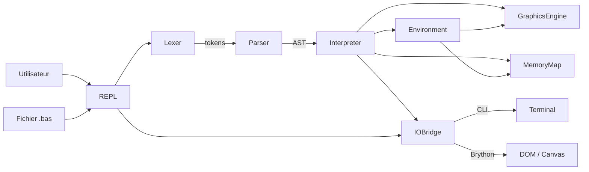

# AppleSoft BASIC Emulator — Spécification SDD

Version : 1.0
Date : 2026-02-14
Auteur : Franz (Olaqin) / Claude (Anthropic)
Statut : Brouillon

## Contexte et objectifs

**Ce que le projet fait :** Un émulateur du langage Applesoft BASIC de l'Apple II, exécutable en ligne de commande Python puis dans un navigateur web via Brython.

**Pourquoi il existe :** C'est une application de démonstration à double vocation : offrir un émulateur fonctionnel pour les passionnés d'Apple II, et servir de cas d'usage concret pour valider la méthodologie Spec Driven Development (SDD) et le skill de rédaction de spécifications associé.

**Pour qui :** Les passionnés d'Apple II et de rétro-informatique, ainsi que les praticiens SDD souhaitant évaluer la qualité d'une spécification générée par le skill.

**Contraintes structurantes :**

- Python 3.10.12 minimum comme plateforme d'exécution.
- Brython comme runtime Python dans le navigateur (Phase 2) — le code doit rester compatible Python pur, sans dépendance C ou binaire.
- Pas de ROM Apple II disponible : les fonctionnalités dépendant du binaire de la ROM (PEEK/POKE sur des adresses ROM spécifiques, CALL vers des routines machine) doivent être émulées ou signalées comme non supportées.
- Respect des licences et de la propriété intellectuelle des documents de référence utilisés pour la grammaire et le comportement du langage.
- Aucune contrainte réglementaire ou normative.

## Phases du projet

### Phase 1 — Interpréteur CLI Python

- **Périmètre :** Parseur et interpréteur Applesoft BASIC en Python, exécutable en ligne de commande. Inclut une boucle interactive (REPL) avec mode direct (exécution immédiate) et mode différé (saisie de programme par lignes numérotées), fidèle au comportement de l'Apple II. Couvre le cœur du langage (variables, expressions, structures de contrôle, entrées/sorties texte) et le graphisme (basse et haute résolution, rendu en mode texte ou export image). Les accès mémoire émulables (PEEK/POKE sur des adresses connues et documentées) sont inclus. Le son et les accès disque restent à étudier en phase de conception : leur inclusion est souhaitée mais non garantie.
- **Livrable :** Un interpréteur Applesoft BASIC en Python exécutable en CLI, offrant un mode interactif (REPL) fidèle à l'expérience Apple II : prompt `]`, exécution immédiate de commandes (mode direct), saisie et édition de programmes par lignes numérotées (mode différé), et commandes système (RUN, LIST, NEW, DEL, SAVE, LOAD). Le chargement de fichiers sources (.bas) est également supporté comme alternative au mode interactif.
- **Dépendances :** Aucune.

### Phase 2 — Portage navigateur via Brython

- **Périmètre :** Adaptation de l'interpréteur Phase 1 pour exécution dans un navigateur web via Brython. Interface web intégrant un éditeur de code, une console de sortie texte et un canvas pour le rendu graphique. Le code Python reste partagé entre les deux cibles autant que possible.
- **Livrable :** Une application web statique (HTML + Brython) offrant la même expérience interactive que la Phase 1 : REPL avec prompt, mode direct et différé, éditeur intégré, console de sortie texte et canvas pour le rendu graphique.
- **Dépendances :** Phase 1.

## Architecture

| Composant | Responsabilité | Interfaces exposées | Dépendances |
|---|---|---|---|
| **REPL** | Boucle interactive fidèle au comportement Apple II. Affiche le prompt `]`, distingue le mode direct (commandes sans numéro de ligne, exécutées immédiatement) du mode différé (lignes numérotées, stockées en mémoire). Gère les commandes système : RUN, LIST, NEW, DEL, SAVE, LOAD. | `start() → None` (point d'entrée principal en mode interactif) | Lexer, Parser, Interpreter, IOBridge |
| **Lexer** | Découpe le code source Applesoft BASIC en tokens. Gère les particularités du tokenizing Applesoft (mots réservés détectés dans le flux de caractères, pas de séparateur obligatoire). | `tokenize(source: str) → list[Token]` (synchrone) | — |
| **Parser** | Construit un arbre syntaxique abstrait (AST) à partir de la liste de tokens. Valide la syntaxe selon la grammaire définie dans GRAMMAR.md. | `parse(tokens: list[Token]) → Program` (synchrone) | Lexer |
| **Interpreter** | Parcourt l'AST et exécute les instructions. Gère l'état du programme (variables, pile d'appels, DATA pointer, gestion d'erreurs ONERR). | `run(program: Program, env: Environment) → None` (synchrone) | Parser, Environment |
| **Environment** | Maintient l'état d'exécution : variables, tableaux (DIM), pile GOSUB/FOR, pointeur DATA, état graphique. | Lecture/écriture synchrone sur l'état interne. | — |
| **GraphicsEngine** | Gère le rendu des modes graphiques basse résolution (GR, COLOR, PLOT, HLIN, VLIN) et haute résolution (HGR, HCOLOR, HPLOT). | `plot(x, y)`, `hlin(x1, x2, y)`, `hplot(x, y)`, etc. (synchrone) | Environment |
| **IOBridge** | Abstrait les entrées/sorties (PRINT, INPUT, GET) pour permettre deux backends : CLI (stdin/stdout) et navigateur (DOM/canvas via Brython). | `print(text)`, `input(prompt) → str`, `get() → str` (synchrone/asynchrone selon backend) | — |
| **MemoryMap** | Émule un sous-ensemble d'adresses mémoire Apple II pour PEEK et POKE. Mappe les adresses connues (clavier, état graphique, soft-switches) vers l'état de l'Environment. | `peek(address: int) → int`, `poke(address: int, value: int) → None` (synchrone) | Environment |

## Documents de référence

| Document | Description |
|---|---|
| GRAMMAR.md | Grammaire formelle du sous-ensemble Applesoft BASIC supporté, en notation EBNF. Définit les productions pour les instructions, expressions, opérateurs et littéraux. |

**Sources externes (propriété intellectuelle tierce) :**

| Source | Usage | Licence / Statut |
|---|---|---|
| *Applesoft II BASIC Programming Reference Manual* (Apple Computer, 1978) | Référence pour la sémantique des instructions et l'Appendice B (définitions syntaxiques). | Document historique, domaine de référence Apple. Utilisation à des fins de compatibilité et d'interopérabilité. |
| Joshua Bell — Applesoft BASIC in JavaScript (calormen.com/jsbasic) | Référence croisée pour la grammaire des expressions et le comportement des instructions. | MIT License. |
| dfgordon/tree-sitter-applesoft (GitHub) | Référence croisée pour la grammaire formelle complète. | MIT License. |
| Wikipedia — Applesoft BASIC | Référence pour les particularités du langage (variables 2 caractères, mots réservés dans les identifiants). | CC BY-SA. |

## Exigences fonctionnelles

### Domaine : REPL et gestion de programme

#### EXG-001 : Boucle interactive REPL

**Priorité :** Critique

**Description :** Au lancement en mode interactif, l'émulateur affiche le prompt `]` et attend une saisie utilisateur. Chaque ligne saisie est analysée : si elle commence par un numéro de ligne (mode différé), elle est stockée en mémoire programme ; sinon (mode direct), elle est exécutée immédiatement. Après chaque exécution ou stockage, le prompt `]` est réaffiché.

**Critères d'acceptation :**

- **CA-001-01 :** Soit l'émulateur démarré en mode interactif, Quand aucune saisie n'a été faite, Alors le prompt `]` est affiché et l'émulateur attend une entrée.
- **CA-001-02 :** Soit le prompt affiché, Quand l'utilisateur saisit `PRINT "HELLO"` (sans numéro de ligne), Alors `HELLO` est affiché et le prompt `]` est réaffiché.
- **CA-001-03 :** Soit le prompt affiché, Quand l'utilisateur saisit `10 PRINT "HELLO"`, Alors la ligne est stockée en mémoire programme sans rien exécuter, et le prompt `]` est réaffiché.

**Cas limites :**

- **CL-001-01 :** L'utilisateur saisit une ligne vide (juste RETURN) → Le prompt est réaffiché sans erreur.
- **CL-001-02 :** L'utilisateur saisit une commande en mode direct contenant une erreur de syntaxe → Le message d'erreur Applesoft correspondant est affiché (ex. `?SYNTAX ERROR`), puis le prompt est réaffiché.

#### EXG-002 : Stockage et gestion des lignes de programme

**Priorité :** Critique

**Description :** Les lignes saisies en mode différé sont stockées en mémoire programme, triées par numéro de ligne croissant. Les numéros de ligne valides vont de 0 à 63999. Saisir une ligne avec un numéro existant remplace la ligne précédente. Saisir un numéro de ligne seul (sans instruction) supprime cette ligne du programme.

**Critères d'acceptation :**

- **CA-002-01 :** Soit un programme vide en mémoire, Quand l'utilisateur saisit `20 PRINT "B"` puis `10 PRINT "A"`, Alors le programme contient les deux lignes dans l'ordre 10, 20.
- **CA-002-02 :** Soit la ligne `10 PRINT "A"` en mémoire, Quand l'utilisateur saisit `10 PRINT "Z"`, Alors la ligne 10 contient désormais `PRINT "Z"`.
- **CA-002-03 :** Soit la ligne `10 PRINT "A"` en mémoire, Quand l'utilisateur saisit `10` (numéro seul), Alors la ligne 10 est supprimée du programme.

**Cas limites :**

- **CL-002-01 :** L'utilisateur saisit un numéro de ligne supérieur à 63999 → `?SYNTAX ERROR` est affiché.
- **CL-002-02 :** L'utilisateur saisit un numéro de ligne seul qui n'existe pas en mémoire → Aucune erreur, le prompt est réaffiché.
- **CL-002-03 :** La ligne saisie dépasse 239 caractères → Comportement fidèle à l'Apple II : la ligne est tronquée à 239 caractères.

#### EXG-003 : Commande RUN

**Priorité :** Critique

**Description :** La commande `RUN` exécute le programme en mémoire à partir de la ligne ayant le plus petit numéro. `RUN linenum` commence l'exécution à la ligne spécifiée. Avant l'exécution, toutes les variables sont réinitialisées (sauf si invoqué via `GOTO` depuis le mode direct). À la fin du programme ou sur rencontre de `END`/`STOP`, le contrôle revient au prompt.

**Critères d'acceptation :**

- **CA-003-01 :** Soit le programme `10 PRINT "A"` / `20 PRINT "B"` en mémoire, Quand l'utilisateur saisit `RUN`, Alors `A` puis `B` sont affichés, suivis du prompt.
- **CA-003-02 :** Soit le même programme, Quand l'utilisateur saisit `RUN 20`, Alors seul `B` est affiché.
- **CA-003-03 :** Soit le programme `10 X=5` / `20 PRINT X`, Quand l'utilisateur saisit `RUN`, Alors `5` est affiché (les variables sont initialisées à 0 avant RUN, puis assignées).

**Cas limites :**

- **CL-003-01 :** `RUN` est exécuté alors qu'aucun programme n'est en mémoire → Le prompt est réaffiché sans erreur.
- **CL-003-02 :** `RUN 99` alors que la ligne 99 n'existe pas → `?UNDEF'D STATEMENT ERROR` est affiché.

#### EXG-004 : Commande LIST

**Priorité :** Critique

**Description :** La commande `LIST` affiche le programme en mémoire sous forme de texte lisible. `LIST` sans argument affiche tout le programme. `LIST linenum` affiche une seule ligne. `LIST start-end` affiche les lignes de `start` à `end` inclus. `LIST -end` affiche du début jusqu'à `end`. `LIST start-` affiche de `start` jusqu'à la fin.

**Critères d'acceptation :**

- **CA-004-01 :** Soit le programme `10 PRINT "A"` / `20 PRINT "B"` / `30 PRINT "C"` en mémoire, Quand l'utilisateur saisit `LIST`, Alors les trois lignes sont affichées dans l'ordre.
- **CA-004-02 :** Soit le même programme, Quand l'utilisateur saisit `LIST 20`, Alors seule la ligne `20 PRINT "B"` est affichée.
- **CA-004-03 :** Soit le même programme, Quand l'utilisateur saisit `LIST 10,20`, Alors les lignes 10 et 20 sont affichées.

**Cas limites :**

- **CL-004-01 :** `LIST` alors qu'aucun programme n'est en mémoire → Rien n'est affiché, le prompt revient.
- **CL-004-02 :** `LIST 99` alors que la ligne 99 n'existe pas → Rien n'est affiché, le prompt revient.

#### EXG-005 : Commande NEW

**Priorité :** Critique

**Description :** La commande `NEW` efface le programme en mémoire et réinitialise toutes les variables. Après `NEW`, la mémoire programme est vide et l'état d'exécution est remis à zéro.

**Critères d'acceptation :**

- **CA-005-01 :** Soit le programme `10 PRINT "A"` en mémoire et la variable X=5 définie, Quand l'utilisateur saisit `NEW`, Alors `LIST` n'affiche rien et `PRINT X` affiche `0`.

**Cas limites :**

- **CL-005-01 :** `NEW` est exécuté alors que la mémoire est déjà vide → Aucune erreur, le prompt est réaffiché.

#### EXG-006 : Commande DEL

**Priorité :** Important

**Description :** La commande `DEL start,end` supprime toutes les lignes du programme dont le numéro est compris entre `start` et `end` inclus.

**Critères d'acceptation :**

- **CA-006-01 :** Soit le programme `10 PRINT "A"` / `20 PRINT "B"` / `30 PRINT "C"` en mémoire, Quand l'utilisateur saisit `DEL 10,20`, Alors seule la ligne 30 reste en mémoire.
- **CA-006-02 :** Soit le même programme, Quand l'utilisateur saisit `DEL 20,20`, Alors seule la ligne 20 est supprimée.

**Cas limites :**

- **CL-006-01 :** `DEL 50,60` alors qu'aucune ligne n'existe dans cette plage → Aucune erreur, le prompt est réaffiché.
- **CL-006-02 :** `DEL` sans arguments → `?SYNTAX ERROR`.

#### EXG-007 : Commande SAVE

**Priorité :** Important

**Description :** La commande `SAVE "filename"` sauvegarde le programme en mémoire dans un fichier. En Phase 1 (CLI), le fichier est écrit sur le système de fichiers local. Le format de sauvegarde est le texte source tel qu'affiché par LIST.

**Critères d'acceptation :**

- **CA-007-01 :** Soit le programme `10 PRINT "A"` / `20 PRINT "B"` en mémoire, Quand l'utilisateur saisit `SAVE "TEST.BAS"`, Alors un fichier `TEST.BAS` est créé contenant les deux lignes au format texte.

**Cas limites :**

- **CL-007-01 :** `SAVE` sans nom de fichier → `?SYNTAX ERROR`.
- **CL-007-02 :** Le fichier cible existe déjà → Il est écrasé sans avertissement (comportement fidèle à l'Apple II).

#### EXG-008 : Commande LOAD

**Priorité :** Important

**Description :** La commande `LOAD "filename"` charge un programme depuis un fichier et remplace le programme actuellement en mémoire. Les variables sont réinitialisées. Le fichier doit être au format texte (lignes numérotées).

**Critères d'acceptation :**

- **CA-008-01 :** Soit un fichier `TEST.BAS` contenant `10 PRINT "A"` / `20 PRINT "B"`, Quand l'utilisateur saisit `LOAD "TEST.BAS"`, Alors le programme en mémoire contient ces deux lignes et les variables précédentes sont effacées.
- **CA-008-02 :** Soit un programme existant en mémoire, Quand l'utilisateur saisit `LOAD "TEST.BAS"`, Alors l'ancien programme est intégralement remplacé.

**Cas limites :**

- **CL-008-01 :** `LOAD "INEXISTANT.BAS"` alors que le fichier n'existe pas → `?FILE NOT FOUND` est affiché.
- **CL-008-02 :** `LOAD` sans nom de fichier → `?SYNTAX ERROR`.

#### EXG-009 : Commande CONT

**Priorité :** Important

**Description :** La commande `CONT` reprend l'exécution d'un programme interrompu par `STOP`, `END` ou Ctrl+C, à l'instruction suivant le point d'arrêt. Les variables conservent leur état au moment de l'interruption.

**Critères d'acceptation :**

- **CA-009-01 :** Soit le programme `10 X=1` / `20 STOP` / `30 PRINT X` en mémoire, Quand l'utilisateur saisit `RUN`, l'exécution s'arrête à la ligne 20, puis l'utilisateur saisit `CONT`, Alors `1` est affiché.
- **CA-009-02 :** Soit le programme arrêté par STOP, Quand l'utilisateur modifie une variable en mode direct (`X=99`) puis saisit `CONT`, Alors l'exécution reprend avec la variable modifiée.

**Cas limites :**

- **CL-009-01 :** `CONT` sans programme interrompu (ex. après `RUN` terminé normalement, ou après `NEW`) → `?CAN'T CONTINUE ERROR`.
- **CL-009-02 :** `CONT` après modification du programme (ajout ou suppression de ligne) → `?CAN'T CONTINUE ERROR`.

#### EXG-010 : Instructions multi-commandes (séparateur `:`)

**Priorité :** Critique

**Description :** Plusieurs instructions peuvent apparaître sur une même ligne, séparées par le caractère `:`. Elles sont exécutées séquentiellement de gauche à droite. Cela s'applique aussi bien en mode direct qu'en mode différé.

**Critères d'acceptation :**

- **CA-010-01 :** Soit le prompt affiché, Quand l'utilisateur saisit `PRINT "A" : PRINT "B"`, Alors `A` puis `B` sont affichés sur des lignes séparées.
- **CA-010-02 :** Soit le programme `10 X=1 : Y=2 : PRINT X+Y` en mémoire, Quand l'utilisateur saisit `RUN`, Alors `3` est affiché.

**Cas limites :**

- **CL-010-01 :** `REM commentaire : PRINT "A"` → Le `:` après REM fait partie du commentaire. `PRINT "A"` n'est pas exécuté.
- **CL-010-02 :** `PRINT "A:B"` → Le `:` à l'intérieur d'une chaîne n'est pas un séparateur. `A:B` est affiché.

### Domaine : Entrées/Sorties texte

#### EXG-011 : Instruction PRINT

**Priorité :** Critique

**Description :** L'instruction `PRINT` affiche des expressions (numériques ou chaînes) sur la sortie. Le séparateur `;` concatène sans espace. Le séparateur `,` avance au prochain tabulateur (colonnes 0, 16, 32 sur l'Apple II, soit des tabulations de 16 caractères). Un `PRINT` sans argument produit une ligne vide. Un `PRINT` sans séparateur final ajoute un retour à la ligne. Un `;` en fin de ligne supprime le retour à la ligne. `?` est un alias de `PRINT`.

**Critères d'acceptation :**

- **CA-011-01 :** Soit le programme `10 PRINT "HELLO"`, Quand l'utilisateur saisit `RUN`, Alors `HELLO` est affiché suivi d'un retour à la ligne.
- **CA-011-02 :** Soit le programme `10 PRINT "A";"B"`, Quand l'utilisateur saisit `RUN`, Alors `AB` est affiché (concaténation par `;`).
- **CA-011-03 :** Soit le programme `10 PRINT "A","B"`, Quand l'utilisateur saisit `RUN`, Alors `A` est affiché suivi d'espaces jusqu'à la colonne 16, puis `B`.
- **CA-011-04 :** Soit le programme `10 PRINT "A"; : 20 PRINT "B"`, Quand l'utilisateur saisit `RUN`, Alors `AB` est affiché sur une seule ligne (le `;` final de la ligne 10 supprime le retour à la ligne).
- **CA-011-05 :** Soit le programme `10 PRINT`, Quand l'utilisateur saisit `RUN`, Alors une ligne vide est affichée.

**Cas limites :**

- **CL-011-01 :** `PRINT 1/0` → `?DIVISION BY ZERO ERROR` est affiché.
- **CL-011-02 :** `? "HELLO"` → `HELLO` est affiché (`?` est reconnu comme alias de `PRINT`).

#### EXG-012 : Instruction INPUT

**Priorité :** Critique

**Description :** L'instruction `INPUT` lit une ou plusieurs valeurs depuis l'entrée utilisateur. `INPUT var` affiche `?` comme invite et attend la saisie. `INPUT "prompt";var` affiche le texte spécifié suivi de `?` avant d'attendre. Plusieurs variables peuvent être lues : `INPUT A,B$,C`. Si le nombre de valeurs saisies ne correspond pas, Applesoft réaffiche `??` pour demander les valeurs manquantes, ou affiche `?EXTRA IGNORED` si trop de valeurs sont fournies.

**Critères d'acceptation :**

- **CA-012-01 :** Soit le programme `10 INPUT A$ : 20 PRINT A$`, Quand l'utilisateur saisit `RUN` puis entre `HELLO`, Alors `HELLO` est affiché.
- **CA-012-02 :** Soit le programme `10 INPUT "NAME";N$`, Quand l'utilisateur saisit `RUN`, Alors `NAME?` est affiché comme invite.
- **CA-012-03 :** Soit le programme `10 INPUT A,B : 20 PRINT A+B`, Quand l'utilisateur entre `3,7`, Alors `10` est affiché.

**Cas limites :**

- **CL-012-01 :** `INPUT A,B` et l'utilisateur saisit un seul nombre → `??` est affiché pour demander la valeur manquante.
- **CL-012-02 :** `INPUT A` et l'utilisateur saisit `3,7,9` → La valeur 3 est assignée à A et `?EXTRA IGNORED` est affiché.
- **CL-012-03 :** `INPUT A` et l'utilisateur saisit du texte non numérique → `?REENTER` est affiché et la saisie est redemandée.

#### EXG-013 : Instruction GET

**Priorité :** Critique

**Description :** L'instruction `GET var` lit un seul caractère depuis l'entrée sans attendre la touche RETURN et sans écho à l'écran. La variable reçoit le caractère lu. Pour une variable numérique, le caractère est converti en sa valeur numérique (ou provoque une erreur si non numérique).

**Critères d'acceptation :**

- **CA-013-01 :** Soit le programme `10 GET A$ : 20 PRINT A$`, Quand l'utilisateur saisit `RUN` puis appuie sur la touche `X`, Alors `X` est affiché sans que le `X` ait été préalablement affiché en écho.

**Cas limites :**

- **CL-013-01 :** `GET A` (variable numérique) et l'utilisateur appuie sur une lettre → `?TYPE MISMATCH ERROR`.

#### EXG-014 : Instructions DATA, READ et RESTORE

**Priorité :** Critique

**Description :** `DATA` définit des valeurs littérales (numériques ou chaînes) accessibles séquentiellement par `READ`. Un pointeur DATA global, initialisé au début du programme par `RUN`, avance à chaque `READ`. `RESTORE` remet le pointeur au début. Les instructions `DATA` peuvent apparaître n'importe où dans le programme ; elles sont parcourues dans l'ordre des numéros de ligne.

**Critères d'acceptation :**

- **CA-014-01 :** Soit le programme `10 DATA 1,2,3` / `20 READ A,B,C` / `30 PRINT A+B+C`, Quand l'utilisateur saisit `RUN`, Alors `6` est affiché.
- **CA-014-02 :** Soit le programme `10 READ A$` / `20 PRINT A$` / `30 DATA HELLO`, Quand l'utilisateur saisit `RUN`, Alors `HELLO` est affiché (la position du DATA dans le programme n'a pas d'importance).
- **CA-014-03 :** Soit le programme `10 DATA 1,2` / `20 READ A` / `30 RESTORE` / `40 READ B` / `50 PRINT A;B`, Quand l'utilisateur saisit `RUN`, Alors `1 1` est affiché (RESTORE remet le pointeur au début).

**Cas limites :**

- **CL-014-01 :** `READ A` alors que toutes les données DATA ont été consommées → `?OUT OF DATA ERROR`.
- **CL-014-02 :** `READ A` (variable numérique) et la donnée DATA suivante est une chaîne non numérique → `?TYPE MISMATCH ERROR`.

#### EXG-015 : Fonctions de positionnement SPC et TAB dans PRINT

**Priorité :** Important

**Description :** `SPC(n)` dans une instruction PRINT insère `n` espaces. `TAB(n)` avance le curseur à la colonne `n` (base 1). Si le curseur est déjà au-delà de la colonne `n`, TAB passe à la ligne suivante et avance à la colonne `n`. Ces fonctions ne sont valides qu'à l'intérieur d'une instruction PRINT.

**Critères d'acceptation :**

- **CA-015-01 :** Soit le programme `10 PRINT SPC(5);"X"`, Quand l'utilisateur saisit `RUN`, Alors `X` est affiché précédé de 5 espaces.
- **CA-015-02 :** Soit le programme `10 PRINT TAB(10);"X"`, Quand l'utilisateur saisit `RUN`, Alors `X` est affiché en colonne 10.
- **CA-015-03 :** Soit le programme `10 PRINT "ABCDEFGHIJ";TAB(5);"X"`, Quand l'utilisateur saisit `RUN`, Alors le curseur étant en colonne 11, TAB(5) passe à la ligne suivante et place `X` en colonne 5.

**Cas limites :**

- **CL-015-01 :** `SPC` ou `TAB` utilisé en dehors d'une instruction PRINT → `?SYNTAX ERROR`.
- **CL-015-02 :** `SPC(-1)` ou `TAB(0)` → `?ILLEGAL QUANTITY ERROR`.

#### EXG-016 : Instructions HTAB et VTAB

**Priorité :** Important

**Description :** `HTAB n` positionne le curseur à la colonne `n` (base 1, de 1 à 40 en mode texte standard). `VTAB n` positionne le curseur à la ligne `n` (base 1, de 1 à 24). Ces instructions agissent sur la position du curseur indépendamment de PRINT.

**Critères d'acceptation :**

- **CA-016-01 :** Soit le programme `10 HTAB 10 : PRINT "X"`, Quand l'utilisateur saisit `RUN`, Alors `X` est affiché en colonne 10.
- **CA-016-02 :** Soit le programme `10 VTAB 12 : HTAB 20 : PRINT "X"`, Quand l'utilisateur saisit `RUN`, Alors `X` est affiché en ligne 12, colonne 20.

**Cas limites :**

- **CL-016-01 :** `HTAB 0` ou `HTAB 41` → `?ILLEGAL QUANTITY ERROR`.
- **CL-016-02 :** `VTAB 0` ou `VTAB 25` → `?ILLEGAL QUANTITY ERROR`.

#### EXG-017 : Instruction HOME

**Priorité :** Important

**Description :** L'instruction `HOME` efface l'écran texte et positionne le curseur en haut à gauche (ligne 1, colonne 1).

**Critères d'acceptation :**

- **CA-017-01 :** Soit du texte affiché à l'écran, Quand l'utilisateur exécute `HOME`, Alors l'écran texte est vidé et le curseur est repositionné en position (1, 1).

**Cas limites :**

- **CL-017-01 :** `HOME` exécuté alors que l'écran est déjà vide → Aucune erreur, le curseur est en position (1, 1).

#### EXG-018 : Modes d'affichage NORMAL, INVERSE et FLASH

**Priorité :** Important

**Description :** `NORMAL` active le mode d'affichage standard (texte clair sur fond sombre). `INVERSE` active le mode vidéo inversé (texte sombre sur fond clair). `FLASH` active le mode clignotant (alternance entre normal et inverse). Le mode s'applique à tout le texte affiché par PRINT jusqu'au prochain changement de mode. Le mode par défaut au démarrage et après `RUN` est NORMAL.

**Critères d'acceptation :**

- **CA-018-01 :** Soit le programme `10 INVERSE : PRINT "INV" : NORMAL : PRINT "NOR"`, Quand l'utilisateur saisit `RUN`, Alors `INV` est affiché en mode inversé et `NOR` en mode normal.
- **CA-018-02 :** Soit le programme `10 FLASH : PRINT "BLINK"`, Quand l'utilisateur saisit `RUN`, Alors `BLINK` est affiché avec l'attribut clignotant (implémentation dépendante du backend IOBridge).

**Cas limites :**

- **CL-018-01 :** `NORMAL` exécuté alors que le mode est déjà NORMAL → Aucun effet, pas d'erreur.

#### EXG-019 : Instruction REM

**Priorité :** Critique

**Description :** L'instruction `REM` introduit un commentaire. Tout le texte après `REM` jusqu'à la fin de la ligne (physique) est ignoré. Le séparateur `:` après `REM` ne délimite pas une nouvelle instruction — il fait partie du commentaire.

**Critères d'acceptation :**

- **CA-019-01 :** Soit le programme `10 REM CECI EST UN COMMENTAIRE` / `20 PRINT "OK"`, Quand l'utilisateur saisit `RUN`, Alors seul `OK` est affiché.
- **CA-019-02 :** Soit le programme `10 REM TEXTE : PRINT "CACHÉ"`, Quand l'utilisateur saisit `RUN`, Alors rien n'est affiché (le PRINT fait partie du commentaire).

**Cas limites :**

- **CL-019-01 :** `10 REM` sans texte → Valide, aucun effet.
- **CL-019-02 :** `LIST` affiche les lignes REM avec leur commentaire intact.

#### EXG-020 : Instruction SPEED=

**Priorité :** Souhaité

**Description :** `SPEED= n` contrôle la vitesse d'affichage du texte, où `n` va de 0 (le plus lent) à 255 (vitesse maximale, aucun délai). La valeur par défaut est 255. Chaque caractère affiché par PRINT est retardé proportionnellement à la valeur inverse de `n`.

**Critères d'acceptation :**

- **CA-020-01 :** Soit le programme `10 SPEED=100 : PRINT "SLOW"`, Quand l'utilisateur saisit `RUN`, Alors `SLOW` est affiché caractère par caractère avec un délai visible entre chaque caractère.
- **CA-020-02 :** Soit le programme `10 SPEED=255 : PRINT "FAST"`, Quand l'utilisateur saisit `RUN`, Alors `FAST` est affiché instantanément.

**Cas limites :**

- **CL-020-01 :** `SPEED= -1` ou `SPEED= 256` → `?ILLEGAL QUANTITY ERROR`.

#### EXG-021 : Fonction POS

**Priorité :** Important

**Description :** La fonction `POS(n)` retourne la position horizontale actuelle du curseur (colonne, base 0). L'argument `n` est évalué mais ignoré (convention Applesoft — le paramètre est un dummy).

**Critères d'acceptation :**

- **CA-021-01 :** Soit le programme `10 PRINT "ABC"; : PRINT POS(0)`, Quand l'utilisateur saisit `RUN`, Alors `3` est affiché (le curseur est en colonne 3 après avoir imprimé 3 caractères).

**Cas limites :**

- **CL-021-01 :** `POS(0)` au tout début de l'exécution → Retourne `0`.

### Domaine : Analyse lexicale

#### EXG-022 : Tokenization du code source

**Priorité :** Critique

**Description :** Le lexer découpe une ligne de code source Applesoft BASIC en une séquence de tokens. Les catégories de tokens sont : numéro de ligne, mot réservé (keyword), identifiant de variable, littéral numérique (entier ou flottant), littéral chaîne (délimité par `"`), opérateur, séparateur (`:`, `;`, `,`), parenthèse, et fin de ligne. Les espaces en dehors des chaînes sont ignorés (ils ne sont pas significatifs en Applesoft BASIC, sauf à l'intérieur des littéraux chaîne).

**Critères d'acceptation :**

- **CA-022-01 :** Soit la ligne `10 PRINT "HELLO"`, Quand le lexer la tokenize, Alors la séquence produite est : `[LINENUM:10, KEYWORD:PRINT, STRING:"HELLO"]`.
- **CA-022-02 :** Soit la ligne `A = 3.14 + B`, Quand le lexer la tokenize, Alors la séquence produite est : `[IDENT:A, OP:=, NUMBER:3.14, OP:+, IDENT:B]`.
- **CA-022-03 :** Soit la ligne `10 PRINT"HELLO"`, Quand le lexer la tokenize, Alors la séquence est identique à `10 PRINT "HELLO"` (les espaces sont optionnels entre un keyword et un littéral chaîne).

**Cas limites :**

- **CL-022-01 :** Ligne vide → Le lexer produit une séquence vide ou un unique token de fin de ligne.
- **CL-022-02 :** Chaîne non fermée `10 PRINT "HELLO` → La chaîne se termine implicitement en fin de ligne (comportement fidèle à l'Apple II : pas d'erreur, le `"` fermant est optionnel).

#### EXG-023 : Reconnaissance des mots réservés dans le flux de caractères

**Priorité :** Critique

**Description :** Applesoft BASIC ne requiert pas de séparateur entre les mots réservés et les identifiants. Le lexer doit reconnaître les mots réservés par correspondance gloutonne (longest match) directement dans le flux de caractères, sans se fier aux espaces. Par exemple, `FORI=1TO10` est valide et doit être tokenizé comme `FOR I = 1 TO 10`. Les mots réservés sont prioritaires sur les identifiants quand ils sont reconnus dans le flux. Voir GRAMMAR.md pour la liste complète des mots réservés.

**Critères d'acceptation :**

- **CA-023-01 :** Soit la ligne `10 FORI=1TO10`, Quand le lexer la tokenize, Alors la séquence produite est : `[LINENUM:10, KEYWORD:FOR, IDENT:I, OP:=, NUMBER:1, KEYWORD:TO, NUMBER:10]`.
- **CA-023-02 :** Soit la ligne `10 IFATHENPRINT"OK"`, Quand le lexer la tokenize, Alors la séquence est : `[LINENUM:10, KEYWORD:IF, IDENT:A, KEYWORD:THEN, KEYWORD:PRINT, STRING:"OK"]`.
- **CA-023-03 :** Soit la ligne `10 GOTO100`, Quand le lexer la tokenize, Alors la séquence est : `[LINENUM:10, KEYWORD:GOTO, NUMBER:100]`.

**Cas limites :**

- **CL-023-01 :** `SCORE` contient le mot réservé `OR` → Le lexer produit `[IDENT:SC, KEYWORD:OR, IDENT:E]` (le mot réservé OR est détecté dans le flux, conformément au comportement Applesoft).
- **CL-023-02 :** `NOTATION` contient `NOT`, `AT` et `TO` → Le lexer applique la correspondance gloutonne : `NOT` est reconnu en premier, puis `AT` est reconnu, puis `ION` produit un identifiant. Le résultat exact doit être conforme au comportement de l'interpréteur Applesoft original.

#### EXG-024 : Identifiants de variables — règle des deux caractères

**Priorité :** Critique

**Description :** Un identifiant de variable commence par une lettre (A-Z) et peut être suivi de lettres ou chiffres. Seuls les deux premiers caractères sont significatifs pour distinguer les variables. `LOW` et `LOSS` sont la même variable. Le suffixe `$` désigne une variable chaîne (ex. `A$`, `NM$`). Le suffixe `%` désigne une variable entière (ex. `A%`, `CT%`). Les suffixes `$` et `%` font partie de l'identifiant et comptent dans la distinction (A, A$ et A% sont trois variables distinctes).

**Critères d'acceptation :**

- **CA-024-01 :** Soit le programme `10 LOW=5 : PRINT LOSS`, Quand l'utilisateur saisit `RUN`, Alors `5` est affiché (LOW et LOSS sont la même variable, les deux premiers caractères `LO` sont identiques).
- **CA-024-02 :** Soit le programme `10 A=1 : A$="X" : A%=2 : PRINT A;A$;A%`, Quand l'utilisateur saisit `RUN`, Alors `1X2` est affiché (A, A$ et A% sont trois variables distinctes).

**Cas limites :**

- **CL-024-01 :** Un identifiant qui commence par un chiffre → Le lexer ne le reconnaît pas comme identifiant ; il est interprété comme un numéro de ligne ou un littéral numérique.
- **CL-024-02 :** Un identifiant constitué d'une seule lettre, ex. `X` → Valide, le lexer produit un token IDENT.

#### EXG-025 : Littéraux numériques

**Priorité :** Critique

**Description :** Le lexer reconnaît les littéraux numériques suivants : entiers (`42`), flottants avec point décimal (`3.14`, `.5`, `10.`), et notation scientifique (`1E3`, `2.5E-10`). Les nombres négatifs ne sont pas des littéraux : le signe `-` est un opérateur unaire appliqué à un littéral positif.

**Critères d'acceptation :**

- **CA-025-01 :** Soit la ligne `X = 3.14`, Quand le lexer la tokenize, Alors un token NUMBER de valeur 3.14 est produit.
- **CA-025-02 :** Soit la ligne `X = 1E3`, Quand le lexer la tokenize, Alors un token NUMBER de valeur 1000 est produit.
- **CA-025-03 :** Soit la ligne `X = .5`, Quand le lexer la tokenize, Alors un token NUMBER de valeur 0.5 est produit.

**Cas limites :**

- **CL-025-01 :** `1E40` — débordement flottant → La valeur est gérée au niveau de l'interpréteur, pas du lexer. Le lexer produit un token NUMBER avec la représentation textuelle.
- **CL-025-02 :** `10.5.3` → Le lexer produit `NUMBER:10.5`, puis `NUMBER:.3` (deux littéraux distincts, séparés par le parsing).

#### EXG-026 : Littéraux chaîne

**Priorité :** Critique

**Description :** Un littéral chaîne commence par un guillemet double `"`. Il se termine par le prochain `"` ou par la fin de la ligne si aucun guillemet fermant n'est trouvé (comportement fidèle à l'Apple II). Il n'y a pas de mécanisme d'échappement dans les chaînes Applesoft. Les chaînes peuvent contenir n'importe quel caractère imprimable sauf le guillemet double lui-même.

**Critères d'acceptation :**

- **CA-026-01 :** Soit la ligne `PRINT "HELLO WORLD"`, Quand le lexer la tokenize, Alors un token STRING de valeur `HELLO WORLD` est produit.
- **CA-026-02 :** Soit la ligne `PRINT "HELLO`, Quand le lexer la tokenize, Alors un token STRING de valeur `HELLO` est produit (guillemet fermant implicite en fin de ligne).

**Cas limites :**

- **CL-026-01 :** Chaîne vide `""` → Le lexer produit un token STRING de valeur vide.
- **CL-026-02 :** `PRINT "A" "B"` → Deux tokens STRING distincts sont produits. Le parser déterminera si cette séquence est syntaxiquement valide.

### Domaine : Types, variables et expressions

#### EXG-027 : Types de données numériques

**Priorité :** Critique

**Description :** Applesoft BASIC utilise des nombres à virgule flottante en simple précision (8 bits d'exposant, 31 bits de mantisse) comme type numérique principal. Les variables suffixées `%` stockent des entiers signés sur 16 bits (plage -32768 à 32767). Les opérations entre entiers et flottants produisent un résultat flottant. L'affichage des nombres par PRINT suit les conventions Applesoft : pas de zéros inutiles, un espace avant les nombres positifs (réservé au signe), notation scientifique au-delà de 9 chiffres.

**Critères d'acceptation :**

- **CA-027-01 :** Soit le programme `10 X = 3.14 : PRINT X`, Quand l'utilisateur saisit `RUN`, Alors `3.14` est affiché (précédé d'un espace pour le signe positif implicite).
- **CA-027-02 :** Soit le programme `10 X% = 7 : PRINT X%`, Quand l'utilisateur saisit `RUN`, Alors `7` est affiché.
- **CA-027-03 :** Soit le programme `10 PRINT 1000000000`, Quand l'utilisateur saisit `RUN`, Alors `1E+09` est affiché (notation scientifique pour les grands nombres).
- **CA-027-04 :** Soit le programme `10 PRINT -5`, Quand l'utilisateur saisit `RUN`, Alors `-5` est affiché (pas d'espace avant le signe négatif).

**Cas limites :**

- **CL-027-01 :** `X% = 32768` → `?ILLEGAL QUANTITY ERROR` (dépassement entier 16 bits signé).
- **CL-027-02 :** `X% = 3.7` → La valeur est tronquée à `3` (conversion flottant → entier par troncature, pas par arrondi).
- **CL-027-03 :** `X = 1E39` → `?OVERFLOW ERROR` (dépassement flottant).

#### EXG-028 : Type chaîne de caractères

**Priorité :** Critique

**Description :** Les variables suffixées `$` stockent des chaînes de caractères. La longueur maximale d'une chaîne est de 255 caractères. Les chaînes sont des objets atomiques récupérés par le ramasse-miettes (garbage collector). La concaténation se fait avec l'opérateur `+`. Une variable chaîne non initialisée contient la chaîne vide `""`.

**Critères d'acceptation :**

- **CA-028-01 :** Soit le programme `10 A$ = "HELLO" : B$ = " WORLD" : PRINT A$ + B$`, Quand l'utilisateur saisit `RUN`, Alors `HELLO WORLD` est affiché.
- **CA-028-02 :** Soit le programme `10 PRINT A$`, Quand l'utilisateur saisit `RUN`, Alors une chaîne vide est affichée (retour à la ligne seul).

**Cas limites :**

- **CL-028-01 :** Concaténation produisant une chaîne de plus de 255 caractères → `?STRING TOO LONG ERROR`.
- **CL-028-02 :** `A$ = 5` (assignation d'un nombre à une variable chaîne) → `?TYPE MISMATCH ERROR`.
- **CL-028-03 :** `A = "TEXT"` (assignation d'une chaîne à une variable numérique) → `?TYPE MISMATCH ERROR`.

#### EXG-029 : Assignation de variables (LET)

**Priorité :** Critique

**Description :** L'instruction `LET var = expr` assigne la valeur de l'expression à la variable. Le mot-clé `LET` est optionnel : `A = 5` et `LET A = 5` sont équivalents. Toute variable numérique non initialisée vaut `0`. Toute variable chaîne non initialisée vaut `""`.

**Critères d'acceptation :**

- **CA-029-01 :** Soit le programme `10 LET A = 5 : PRINT A`, Quand l'utilisateur saisit `RUN`, Alors `5` est affiché.
- **CA-029-02 :** Soit le programme `10 A = 5 : PRINT A`, Quand l'utilisateur saisit `RUN`, Alors `5` est affiché (LET implicite).
- **CA-029-03 :** Soit le programme `10 PRINT X`, Quand l'utilisateur saisit `RUN`, Alors `0` est affiché (variable non initialisée).

**Cas limites :**

- **CL-029-01 :** `LET` sans variable ni expression → `?SYNTAX ERROR`.

#### EXG-030 : Tableaux (DIM)

**Priorité :** Critique

**Description :** `DIM var(size [, size2 ...])` alloue un tableau. Les indices commencent à 0. `DIM A(10)` crée un tableau de 11 éléments (0 à 10). Les tableaux peuvent avoir jusqu'à 88 dimensions (limite théorique Applesoft, rarement atteinte). Un tableau non déclaré avec DIM est automatiquement dimensionné à 10 lors de son premier accès. Un tableau ne peut être re-dimensionné après déclaration. Les tableaux peuvent être numériques ou de chaînes (`DIM A$(5)`).

**Critères d'acceptation :**

- **CA-030-01 :** Soit le programme `10 DIM A(5)` / `20 A(3) = 42` / `30 PRINT A(3)`, Quand l'utilisateur saisit `RUN`, Alors `42` est affiché.
- **CA-030-02 :** Soit le programme `10 DIM B(2,3)` / `20 B(1,2) = 7` / `30 PRINT B(1,2)`, Quand l'utilisateur saisit `RUN`, Alors `7` est affiché (tableau à deux dimensions).
- **CA-030-03 :** Soit le programme `10 A(3) = 5 : PRINT A(3)` (sans DIM explicite), Quand l'utilisateur saisit `RUN`, Alors `5` est affiché (dimensionnement automatique à 10).

**Cas limites :**

- **CL-030-01 :** `A(11) = 1` sans DIM préalable → `?BAD SUBSCRIPT ERROR` (dimension par défaut 10, indice max = 10).
- **CL-030-02 :** `DIM A(5)` exécuté deux fois → `?REDIM'D ARRAY ERROR`.
- **CL-030-03 :** `DIM A(-1)` → `?ILLEGAL QUANTITY ERROR`.

#### EXG-031 : Opérateurs arithmétiques et précédence

**Priorité :** Critique

**Description :** Les opérateurs arithmétiques sont : `+` (addition), `-` (soustraction et unaire négatif), `*` (multiplication), `/` (division), `^` (exponentiation). L'ordre de précédence du plus fort au plus faible est : unaire `-`/`+`, `^`, `*`/`/`, `+`/`-`. L'exponentiation est associative à droite. Les autres opérateurs arithmétiques sont associatifs à gauche. Les parenthèses `()` permettent de forcer la précédence.

**Critères d'acceptation :**

- **CA-031-01 :** Soit `PRINT 2 + 3 * 4`, Quand exécuté, Alors `14` est affiché (multiplication avant addition).
- **CA-031-02 :** Soit `PRINT (2 + 3) * 4`, Quand exécuté, Alors `20` est affiché (parenthèses forcent la précédence).
- **CA-031-03 :** Soit `PRINT 2 ^ 3 ^ 2`, Quand exécuté, Alors `512` est affiché (associativité à droite : 2^(3^2) = 2^9 = 512).
- **CA-031-04 :** Soit `PRINT 10 - 3 - 2`, Quand exécuté, Alors `5` est affiché (associativité à gauche : (10-3)-2 = 5).

**Cas limites :**

- **CL-031-01 :** `PRINT 1/0` → `?DIVISION BY ZERO ERROR`.
- **CL-031-02 :** `PRINT 0^0` → `1` est affiché (convention Applesoft).
- **CL-031-03 :** `PRINT -2^2` → `4` est affiché (le unaire `-` a une précédence plus élevée que `^` en Applesoft : `(-2)^2 = 4`).

#### EXG-032 : Opérateurs de comparaison

**Priorité :** Critique

**Description :** Les opérateurs de comparaison sont : `=` (égalité), `<>` ou `><` (inégalité), `<` (inférieur), `>` (supérieur), `<=` ou `=<` (inférieur ou égal), `>=` ou `=>` (supérieur ou égal). Ils retournent `1` (vrai) ou `0` (faux). Ils s'appliquent aux nombres et aux chaînes. La comparaison de chaînes est lexicographique basée sur les codes ASCII.

**Critères d'acceptation :**

- **CA-032-01 :** Soit `PRINT 5 > 3`, Quand exécuté, Alors `1` est affiché.
- **CA-032-02 :** Soit `PRINT 5 = 3`, Quand exécuté, Alors `0` est affiché.
- **CA-032-03 :** Soit `PRINT "B" > "A"`, Quand exécuté, Alors `1` est affiché (comparaison lexicographique).
- **CA-032-04 :** Soit `PRINT 5 <> 3`, Quand exécuté, Alors `1` est affiché.

**Cas limites :**

- **CL-032-01 :** `PRINT "ABC" = "ABC"` → `1` (comparaison d'égalité de chaînes).
- **CL-032-02 :** `PRINT 5 > "A"` → `?TYPE MISMATCH ERROR` (comparaison entre types incompatibles).
- **CL-032-03 :** `PRINT 5 =< 5` → `1` (`=<` est un synonyme valide de `<=`).

#### EXG-033 : Opérateurs logiques

**Priorité :** Critique

**Description :** Les opérateurs logiques sont : `AND`, `OR`, `NOT`. Ils opèrent au niveau bit sur des valeurs entières. En contexte booléen, toute valeur non nulle est vraie, zéro est faux. L'ordre de précédence du plus fort au plus faible est : `NOT`, `AND`, `OR`. Les opérateurs logiques ont une précédence inférieure aux opérateurs de comparaison.

**Critères d'acceptation :**

- **CA-033-01 :** Soit `PRINT 1 AND 0`, Quand exécuté, Alors `0` est affiché.
- **CA-033-02 :** Soit `PRINT 1 OR 0`, Quand exécuté, Alors `1` est affiché.
- **CA-033-03 :** Soit `PRINT NOT 0`, Quand exécuté, Alors `1` est affiché.
- **CA-033-04 :** Soit `PRINT 5 > 3 AND 2 < 4`, Quand exécuté, Alors `1` est affiché (comparaisons évaluées avant AND).
- **CA-033-05 :** Soit `PRINT 12 AND 10`, Quand exécuté, Alors `8` est affiché (opération bit à bit : 1100 AND 1010 = 1000).

**Cas limites :**

- **CL-033-01 :** `PRINT NOT -1` → `0` (NOT sur -1, qui est tous bits à 1 en complément à deux, donne 0).
- **CL-033-02 :** `PRINT 3.7 AND 2.1` → Les opérandes sont convertis en entiers (3 AND 2 = 2) avant l'opération bit à bit.

#### EXG-034 : Fonctions mathématiques intégrées

**Priorité :** Critique

**Description :** Applesoft BASIC fournit les fonctions mathématiques suivantes : `ABS(n)` (valeur absolue), `INT(n)` (partie entière, arrondi vers le bas), `SGN(n)` (signe : -1, 0, ou 1), `SQR(n)` (racine carrée), `LOG(n)` (logarithme naturel), `EXP(n)` (exponentielle), `SIN(n)` (sinus, argument en radians), `COS(n)` (cosinus), `TAN(n)` (tangente), `ATN(n)` (arctangente, résultat en radians), `RND(n)` (nombre pseudo-aléatoire).

**Critères d'acceptation :**

- **CA-034-01 :** Soit `PRINT ABS(-5)`, Quand exécuté, Alors `5` est affiché.
- **CA-034-02 :** Soit `PRINT INT(3.7)`, Quand exécuté, Alors `3` est affiché.
- **CA-034-03 :** Soit `PRINT INT(-3.7)`, Quand exécuté, Alors `-4` est affiché (arrondi vers le bas, pas troncature).
- **CA-034-04 :** Soit `PRINT SQR(16)`, Quand exécuté, Alors `4` est affiché.
- **CA-034-05 :** Soit `PRINT SGN(-42)`, Quand exécuté, Alors `-1` est affiché.

**Cas limites :**

- **CL-034-01 :** `SQR(-1)` → `?ILLEGAL QUANTITY ERROR`.
- **CL-034-02 :** `LOG(0)` → `?ILLEGAL QUANTITY ERROR`.
- **CL-034-03 :** `LOG(-1)` → `?ILLEGAL QUANTITY ERROR`.

#### EXG-035 : Fonction RND (générateur pseudo-aléatoire)

**Priorité :** Important

**Description :** `RND(n)` retourne un nombre pseudo-aléatoire. Le comportement dépend de l'argument : si `n > 0`, retourne un nouveau nombre aléatoire entre 0 (inclus) et 1 (exclus) ; si `n = 0`, retourne le dernier nombre aléatoire généré ; si `n < 0`, réinitialise le générateur avec `n` comme graine et retourne un nombre déterministe (permet la reproductibilité).

**Critères d'acceptation :**

- **CA-035-01 :** Soit le programme `10 PRINT RND(1)`, Quand l'utilisateur saisit `RUN` deux fois, Alors deux valeurs différentes sont affichées (entre 0 et 1 exclus).
- **CA-035-02 :** Soit le programme `10 X = RND(-5) : PRINT RND(1)`, Quand l'utilisateur saisit `RUN` deux fois, Alors la même valeur est affichée les deux fois (la graine -5 rend la séquence déterministe).
- **CA-035-03 :** Soit le programme `10 X = RND(1) : PRINT RND(0)`, Quand exécuté, Alors la même valeur est affichée que celle stockée dans X (RND(0) répète la dernière valeur).

**Cas limites :**

- **CL-035-01 :** `RND(1)` au tout premier appel après démarrage → Retourne une valeur valide entre 0 et 1.

#### EXG-036 : Fonctions de manipulation de chaînes

**Priorité :** Critique

**Description :** Applesoft BASIC fournit les fonctions de chaîne suivantes : `LEN(s$)` (longueur), `LEFT$(s$,n)` (n premiers caractères), `RIGHT$(s$,n)` (n derniers caractères), `MID$(s$,pos[,len])` (sous-chaîne à partir de `pos` base 1, optionnellement limitée à `len` caractères), `ASC(s$)` (code ASCII du premier caractère), `CHR$(n)` (caractère correspondant au code ASCII `n`), `STR$(n)` (conversion nombre → chaîne), `VAL(s$)` (conversion chaîne → nombre).

**Critères d'acceptation :**

- **CA-036-01 :** Soit `PRINT LEN("HELLO")`, Quand exécuté, Alors `5` est affiché.
- **CA-036-02 :** Soit `PRINT LEFT$("HELLO",3)`, Quand exécuté, Alors `HEL` est affiché.
- **CA-036-03 :** Soit `PRINT RIGHT$("HELLO",3)`, Quand exécuté, Alors `LLO` est affiché.
- **CA-036-04 :** Soit `PRINT MID$("HELLO",2,3)`, Quand exécuté, Alors `ELL` est affiché (3 caractères à partir de la position 2).
- **CA-036-05 :** Soit `PRINT ASC("A")`, Quand exécuté, Alors `65` est affiché.
- **CA-036-06 :** Soit `PRINT CHR$(65)`, Quand exécuté, Alors `A` est affiché.
- **CA-036-07 :** Soit `PRINT VAL("3.14")`, Quand exécuté, Alors `3.14` est affiché.
- **CA-036-08 :** Soit `PRINT STR$(42)`, Quand exécuté, Alors la chaîne `" 42"` est retournée (espace réservé au signe).

**Cas limites :**

- **CL-036-01 :** `ASC("")` → `?ILLEGAL QUANTITY ERROR` (chaîne vide).
- **CL-036-02 :** `CHR$(256)` → `?ILLEGAL QUANTITY ERROR`.
- **CL-036-03 :** `MID$("AB",5,1)` → Retourne la chaîne vide (position au-delà de la longueur).
- **CL-036-04 :** `VAL("HELLO")` → Retourne `0` (pas d'erreur, la conversion échoue silencieusement).
- **CL-036-05 :** `VAL("3ABC")` → Retourne `3` (conversion s'arrête au premier caractère non numérique).
- **CL-036-06 :** `LEFT$("HI",-1)` → `?ILLEGAL QUANTITY ERROR`.

#### EXG-037 : Fonctions DEF FN (fonctions utilisateur)

**Priorité :** Important

**Description :** `DEF FN name(param) = expression` définit une fonction utilisateur à un seul paramètre. Le nom doit commencer par `FN` suivi d'un nom de variable. L'expression peut référencer le paramètre et toute autre variable du programme. L'appel se fait par `FN name(value)`. Les fonctions utilisateur peuvent être numériques ou de chaîne (`DEF FN A$(X$) = ...`).

**Critères d'acceptation :**

- **CA-037-01 :** Soit le programme `10 DEF FN DOUBLE(X) = X * 2` / `20 PRINT FN DOUBLE(5)`, Quand l'utilisateur saisit `RUN`, Alors `10` est affiché.
- **CA-037-02 :** Soit le programme `10 Y = 10` / `20 DEF FN ADD(X) = X + Y` / `30 PRINT FN ADD(5)`, Quand l'utilisateur saisit `RUN`, Alors `15` est affiché (la fonction accède aux variables globales).

**Cas limites :**

- **CL-037-01 :** `FN DOUBLE(5)` sans DEF FN préalable → `?UNDEF'D FUNCTION ERROR`.
- **CL-037-02 :** `DEF FN` avec une expression contenant une erreur → L'erreur est détectée à l'appel, pas à la définition.

### Domaine : Structures de contrôle

#### EXG-038 : Instruction GOTO

**Priorité :** Critique

**Description :** `GOTO linenum` transfère l'exécution à la ligne spécifiée. L'exécution se poursuit séquentiellement à partir de cette ligne.

**Critères d'acceptation :**

- **CA-038-01 :** Soit le programme `10 GOTO 30` / `20 PRINT "SKIP"` / `30 PRINT "OK"`, Quand l'utilisateur saisit `RUN`, Alors seul `OK` est affiché.

**Cas limites :**

- **CL-038-01 :** `GOTO 999` alors que la ligne 999 n'existe pas → `?UNDEF'D STATEMENT ERROR`.
- **CL-038-02 :** `GOTO` sans numéro de ligne → `?SYNTAX ERROR`.

#### EXG-039 : Instructions GOSUB et RETURN

**Priorité :** Critique

**Description :** `GOSUB linenum` empile l'adresse de retour et transfère l'exécution à la ligne spécifiée. `RETURN` dépile l'adresse de retour et reprend l'exécution à l'instruction suivant le `GOSUB` correspondant. Les appels GOSUB peuvent être imbriqués.

**Critères d'acceptation :**

- **CA-039-01 :** Soit le programme `10 GOSUB 100` / `20 PRINT "BACK"` / `30 END` / `100 PRINT "SUB"` / `110 RETURN`, Quand l'utilisateur saisit `RUN`, Alors `SUB` puis `BACK` sont affichés.
- **CA-039-02 :** Soit le programme `10 GOSUB 100` / `20 END` / `100 GOSUB 200` / `110 RETURN` / `200 PRINT "DEEP"` / `210 RETURN`, Quand l'utilisateur saisit `RUN`, Alors `DEEP` est affiché (imbrication de GOSUB).

**Cas limites :**

- **CL-039-01 :** `RETURN` sans `GOSUB` préalable → `?RETURN WITHOUT GOSUB ERROR`.
- **CL-039-02 :** `GOSUB 999` alors que la ligne 999 n'existe pas → `?UNDEF'D STATEMENT ERROR`.

#### EXG-040 : Boucle FOR / NEXT

**Priorité :** Critique

**Description :** `FOR var = start TO end [STEP step]` initialise une boucle. `NEXT [var]` incrémente la variable du pas (défaut 1) et revient au FOR tant que la condition de fin n'est pas atteinte. Si `STEP` est positif, la boucle continue tant que `var <= end`. Si `STEP` est négatif, la boucle continue tant que `var >= end`. La variable de contrôle est accessible et modifiable dans le corps de la boucle. `NEXT` sans variable utilise la boucle FOR la plus récente. `NEXT I,J` est équivalent à `NEXT I : NEXT J`.

**Critères d'acceptation :**

- **CA-040-01 :** Soit le programme `10 FOR I=1 TO 3 : PRINT I : NEXT I`, Quand l'utilisateur saisit `RUN`, Alors `1`, `2`, `3` sont affichés.
- **CA-040-02 :** Soit le programme `10 FOR I=1 TO 10 STEP 3 : PRINT I : NEXT`, Quand l'utilisateur saisit `RUN`, Alors `1`, `4`, `7`, `10` sont affichés.
- **CA-040-03 :** Soit le programme `10 FOR I=5 TO 1 STEP -1 : PRINT I : NEXT`, Quand l'utilisateur saisit `RUN`, Alors `5`, `4`, `3`, `2`, `1` sont affichés.
- **CA-040-04 :** Soit le programme `10 FOR I=1 TO 2 : FOR J=1 TO 2 : PRINT I;J : NEXT J,I`, Quand l'utilisateur saisit `RUN`, Alors `1 1`, `1 2`, `2 1`, `2 2` sont affichés.

**Cas limites :**

- **CL-040-01 :** `FOR I=1 TO 0` (start > end avec STEP positif par défaut) → Le corps de la boucle est exécuté une fois (Applesoft teste la condition après l'exécution du corps, pas avant).
- **CL-040-02 :** `NEXT J` alors que la boucle active est `FOR I` → `?NEXT WITHOUT FOR ERROR`.
- **CL-040-03 :** `FOR I=1 TO 3 STEP 0` → Boucle infinie (pas d'erreur, la condition de fin n'est jamais atteinte).
- **CL-040-04 :** `NEXT` sans `FOR` correspondant → `?NEXT WITHOUT FOR ERROR`.

#### EXG-041 : Instruction IF / THEN / ELSE

**Priorité :** Critique

**Description :** `IF expr THEN action [ELSE action]` évalue l'expression. Si elle est vraie (non nulle), l'action après THEN est exécutée. Si elle est fausse (zéro) et qu'un ELSE est présent, l'action après ELSE est exécutée. L'action peut être un numéro de ligne (équivalent à GOTO), une instruction unique, ou plusieurs instructions séparées par `:`. ELSE appartient au IF le plus récent sur la même ligne. Il n'y a pas de IF multi-lignes en Applesoft BASIC.

**Critères d'acceptation :**

- **CA-041-01 :** Soit le programme `10 X=5 : IF X>3 THEN PRINT "YES"`, Quand l'utilisateur saisit `RUN`, Alors `YES` est affiché.
- **CA-041-02 :** Soit le programme `10 X=1 : IF X>3 THEN PRINT "YES" : PRINT "ALSO"`, Quand l'utilisateur saisit `RUN`, Alors rien n'est affiché (les deux PRINT sont dans le bloc THEN, qui n'est pas exécuté).
- **CA-041-03 :** Soit le programme `10 X=1 : IF X>3 THEN PRINT "BIG" ELSE PRINT "SMALL"`, Quand l'utilisateur saisit `RUN`, Alors `SMALL` est affiché.
- **CA-041-04 :** Soit le programme `10 X=5 : IF X>3 THEN 100` / `20 PRINT "NO"` / `30 END` / `100 PRINT "YES"`, Quand l'utilisateur saisit `RUN`, Alors `YES` est affiché (THEN suivi d'un numéro agit comme GOTO).

**Cas limites :**

- **CL-041-01 :** `IF "HELLO" THEN PRINT "YES"` → `?TYPE MISMATCH ERROR` (l'expression doit être numérique).
- **CL-041-02 :** `IF 0 THEN PRINT "A" ELSE IF 1 THEN PRINT "B" ELSE PRINT "C"` → `B` est affiché (IF imbriqués sur une seule ligne).

#### EXG-042 : Instructions ON...GOTO et ON...GOSUB

**Priorité :** Critique

**Description :** `ON expr GOTO line1 [, line2, ...]` évalue l'expression, la convertit en entier, et effectue un GOTO vers la n-ième ligne de la liste (base 1). `ON expr GOSUB line1 [, line2, ...]` fonctionne de manière identique mais avec GOSUB. Si la valeur est inférieure à 1 ou supérieure au nombre de lignes dans la liste, l'exécution continue à l'instruction suivante (pas d'erreur).

**Critères d'acceptation :**

- **CA-042-01 :** Soit le programme `10 X=2 : ON X GOTO 100,200,300` / `100 PRINT "A" : END` / `200 PRINT "B" : END` / `300 PRINT "C" : END`, Quand l'utilisateur saisit `RUN`, Alors `B` est affiché.
- **CA-042-02 :** Soit le programme `10 X=2 : ON X GOSUB 100,200` / `20 PRINT "BACK" : END` / `100 PRINT "A" : RETURN` / `200 PRINT "B" : RETURN`, Quand l'utilisateur saisit `RUN`, Alors `B` puis `BACK` sont affichés.

**Cas limites :**

- **CL-042-01 :** `ON 0 GOTO 100,200` → L'exécution continue à l'instruction suivante (valeur hors plage).
- **CL-042-02 :** `ON 5 GOTO 100,200` (seulement 2 lignes listées) → L'exécution continue à l'instruction suivante.
- **CL-042-03 :** `ON -1 GOTO 100` → `?ILLEGAL QUANTITY ERROR` (valeur négative).

#### EXG-043 : Instructions END et STOP

**Priorité :** Critique

**Description :** `END` termine l'exécution du programme et rend le contrôle au prompt. Les variables sont conservées. `STOP` interrompt l'exécution et affiche `BREAK IN linenum`. Après STOP, les variables sont conservées et `CONT` peut reprendre l'exécution. La différence principale : STOP affiche un message et permet CONT, tandis que END termine silencieusement. Si un programme atteint sa dernière ligne sans END ni STOP, il se termine comme si END avait été exécuté.

**Critères d'acceptation :**

- **CA-043-01 :** Soit le programme `10 PRINT "A" : END : PRINT "B"`, Quand l'utilisateur saisit `RUN`, Alors seul `A` est affiché, suivi du prompt.
- **CA-043-02 :** Soit le programme `10 PRINT "A" : STOP : PRINT "B"`, Quand l'utilisateur saisit `RUN`, Alors `A` est affiché, puis `BREAK IN 10`, puis le prompt. `CONT` affiche ensuite `B`.
- **CA-043-03 :** Soit le programme `10 PRINT "A"` (pas de END), Quand l'utilisateur saisit `RUN`, Alors `A` est affiché, suivi du prompt (terminaison implicite).

**Cas limites :**

- **CL-043-01 :** `END` en mode direct → Le prompt est réaffiché sans erreur.
- **CL-043-02 :** `STOP` en mode direct → `BREAK` est affiché sans numéro de ligne.

#### EXG-044 : Instruction POP

**Priorité :** Important

**Description :** `POP` supprime l'adresse de retour la plus récente de la pile GOSUB. Cela permet de sortir d'un sous-programme via GOTO au lieu de RETURN, sans provoquer de fuite sur la pile.

**Critères d'acceptation :**

- **CA-044-01 :** Soit le programme `10 GOSUB 100` / `20 PRINT "BACK"` / `30 END` / `100 POP` / `110 GOTO 20`, Quand l'utilisateur saisit `RUN`, Alors `BACK` est affiché (POP supprime l'adresse de retour, GOTO 20 reprend sans passer par RETURN).

**Cas limites :**

- **CL-044-01 :** `POP` alors que la pile GOSUB est vide → `?RETURN WITHOUT GOSUB ERROR`.

#### EXG-045 : Interruption par Ctrl+C

**Priorité :** Important

**Description :** Pendant l'exécution d'un programme, l'appui sur Ctrl+C interrompt l'exécution. Le message `BREAK IN linenum` est affiché et le contrôle revient au prompt. Les variables sont conservées. `CONT` peut reprendre l'exécution à l'instruction suivant l'interruption.

**Critères d'acceptation :**

- **CA-045-01 :** Soit le programme `10 GOTO 10` (boucle infinie), Quand l'utilisateur appuie sur Ctrl+C, Alors `BREAK IN 10` est affiché et le prompt réapparaît.
- **CA-045-02 :** Soit le programme interrompu par Ctrl+C, Quand l'utilisateur saisit `CONT`, Alors l'exécution reprend à l'instruction suivant le point d'interruption.

**Cas limites :**

- **CL-045-01 :** Ctrl+C pendant une attente INPUT ou GET → L'entrée est annulée, `BREAK` est affiché, retour au prompt.

#### EXG-046 : Instruction ONERR GOTO

**Priorité :** Important

**Description :** `ONERR GOTO linenum` installe un gestionnaire d'erreurs. Quand une erreur d'exécution survient (sauf les erreurs de syntaxe détectées au parsing), au lieu d'afficher le message d'erreur et de revenir au prompt, l'exécution saute à la ligne spécifiée. Le code d'erreur est accessible via `PEEK(222)`. `ONERR GOTO 0` désactive le gestionnaire d'erreurs et restaure le comportement par défaut.

**Critères d'acceptation :**

- **CA-046-01 :** Soit le programme `10 ONERR GOTO 100` / `20 X = 1/0` / `30 END` / `100 PRINT "ERREUR";PEEK(222)`, Quand l'utilisateur saisit `RUN`, Alors `ERREUR 133` est affiché (133 est le code de DIVISION BY ZERO).
- **CA-046-02 :** Soit le programme `10 ONERR GOTO 100` / `20 ONERR GOTO 0` / `30 X = 1/0`, Quand l'utilisateur saisit `RUN`, Alors `?DIVISION BY ZERO ERROR IN 30` est affiché (le gestionnaire a été désactivé).

**Cas limites :**

- **CL-046-01 :** `ONERR GOTO 999` alors que la ligne 999 n'existe pas → Pas d'erreur à la déclaration. L'erreur `?UNDEF'D STATEMENT ERROR` se produit quand le gestionnaire tente de transférer l'exécution.
- **CL-046-02 :** Erreur dans le gestionnaire d'erreurs lui-même → Comportement indéfini sur l'Apple II d'origine. L'émulateur doit éviter la boucle infinie et afficher l'erreur avec retour au prompt.

#### EXG-047 : Instruction RESUME

**Priorité :** Important

**Description :** `RESUME` est utilisé à la fin d'un gestionnaire d'erreurs installé par `ONERR GOTO`. Il reprend l'exécution à l'instruction qui a provoqué l'erreur. Cela permet de tenter de corriger la situation (par exemple, demander une nouvelle saisie) et de réessayer.

**Critères d'acceptation :**

- **CA-047-01 :** Soit le programme `5 ONERR GOTO 100` / `10 INPUT "NUM";A` / `20 PRINT A*2` / `30 END` / `100 PRINT "ERREUR, RECOMMENCEZ"` / `110 RESUME`, Quand l'utilisateur saisit `RUN`, entre du texte non numérique (déclenchant une erreur), Alors le message d'erreur est affiché et l'INPUT est redemandé.

**Cas limites :**

- **CL-047-01 :** `RESUME` sans `ONERR GOTO` actif → Comportement imprévisible. L'émulateur affiche `?SYNTAX ERROR` et revient au prompt.

### Domaine : Graphisme basse résolution

#### EXG-048 : Activation du mode basse résolution (GR)

**Priorité :** Critique

**Description :** L'instruction `GR` active le mode graphique basse résolution. L'écran est divisé en une grille de 40 colonnes × 48 lignes de blocs colorés (40×40 visibles en mode mixte texte/graphique, les 8 lignes du bas étant réservées à 4 lignes de texte). L'écran graphique est effacé (rempli de noir) à l'activation. La couleur de dessin est initialisée à 0 (noir).

**Critères d'acceptation :**

- **CA-048-01 :** Soit le programme `10 GR`, Quand l'utilisateur saisit `RUN`, Alors le mode basse résolution est activé, l'écran graphique est effacé en noir, et 4 lignes de texte restent disponibles en bas.
- **CA-048-02 :** Soit le programme `10 GR : PRINT "HELLO"`, Quand l'utilisateur saisit `RUN`, Alors `HELLO` est affiché dans la zone texte en bas de l'écran.

**Cas limites :**

- **CL-048-01 :** `GR` exécuté deux fois consécutivement → L'écran est effacé à chaque appel, pas d'erreur.

#### EXG-049 : Instruction COLOR=

**Priorité :** Critique

**Description :** `COLOR= n` définit la couleur de dessin pour les instructions graphiques basse résolution. La valeur `n` est un entier de 0 à 15 correspondant à la palette Apple II : 0=noir, 1=magenta, 2=bleu foncé, 3=violet, 4=vert foncé, 5=gris 1, 6=bleu moyen, 7=bleu clair, 8=marron, 9=orange, 10=gris 2, 11=rose, 12=vert, 13=jaune, 14=aqua, 15=blanc.

**Critères d'acceptation :**

- **CA-049-01 :** Soit le programme `10 GR : COLOR=1 : PLOT 5,5`, Quand l'utilisateur saisit `RUN`, Alors un bloc magenta est affiché en position (5,5).
- **CA-049-02 :** Soit le programme `10 GR : COLOR=15 : PLOT 0,0`, Quand l'utilisateur saisit `RUN`, Alors un bloc blanc est affiché en position (0,0).

**Cas limites :**

- **CL-049-01 :** `COLOR= -1` → `?ILLEGAL QUANTITY ERROR`.
- **CL-049-02 :** `COLOR= 16` → `?ILLEGAL QUANTITY ERROR`.
- **CL-049-03 :** `COLOR= 5.9` → La valeur est tronquée à 5 (conversion en entier).

#### EXG-050 : Instruction PLOT

**Priorité :** Critique

**Description :** `PLOT x, y` dessine un bloc de la couleur courante (définie par `COLOR=`) à la position (x, y) sur l'écran basse résolution. Les coordonnées valides sont x de 0 à 39 et y de 0 à 47 (ou 0 à 39 en mode mixte).

**Critères d'acceptation :**

- **CA-050-01 :** Soit le programme `10 GR : COLOR=13 : PLOT 20,20`, Quand l'utilisateur saisit `RUN`, Alors un bloc jaune est affiché au centre de l'écran.
- **CA-050-02 :** Soit le programme `10 GR : COLOR=1 : PLOT 0,0 : COLOR=15 : PLOT 39,39`, Quand l'utilisateur saisit `RUN`, Alors un bloc magenta en haut à gauche et un bloc blanc en bas à droite sont affichés.

**Cas limites :**

- **CL-050-01 :** `PLOT 40,0` → `?ILLEGAL QUANTITY ERROR` (x hors limites).
- **CL-050-02 :** `PLOT 0,48` → `?ILLEGAL QUANTITY ERROR` (y hors limites).
- **CL-050-03 :** `PLOT 0,0` sans `GR` préalable → Le comportement dépend de l'état de l'écran. L'émulateur dessine sur le buffer graphique même si le mode n'est pas actif (conformément à l'Apple II).

#### EXG-051 : Instructions HLIN et VLIN

**Priorité :** Critique

**Description :** `HLIN x1, x2 AT y` dessine une ligne horizontale de la couleur courante de la colonne x1 à la colonne x2 (inclus) à la ligne y. `VLIN y1, y2 AT x` dessine une ligne verticale de la colonne x de la ligne y1 à la ligne y2 (inclus). Si x1 > x2 (ou y1 > y2), la ligne est tout de même tracée de la plus petite à la plus grande valeur.

**Critères d'acceptation :**

- **CA-051-01 :** Soit le programme `10 GR : COLOR=4 : HLIN 0,39 AT 20`, Quand l'utilisateur saisit `RUN`, Alors une ligne horizontale verte foncé est tracée sur toute la largeur à la ligne 20.
- **CA-051-02 :** Soit le programme `10 GR : COLOR=6 : VLIN 0,39 AT 20`, Quand l'utilisateur saisit `RUN`, Alors une ligne verticale bleue est tracée sur toute la hauteur visible à la colonne 20.
- **CA-051-03 :** Soit le programme `10 GR : COLOR=1 : HLIN 30,10 AT 5`, Quand l'utilisateur saisit `RUN`, Alors la ligne est tracée de x=10 à x=30 (inversion des bornes).

**Cas limites :**

- **CL-051-01 :** `HLIN 0,39 AT 48` → `?ILLEGAL QUANTITY ERROR` (y hors limites).
- **CL-051-02 :** `VLIN 0,47 AT 40` → `?ILLEGAL QUANTITY ERROR` (x hors limites).

#### EXG-052 : Fonction SCRN()

**Priorité :** Important

**Description :** `SCRN(x, y)` retourne le code couleur (0-15) du bloc affiché à la position (x, y) sur l'écran basse résolution.

**Critères d'acceptation :**

- **CA-052-01 :** Soit le programme `10 GR : COLOR=9 : PLOT 5,5 : PRINT SCRN(5,5)`, Quand l'utilisateur saisit `RUN`, Alors `9` est affiché (orange).
- **CA-052-02 :** Soit le programme `10 GR : PRINT SCRN(0,0)`, Quand l'utilisateur saisit `RUN`, Alors `0` est affiché (noir, écran effacé par GR).

**Cas limites :**

- **CL-052-01 :** `SCRN(40,0)` → `?ILLEGAL QUANTITY ERROR`.
- **CL-052-02 :** `SCRN(0,48)` → `?ILLEGAL QUANTITY ERROR`.

#### EXG-053 : Instruction TEXT

**Priorité :** Important

**Description :** L'instruction `TEXT` quitte le mode graphique et revient au mode texte plein écran (40 colonnes × 24 lignes). L'écran n'est pas effacé — le contenu texte existant reste visible.

**Critères d'acceptation :**

- **CA-053-01 :** Soit le programme `10 GR : COLOR=1 : PLOT 5,5 : TEXT : PRINT "BACK"`, Quand l'utilisateur saisit `RUN`, Alors le mode texte est restauré et `BACK` est affiché.

**Cas limites :**

- **CL-053-01 :** `TEXT` exécuté alors que le mode texte est déjà actif → Aucun effet, pas d'erreur.

#### EXG-054 : Rendu graphique basse résolution en Phase 1 (CLI)

**Priorité :** Important

**Description :** En Phase 1 (CLI), le moteur graphique basse résolution produit un rendu adapté au terminal. Deux options sont supportées : rendu en caractères texte (blocs Unicode ou caractères ASCII avec codes couleur ANSI) et/ou export dans un fichier image (PNG ou similaire). Le choix du mode de rendu est configurable. L'objectif est de permettre la vérification visuelle des programmes graphiques sans navigateur.

**Critères d'acceptation :**

- **CA-054-01 :** Soit un programme dessinant un rectangle coloré en basse résolution, Quand exécuté en CLI, Alors le rendu est visible dans le terminal (via caractères blocs et couleurs ANSI) ou exporté dans un fichier image.

**Cas limites :**

- **CL-054-01 :** Terminal ne supportant pas les codes ANSI → Le rendu dégradé affiche des caractères sans couleur, ou l'export image est utilisé comme alternative.

### Domaine : Graphisme haute résolution

#### EXG-055 : Activation du mode haute résolution (HGR / HGR2)

**Priorité :** Critique

**Description :** `HGR` active la première page haute résolution. L'écran offre une résolution de 280×192 pixels. En mode mixte (par défaut), les 32 lignes du bas sont réservées à 4 lignes de texte, laissant 280×160 pixels disponibles pour le graphisme. L'écran est effacé (noir) à l'activation. `HGR2` active la deuxième page haute résolution en plein écran (280×192 pixels, pas de zone texte). L'écran est également effacé à l'activation.

**Critères d'acceptation :**

- **CA-055-01 :** Soit le programme `10 HGR`, Quand l'utilisateur saisit `RUN`, Alors le mode haute résolution page 1 est activé, l'écran est noir, et 4 lignes de texte sont disponibles en bas.
- **CA-055-02 :** Soit le programme `10 HGR2`, Quand l'utilisateur saisit `RUN`, Alors le mode haute résolution page 2 est activé en plein écran (pas de zone texte).
- **CA-055-03 :** Soit le programme `10 HGR : PRINT "HELLO"`, Quand l'utilisateur saisit `RUN`, Alors `HELLO` est affiché dans la zone texte en bas.

**Cas limites :**

- **CL-055-01 :** `HGR` exécuté deux fois → L'écran est effacé à chaque appel, pas d'erreur.
- **CL-055-02 :** `HGR2` suivi de `PRINT` → Le texte ne sera pas visible (pas de zone texte en HGR2). Pas d'erreur, le texte est envoyé au buffer texte non affiché.

#### EXG-056 : Instruction HCOLOR=

**Priorité :** Critique

**Description :** `HCOLOR= n` définit la couleur de dessin pour les instructions haute résolution. La valeur `n` est un entier de 0 à 7 : 0=noir1, 1=vert, 2=violet, 3=blanc1, 4=noir2, 5=orange, 6=bleu, 7=blanc2. Les couleurs dépendent de la colonne de pixel (pair/impair) en raison du fonctionnement du signal NTSC de l'Apple II. L'émulateur reproduit cette palette sans nécessairement émuler les artefacts NTSC.

**Critères d'acceptation :**

- **CA-056-01 :** Soit le programme `10 HGR : HCOLOR=1 : HPLOT 0,0 TO 100,0`, Quand l'utilisateur saisit `RUN`, Alors une ligne verte est tracée.
- **CA-056-02 :** Soit le programme `10 HGR : HCOLOR=3 : HPLOT 140,80`, Quand l'utilisateur saisit `RUN`, Alors un point blanc est affiché au centre de l'écran.

**Cas limites :**

- **CL-056-01 :** `HCOLOR= -1` → `?ILLEGAL QUANTITY ERROR`.
- **CL-056-02 :** `HCOLOR= 8` → `?ILLEGAL QUANTITY ERROR`.

#### EXG-057 : Instruction HPLOT

**Priorité :** Critique

**Description :** `HPLOT x,y` dessine un point à la position (x,y) dans la couleur courante. `HPLOT x1,y1 TO x2,y2` trace une ligne de (x1,y1) à (x2,y2). Plusieurs segments peuvent être enchaînés : `HPLOT x1,y1 TO x2,y2 TO x3,y3`. `HPLOT TO x,y` trace une ligne depuis la dernière position de dessin jusqu'à (x,y). Les coordonnées valides sont x de 0 à 279 et y de 0 à 191.

**Critères d'acceptation :**

- **CA-057-01 :** Soit le programme `10 HGR : HCOLOR=3 : HPLOT 10,10`, Quand l'utilisateur saisit `RUN`, Alors un point blanc est affiché en (10,10).
- **CA-057-02 :** Soit le programme `10 HGR : HCOLOR=1 : HPLOT 0,0 TO 279,191`, Quand l'utilisateur saisit `RUN`, Alors une ligne diagonale verte traverse l'écran.
- **CA-057-03 :** Soit le programme `10 HGR : HCOLOR=3 : HPLOT 0,0 TO 100,0 TO 100,100 TO 0,100 TO 0,0`, Quand l'utilisateur saisit `RUN`, Alors un carré blanc est tracé.
- **CA-057-04 :** Soit le programme `10 HGR : HCOLOR=3 : HPLOT 50,50 : HPLOT TO 100,100`, Quand l'utilisateur saisit `RUN`, Alors un point en (50,50) et une ligne de (50,50) à (100,100) sont dessinés.

**Cas limites :**

- **CL-057-01 :** `HPLOT 280,0` → `?ILLEGAL QUANTITY ERROR` (x hors limites).
- **CL-057-02 :** `HPLOT 0,192` → `?ILLEGAL QUANTITY ERROR` (y hors limites).
- **CL-057-03 :** `HPLOT TO 50,50` sans HPLOT préalable → La dernière position est (0,0) par défaut.

#### EXG-058 : Instructions DRAW et XDRAW (shape tables)

**Priorité :** Souhaité

**Description :** `DRAW n AT x,y` dessine la forme numéro `n` de la shape table chargée en mémoire à la position (x,y) dans la couleur courante. `XDRAW n AT x,y` dessine la forme en mode XOR (inversion des pixels existants), ce qui permet d'effacer une forme en la redessinant. Les shape tables sont des structures de données vectorielles propres à l'Apple II, définissant des formes par des séquences de déplacements. L'émulateur doit supporter le chargement et le rendu de shape tables au format Apple II.

**Critères d'acceptation :**

- **CA-058-01 :** Soit une shape table chargée contenant une forme simple (ex. un carré), Quand le programme exécute `DRAW 1 AT 140,80`, Alors la forme est dessinée au centre de l'écran.
- **CA-058-02 :** Soit une forme dessinée par DRAW, Quand `XDRAW 1 AT 140,80` est exécuté à la même position, Alors la forme est effacée (XOR annule le dessin précédent).

**Cas limites :**

- **CL-058-01 :** `DRAW 1 AT 140,80` sans shape table chargée → `?ILLEGAL QUANTITY ERROR`.
- **CL-058-02 :** `DRAW 0 AT 140,80` (forme numéro 0 invalide) → `?ILLEGAL QUANTITY ERROR`.

#### EXG-059 : Instructions ROT= et SCALE=

**Priorité :** Souhaité

**Description :** `ROT= n` définit l'angle de rotation pour les commandes DRAW/XDRAW. La valeur `n` va de 0 à 255, où 0 = pas de rotation, 16 = 90°, 32 = 180°, 48 = 270°. Les valeurs intermédiaires produisent des rotations approximatives. `SCALE= n` définit le facteur d'échelle pour DRAW/XDRAW. La valeur va de 1 à 255, où 1 = taille originale. `SCALE= 0` rend la forme invisible (aucun pixel dessiné).

**Critères d'acceptation :**

- **CA-059-01 :** Soit une shape table chargée, le programme `10 HGR : HCOLOR=3 : ROT=0 : SCALE=1 : DRAW 1 AT 140,80`, Quand l'utilisateur saisit `RUN`, Alors la forme est dessinée sans rotation à taille originale.
- **CA-059-02 :** Soit le même programme avec `ROT=16 : SCALE=2`, Quand exécuté, Alors la forme est dessinée avec une rotation de 90° et un facteur d'échelle de 2.

**Cas limites :**

- **CL-059-01 :** `ROT= -1` → `?ILLEGAL QUANTITY ERROR`.
- **CL-059-02 :** `SCALE= 0` → La forme est invisible (aucun pixel tracé), pas d'erreur.
- **CL-059-03 :** `ROT= 256` ou `SCALE= 256` → `?ILLEGAL QUANTITY ERROR`.

#### EXG-060 : Rendu graphique haute résolution en Phase 1 (CLI)

**Priorité :** Important

**Description :** En Phase 1 (CLI), le moteur graphique haute résolution produit un rendu adapté au terminal ou un export fichier image. Étant donné la résolution de 280×192, le rendu terminal utilise des demi-blocs Unicode (▀▄█) avec couleurs ANSI pour une approximation visuelle, ou exporte en PNG. Le choix du mode de rendu est configurable, de manière cohérente avec le rendu basse résolution (voir EXG-054).

**Critères d'acceptation :**

- **CA-060-01 :** Soit un programme traçant des lignes en haute résolution, Quand exécuté en CLI, Alors le rendu est visible dans le terminal ou exporté dans un fichier image.

**Cas limites :**

- **CL-060-01 :** La résolution du terminal est insuffisante pour un rendu fidèle → Le rendu est mis à l'échelle ou tronqué. Un avertissement est affiché.

### Domaine : Accès mémoire et gestion d'erreurs

#### EXG-061 : Instruction PEEK

**Priorité :** Important

**Description :** `PEEK(address)` retourne la valeur de l'octet (0-255) stocké à l'adresse mémoire spécifiée. L'émulateur maintient une carte mémoire (MemoryMap) qui émule un sous-ensemble d'adresses Apple II connues et documentées. Les adresses non émulées retournent une valeur par défaut (0) ou déclenchent un avertissement configurable. Les adresses émulées incluent notamment : 222 (code dernière erreur ONERR), 49152 ($C000, dernière touche pressée), 49168 ($C010, strobe clavier), 49200 ($C030, clic speaker), et les adresses liées à l'état graphique.

**Critères d'acceptation :**

- **CA-061-01 :** Soit le programme `10 ONERR GOTO 100` / `20 X=1/0` / `100 PRINT PEEK(222)`, Quand l'utilisateur saisit `RUN`, Alors `133` est affiché (code erreur DIVISION BY ZERO).
- **CA-061-02 :** Soit le programme `10 POKE 768,42 : PRINT PEEK(768)`, Quand l'utilisateur saisit `RUN`, Alors `42` est affiché (écriture puis lecture d'une adresse en mémoire libre).

**Cas limites :**

- **CL-061-01 :** `PEEK(65536)` → `?ILLEGAL QUANTITY ERROR` (adresse hors de l'espace 0-65535).
- **CL-061-02 :** `PEEK(-1)` → `?ILLEGAL QUANTITY ERROR`.
- **CL-061-03 :** `PEEK` sur une adresse ROM non émulée → Retourne 0 et émet optionnellement un avertissement (configurable).

#### EXG-062 : Instruction POKE

**Priorité :** Important

**Description :** `POKE address, value` écrit la valeur (0-255) à l'adresse mémoire spécifiée. Certaines adresses ont des effets de bord (soft-switches Apple II). L'émulateur intercepte les POKE sur les adresses connues et les traduit en actions sur l'état de l'Environment. Les POKE vers des adresses non interceptées sont stockés dans la carte mémoire pour relecture par PEEK.

**Critères d'acceptation :**

- **CA-062-01 :** Soit le programme `10 POKE 768,255 : PRINT PEEK(768)`, Quand l'utilisateur saisit `RUN`, Alors `255` est affiché.
- **CA-062-02 :** Soit le programme `10 POKE 49168,0`, Quand l'utilisateur saisit `RUN`, Alors le strobe clavier est réinitialisé (effet de bord émulé).

**Cas limites :**

- **CL-062-01 :** `POKE 768,256` → `?ILLEGAL QUANTITY ERROR` (valeur > 255).
- **CL-062-02 :** `POKE 768,-1` → `?ILLEGAL QUANTITY ERROR` (valeur < 0).
- **CL-062-03 :** `POKE 65536,0` → `?ILLEGAL QUANTITY ERROR` (adresse hors limites).

#### EXG-063 : Instruction CALL

**Priorité :** Important

**Description :** `CALL address` exécute un sous-programme en langage machine à l'adresse spécifiée. Sans ROM Apple II, l'émulateur ne peut exécuter de code machine arbitraire. Un sous-ensemble d'adresses CALL connues est émulé par des fonctions Python intégrées. Les adresses émulées incluent notamment : `CALL -936` (HOME, effacer l'écran), `CALL -958` (CLREOL, effacer jusqu'à fin de ligne), `CALL -868` (CLREOP, effacer jusqu'à fin de page), `CALL 62450` (SETINV, mode inverse), `CALL 62454` (SETNORM, mode normal). Les adresses non reconnues sont ignorées avec un avertissement ou provoquent une erreur configurable.

**Critères d'acceptation :**

- **CA-063-01 :** Soit le programme `10 CALL -936`, Quand l'utilisateur saisit `RUN`, Alors l'écran est effacé (équivalent de HOME).
- **CA-063-02 :** Soit le programme `10 CALL 12345` (adresse non émulée), Quand l'utilisateur saisit `RUN` avec le mode strict activé, Alors un avertissement ou une erreur est émis.

**Cas limites :**

- **CL-063-01 :** `CALL 65536` → `?ILLEGAL QUANTITY ERROR` (adresse hors limites 16 bits).
- **CL-063-02 :** `CALL` sans argument → `?SYNTAX ERROR`.

#### EXG-064 : Table des adresses mémoire émulées

**Priorité :** Important

**Description :** L'émulateur maintient une table documentée des adresses mémoire émulées pour PEEK, POKE et CALL. Cette table est extensible et constitue le contrat entre l'émulateur et les programmes Applesoft qui accèdent au hardware. Les adresses minimales à supporter sont :

| Adresse | Nom | PEEK | POKE | Description |
|---|---|---|---|---|
| 222 | ERRNUM | Oui | — | Code de la dernière erreur |
| 218-219 | ERRLIN | Oui | — | Numéro de ligne de la dernière erreur |
| 49152 ($C000) | KBD | Oui | — | Dernière touche pressée (bit 7 = 1 si nouvelle) |
| 49168 ($C010) | KBDSTRB | Oui | Oui | Strobe clavier (lecture ou écriture réinitialise bit 7 de KBD) |
| 49200 ($C030) | SPKR | — | Oui | Clic speaker (émulé ou ignoré) |
| 48 ($30) | TXTMODE | Oui | — | Mode texte/graphique courant |
| 103-104 | TXTTAB | Oui | — | Adresse début programme (émulée) |

**Critères d'acceptation :**

- **CA-064-01 :** Soit le programme `10 GET A$ : PRINT PEEK(49152)`, Quand l'utilisateur appuie sur `A`, Alors une valeur ≥ 128+65 (193) est affichée (code ASCII de A + bit 7).
- **CA-064-02 :** Soit le programme `10 POKE 49168,0 : PRINT PEEK(49152)`, Quand exécuté sans touche pressée depuis le strobe, Alors la valeur affichée a le bit 7 à 0 (< 128).

**Cas limites :**

- **CL-064-01 :** PEEK/POKE sur une adresse non documentée dans la table → Comportement par défaut : PEEK retourne 0, POKE est un no-op silencieux.

#### EXG-065 : Messages d'erreur Applesoft

**Priorité :** Critique

**Description :** L'émulateur reproduit fidèlement les messages d'erreur Applesoft. Le format est `?message ERROR [IN linenum]`. Le numéro de ligne est affiché quand l'erreur survient pendant l'exécution d'un programme (pas en mode direct). La table complète des codes et messages d'erreur doit être implémentée.

Les messages d'erreur incluent (liste non exhaustive) :

| Code | Message |
|---|---|
| 0 | NEXT WITHOUT FOR |
| 16 | SYNTAX |
| 22 | RETURN WITHOUT GOSUB |
| 42 | OUT OF DATA |
| 53 | ILLEGAL QUANTITY |
| 69 | OVERFLOW |
| 77 | OUT OF MEMORY |
| 90 | UNDEF'D STATEMENT |
| 107 | BAD SUBSCRIPT |
| 120 | REDIM'D ARRAY |
| 133 | DIVISION BY ZERO |
| 163 | TYPE MISMATCH |
| 176 | STRING TOO LONG |
| 224 | UNDEF'D FUNCTION |
| 254 | CAN'T CONTINUE |
| 255 | FORMULA TOO COMPLEX |

**Critères d'acceptation :**

- **CA-065-01 :** Soit le programme `10 X=1/0`, Quand l'utilisateur saisit `RUN`, Alors `?DIVISION BY ZERO ERROR IN 10` est affiché.
- **CA-065-02 :** Soit la commande directe `X=1/0`, Quand l'utilisateur la saisit, Alors `?DIVISION BY ZERO ERROR` est affiché (sans numéro de ligne).
- **CA-065-03 :** Soit le programme `10 ONERR GOTO 100` / `20 X=1/0` / `100 PRINT PEEK(222)`, Quand exécuté, Alors `133` est affiché (le code correspond au message DIVISION BY ZERO).

**Cas limites :**

- **CL-065-01 :** Erreur dans une instruction multi-commandes (ex. `10 X=1 : Y=1/0 : Z=3`) → `?DIVISION BY ZERO ERROR IN 10` (le numéro de ligne est celui de la ligne entière, pas de la sous-instruction).

---

## Exigences fonctionnelles — Phase 2 (Navigateur)

### Domaine : Interface web (Phase 2)

#### EXG-066 : Layout général de l'interface

**Priorité :** Critique

**Description :** L'interface web se compose de quatre zones principales : un éditeur de code source (panneau gauche ou supérieur), une console de sortie texte (panneau droit ou inférieur), un canvas graphique (affiché quand un mode graphique est actif), et une barre d'outils avec les commandes principales (RUN, STOP, RESET, LIST, SAVE, LOAD). Le layout est responsive et s'adapte aux écrans desktop et tablette. L'interface reproduit fidèlement l'esthétique du moniteur Apple II (fond noir, texte vert phosphore ou blanc, police Apple II authentique — voir EXG-071). Le mode d'affichage (40 ou 80 colonnes) est sélectionnable.

**Critères d'acceptation :**

- **CA-066-01 :** Soit l'utilisateur ouvrant l'application dans un navigateur, Quand la page est chargée, Alors les quatre zones (éditeur, console, canvas masqué, barre d'outils) sont visibles et fonctionnelles.
- **CA-066-02 :** Soit l'utilisateur redimensionnant la fenêtre à une largeur tablette (768px), Quand le layout se réorganise, Alors les panneaux s'empilent verticalement sans perte de fonctionnalité.
- **CA-066-03 :** Soit l'interface au chargement, Quand l'utilisateur inspecte la console, Alors le fond est noir avec du texte en police Apple II authentique (voir EXG-071), reproduisant fidèlement l'aspect du moniteur d'origine.

**Cas limites :**

- **CL-066-01 :** Écran mobile (< 480px) → L'interface reste utilisable mais le canvas graphique peut nécessiter un défilement.

#### EXG-067 : Console interactive

**Priorité :** Critique

**Description :** La console reproduit le comportement du REPL Apple II dans le navigateur. Elle affiche le prompt `]`, accepte les saisies en mode direct et différé, et affiche les résultats d'exécution (PRINT, messages d'erreur, BREAK). La console supporte le défilement vertical. Le texte de la console est sélectionnable et copiable. La console capture les événements clavier (Ctrl+C pour interrompre, RETURN pour valider).

**Critères d'acceptation :**

- **CA-067-01 :** Soit la console affichée, Quand l'utilisateur tape `PRINT "HELLO"` et appuie sur RETURN, Alors `HELLO` est affiché dans la console suivi d'un nouveau prompt.
- **CA-067-02 :** Soit un programme en cours d'exécution avec boucle infinie, Quand l'utilisateur appuie sur Ctrl+C, Alors l'exécution est interrompue et `BREAK IN linenum` est affiché.
- **CA-067-03 :** Soit la console contenant plus de lignes que la zone visible, Quand l'utilisateur fait défiler, Alors l'historique complet est accessible.

**Cas limites :**

- **CL-067-01 :** Console avec des milliers de lignes → L'historique est limité à un nombre configurable de lignes (ex. 10000) pour éviter la dégradation de performance.

#### EXG-068 : Barre d'outils et commandes

**Priorité :** Important

**Description :** La barre d'outils fournit des boutons pour les commandes principales : RUN (exécute le programme), STOP (interrompt l'exécution, équivalent Ctrl+C), RESET (NEW + effacement console), LIST (affiche le programme dans la console). Des boutons supplémentaires permettent SAVE (télécharger/exporter) et LOAD (importer un fichier). Un indicateur visuel signale si un programme est en cours d'exécution.

**Critères d'acceptation :**

- **CA-068-01 :** Soit un programme saisi dans l'éditeur, Quand l'utilisateur clique sur RUN, Alors le programme est exécuté et la sortie apparaît dans la console.
- **CA-068-02 :** Soit un programme en cours d'exécution, Quand l'utilisateur clique sur STOP, Alors l'exécution est interrompue.
- **CA-068-03 :** Soit l'interface avec un programme chargé, Quand l'utilisateur clique sur RESET, Alors le programme et les variables sont effacés, et la console est vidée.

**Cas limites :**

- **CL-068-01 :** Clic sur RUN alors qu'un programme est déjà en cours → Le programme en cours est interrompu avant de relancer.
- **CL-068-02 :** Clic sur STOP sans programme en cours → Aucun effet.

#### EXG-071 : Police de caractères Apple II et modes d'affichage

**Priorité :** Critique

**Description :** L'interface web utilise une police de caractères reproduisant fidèlement le jeu de caractères de l'Apple II (matrice 7×8 pixels, caractères en majuscules, glyphes anguleux caractéristiques). La police est fournie sous forme de web font ou générée à partir de la ROM de caractères Apple II. Deux modes d'affichage texte sont supportés : mode 40 colonnes (standard Apple II, caractères larges) et mode 80 colonnes (Apple IIe avec carte 80 colonnes, caractères étroits). Le mode est sélectionnable par l'utilisateur ou contrôlable par le programme (`PR#3` active le mode 80 colonnes sur l'Apple II d'origine ; l'émulateur propose un mécanisme équivalent). Le rendu respecte les proportions pixel de l'Apple II : en mode 40 colonnes, chaque caractère occupe 7×8 pixels logiques affichés avec un ratio d'aspect reproduisant l'écran cathodique d'origine. En mode 80 colonnes, la largeur de caractère est réduite de moitié. L'affichage supporte les trois modes vidéo : NORMAL (texte clair sur fond sombre), INVERSE (texte sombre sur fond clair) et FLASH (clignotement).

**Critères d'acceptation :**

- **CA-071-01 :** Soit l'interface chargée en mode 40 colonnes, Quand l'utilisateur examine la console, Alors la police reproduit les glyphes Apple II (majuscules, forme caractéristique du `@`, `M`, `W`, etc.) et exactement 40 caractères tiennent sur une ligne.
- **CA-071-02 :** Soit le mode 80 colonnes activé, Quand l'utilisateur examine la console, Alors exactement 80 caractères tiennent sur une ligne avec une police Apple II à largeur réduite.
- **CA-071-03 :** Soit le programme `10 INVERSE : PRINT "TEST" : NORMAL : PRINT "OK"`, Quand exécuté dans le navigateur, Alors `TEST` est affiché en vidéo inversée et `OK` en mode normal, avec la police Apple II.
- **CA-071-04 :** Soit le programme `10 FLASH : PRINT "ALERTE"`, Quand exécuté, Alors `ALERTE` clignote dans la console (alternance normal/inversé à fréquence ~1.9 Hz, fidèle à l'Apple II).

**Cas limites :**

- **CL-071-01 :** Navigateur ne supportant pas les web fonts → Fallback sur une police monospace système. Un avertissement discret est affiché.
- **CL-071-02 :** Caractères minuscules saisis par l'utilisateur → Convertis automatiquement en majuscules en mode Apple II standard (40 colonnes). Le mode 80 colonnes (Apple IIe) supporte les minuscules.
- **CL-071-03 :** Basculement dynamique entre 40 et 80 colonnes en cours d'exécution → La console s'adapte immédiatement, le contenu existant est reformaté.

### Domaine : Éditeur de programme (Phase 2)

#### EXG-069 : Éditeur de code source

**Priorité :** Critique

**Description :** L'éditeur permet la saisie et la modification du programme Applesoft BASIC dans une zone de texte dédiée. Il offre une alternative moderne au mode REPL ligne par ligne : l'utilisateur peut éditer le programme complet puis transférer le code vers le moteur d'exécution. L'éditeur supporte la numérotation des lignes (affichée dans la marge), la coloration syntaxique des mots-clés Applesoft, et les opérations standard (couper, copier, coller, annuler, rétablir).

**Critères d'acceptation :**

- **CA-069-01 :** Soit l'éditeur ouvert, Quand l'utilisateur saisit du code Applesoft, Alors les mots-clés (PRINT, FOR, IF, GOTO...) sont colorés différemment des identifiants et littéraux.
- **CA-069-02 :** Soit du code saisi dans l'éditeur, Quand l'utilisateur clique sur RUN, Alors le code est parsé et exécuté par le moteur.
- **CA-069-03 :** Soit l'utilisateur effectuant une modification, Quand il presse Ctrl+Z, Alors la dernière modification est annulée.

**Cas limites :**

- **CL-069-01 :** Code sans numéros de ligne dans l'éditeur → L'éditeur peut fonctionner en deux modes : mode numéroté (fidèle au BASIC) ou mode libre (numérotation automatique à l'exécution).

#### EXG-070 : Synchronisation éditeur / REPL

**Priorité :** Important

**Description :** L'éditeur et la console REPL opèrent sur le même programme en mémoire. Quand l'utilisateur saisit une ligne numérotée dans la console, le programme est mis à jour dans l'éditeur. Quand l'utilisateur modifie le code dans l'éditeur et clique RUN, le programme en mémoire est remplacé par le contenu de l'éditeur. Un bouton ou raccourci permet de synchroniser explicitement l'éditeur vers le REPL et inversement.

**Critères d'acceptation :**

- **CA-070-01 :** Soit un programme saisi dans la console (`10 PRINT "A"`), Quand l'utilisateur regarde l'éditeur, Alors la ligne `10 PRINT "A"` est visible dans l'éditeur.
- **CA-070-02 :** Soit un programme modifié dans l'éditeur, Quand l'utilisateur clique RUN, Alors c'est le contenu de l'éditeur qui est exécuté (pas l'ancien état mémoire).

**Cas limites :**

- **CL-070-01 :** Conflit entre éditeur et REPL (modifications des deux côtés) → La dernière action (RUN ou saisie console) prévaut. Un avertissement visuel signale la désynchronisation.

### Domaine : IOBridge navigateur (Phase 2)

#### EXG-072 : Abstraction des entrées/sorties pour le navigateur

**Priorité :** Critique

**Description :** Le composant IOBridge fournit l'abstraction nécessaire pour que le moteur d'exécution (Interpreter) fonctionne indifféremment en CLI ou dans le navigateur. L'implémentation navigateur (IOBridgeWeb) redirige les opérations d'E/S vers les éléments HTML de l'interface : PRINT écrit dans la console DOM, INPUT affiche un champ de saisie et attend la réponse de l'utilisateur, GET capture un événement clavier unique, HOME efface le contenu de la console DOM. L'interface IOBridge est définie par un protocole Python (ou classe abstraite) que les deux implémentations (CLI et Web) respectent.

**Critères d'acceptation :**

- **CA-072-01 :** Soit le programme `10 PRINT "HELLO"` exécuté dans le navigateur, Quand l'Interpreter appelle IOBridge.output(), Alors `HELLO` apparaît dans la console DOM (pas dans stdout).
- **CA-072-02 :** Soit le programme `10 INPUT "NOM:";N$` exécuté dans le navigateur, Quand l'Interpreter appelle IOBridge.input(), Alors un champ de saisie apparaît dans la console, l'exécution est suspendue jusqu'à la validation par RETURN, puis la valeur est retournée au programme.
- **CA-072-03 :** Soit le même programme exécuté en CLI Phase 1, Quand l'Interpreter appelle IOBridge.input(), Alors la saisie se fait via stdin standard.

**Cas limites :**

- **CL-072-01 :** IOBridge.input() appelé alors que l'utilisateur a fermé l'onglet → L'exécution est interrompue proprement.

#### EXG-073 : Gestion asynchrone de l'exécution

**Priorité :** Critique

**Description :** Dans le navigateur, l'exécution ne doit pas bloquer le thread principal (UI). L'interpréteur exécute les instructions par tranches (time-slicing) en rendant le contrôle au navigateur régulièrement. Les opérations bloquantes (INPUT, GET, SPEED= avec délai) sont gérées de manière asynchrone : l'exécution est suspendue et reprise quand l'événement attendu se produit. Brython supporte `async`/`await` ou un mécanisme équivalent de coopération avec la boucle d'événements du navigateur.

**Critères d'acceptation :**

- **CA-073-01 :** Soit le programme `10 FOR I=1 TO 100000 : NEXT`, Quand exécuté dans le navigateur, Alors l'interface reste réactive (le bouton STOP est cliquable, pas de gel du navigateur).
- **CA-073-02 :** Soit le programme `10 INPUT A$`, Quand exécuté, Alors l'interface n'est pas bloquée en attente — l'utilisateur peut interagir avec les autres éléments de la page.
- **CA-073-03 :** Soit le programme `10 SPEED=50 : FOR I=1 TO 10 : PRINT I : NEXT`, Quand exécuté, Alors les caractères apparaissent progressivement sans bloquer l'UI.

**Cas limites :**

- **CL-073-01 :** Programme avec boucle infinie sans I/O (`10 GOTO 10`) → Le time-slicing garantit que Ctrl+C ou le bouton STOP restent fonctionnels.

#### EXG-074 : Gestion du clavier dans le navigateur

**Priorité :** Important

**Description :** L'IOBridge navigateur capture les événements clavier du DOM et les traduit en entrées compatibles Applesoft. Les événements sont routés vers la console quand elle a le focus. Les correspondances de touches spéciales sont : RETURN → validation ligne, ESC → ESCAPE Applesoft, Ctrl+C → interruption, flèches gauche/droite → édition ligne courante. Les touches sont converties en codes ASCII Apple II pour compatibilité avec PEEK(49152) et GET. Les événements clavier sont consommés (preventDefault) pour éviter les conflits avec le navigateur.

**Critères d'acceptation :**

- **CA-074-01 :** Soit le programme `10 GET A$ : PRINT ASC(A$)`, Quand l'utilisateur appuie sur `A`, Alors `65` est affiché.
- **CA-074-02 :** Soit la console avec le focus, Quand l'utilisateur appuie sur Ctrl+C, Alors le programme en cours est interrompu (l'événement n'ouvre pas la boîte de copie du navigateur).

**Cas limites :**

- **CL-074-01 :** Touches sans équivalent Apple II (F1-F12, touches multimédia) → Ignorées silencieusement.
- **CL-074-02 :** Console sans le focus → Les événements clavier ne sont pas capturés. Un indicateur visuel invite l'utilisateur à cliquer sur la console.

### Domaine : Rendu graphique navigateur (Phase 2)

#### EXG-075 : Canvas HTML5 pour graphisme basse résolution

**Priorité :** Critique

**Description :** Le rendu graphique basse résolution utilise un élément `<canvas>` HTML5. La grille 40×48 est rendue en pixels sur le canvas avec la palette Apple II 16 couleurs. Chaque bloc logique est rendu comme un rectangle de pixels. La taille du canvas est mise à l'échelle pour s'adapter à l'espace disponible tout en respectant le ratio d'aspect de l'Apple II. Le canvas apparaît automatiquement quand `GR` est exécuté et coexiste avec la zone texte (4 lignes en bas en mode mixte).

**Critères d'acceptation :**

- **CA-075-01 :** Soit le programme `10 GR : COLOR=9 : HLIN 0,39 AT 20`, Quand exécuté dans le navigateur, Alors une ligne horizontale orange est visible sur le canvas à la position attendue.
- **CA-075-02 :** Soit le programme `10 GR : FOR I=0 TO 15 : COLOR=I : VLIN 0,39 AT I*2 : NEXT`, Quand exécuté, Alors les 16 couleurs de la palette Apple II sont visibles.

**Cas limites :**

- **CL-075-01 :** Redimensionnement de la fenêtre pendant l'affichage graphique → Le canvas est mis à l'échelle sans perte du contenu.

#### EXG-076 : Canvas HTML5 pour graphisme haute résolution

**Priorité :** Critique

**Description :** Le rendu graphique haute résolution utilise un élément `<canvas>` HTML5 dimensionné à 280×192 pixels logiques. La palette 8 couleurs HGR est fidèlement reproduite. Le canvas est mis à l'échelle (upscale par nombre entier) pour un affichage net sans anti-aliasing. Le canvas apparaît quand `HGR` ou `HGR2` est exécuté. En mode HGR (mixte), les 32 lignes du bas sont remplacées par 4 lignes de texte rendues dans la console. En mode HGR2 (plein écran), le canvas occupe toute la zone d'affichage.

**Critères d'acceptation :**

- **CA-076-01 :** Soit le programme `10 HGR : HCOLOR=3 : HPLOT 0,0 TO 279,159`, Quand exécuté dans le navigateur, Alors une diagonale blanche traverse le canvas.
- **CA-076-02 :** Soit le programme `10 HGR2 : HCOLOR=1 : HPLOT 140,96`, Quand exécuté, Alors le canvas occupe toute la zone d'affichage et un point vert est visible au centre.

**Cas limites :**

- **CL-076-01 :** Passage de HGR à GR au sein du même programme → Le canvas est recréé avec les dimensions appropriées.
- **CL-076-02 :** `TEXT` après HGR/HGR2 → Le canvas est masqué et la console retrouve sa taille plein écran.

#### EXG-077 : Rafraîchissement et performance du canvas

**Priorité :** Important

**Description :** Le rendu graphique dans le canvas est optimisé pour la performance. Les mises à jour individuelles (PLOT, HPLOT) sont bufferisées et le canvas est rafraîchi par `requestAnimationFrame` pour éviter les redessinages excessifs. Le buffer graphique interne est une structure de données accessible par SCRN() (basse résolution) et modifiable par PLOT/HLIN/VLIN/HPLOT. Le taux de rafraîchissement cible est 60 FPS.

**Critères d'acceptation :**

- **CA-077-01 :** Soit un programme dessinant 1000 PLOT en boucle, Quand exécuté, Alors le rendu est fluide sans gel du navigateur.
- **CA-077-02 :** Soit le programme `10 GR : COLOR=1 : PLOT 5,5 : PRINT SCRN(5,5)`, Quand exécuté, Alors `1` est affiché (le buffer interne est cohérent avec le canvas).

**Cas limites :**

- **CL-077-01 :** Programme redessinant tout l'écran HGR à chaque frame (280×192 HPLOT) → Le rendu peut ralentir. Le time-slicing de l'interpréteur limite naturellement le débit.

### Domaine : Persistance navigateur (Phase 2)

#### EXG-078 : Sauvegarde et chargement via localStorage

**Priorité :** Important

**Description :** L'application web permet de sauvegarder des programmes dans le `localStorage` du navigateur. Chaque programme est stocké sous un nom choisi par l'utilisateur. Une liste des programmes sauvegardés est consultable. Les opérations SAVE et LOAD du REPL sont routées vers le localStorage en Phase 2 (au lieu du système de fichiers en Phase 1). Le format de stockage est le texte source du programme (format LIST).

**Critères d'acceptation :**

- **CA-078-01 :** Soit le programme `10 PRINT "HELLO"`, Quand l'utilisateur exécute `SAVE "DEMO"` dans la console, Alors le programme est stocké dans le localStorage sous la clé `DEMO`.
- **CA-078-02 :** Soit un programme `DEMO` sauvegardé, Quand l'utilisateur exécute `LOAD "DEMO"`, Alors le programme est chargé en mémoire et visible dans l'éditeur.
- **CA-078-03 :** Soit l'utilisateur consultant la liste des programmes, Quand il ouvre le panneau de gestion, Alors tous les programmes sauvegardés sont listés avec leur nom et date.

**Cas limites :**

- **CL-078-01 :** localStorage plein → `?OUT OF MEMORY ERROR` est affiché dans la console.
- **CL-078-02 :** localStorage désactivé (navigation privée sur certains navigateurs) → Un avertissement est affiché, SAVE/LOAD échouent gracieusement avec un message explicite.

#### EXG-079 : Import / Export de fichiers

**Priorité :** Important

**Description :** L'application permet d'importer un programme depuis un fichier local (`.bas`, `.txt`) via un dialogue de sélection de fichier ou par glisser-déposer sur l'éditeur. L'export génère un fichier texte téléchargeable contenant le code source du programme au format LIST. Ces fonctions sont accessibles via les boutons LOAD/SAVE de la barre d'outils et complètent le localStorage pour le partage et l'archivage de programmes.

**Critères d'acceptation :**

- **CA-079-01 :** Soit l'utilisateur cliquant sur le bouton LOAD (import fichier), Quand il sélectionne un fichier `.bas`, Alors le contenu est chargé dans l'éditeur et la mémoire programme.
- **CA-079-02 :** Soit un programme en mémoire, Quand l'utilisateur clique sur le bouton SAVE (export fichier), Alors un fichier `.bas` est téléchargé contenant le code source.
- **CA-079-03 :** Soit l'utilisateur glissant un fichier `.bas` sur l'éditeur, Quand le fichier est déposé, Alors le contenu est chargé.

**Cas limites :**

- **CL-079-01 :** Fichier importé avec un encodage non-ASCII → Les caractères non reconnus sont remplacés ou une erreur est signalée.
- **CL-079-02 :** Fichier importé vide → Le programme en mémoire est effacé (équivalent NEW).

### Domaine : Compatibilité Brython (Phase 2)

#### EXG-080 : Contraintes de code Python pour Brython

**Priorité :** Critique

**Description :** L'intégralité du code Python de l'interpréteur (lexer, parser, interpreter, environment, graphics engine, memory map) doit être compatible avec Brython. Cela implique : pas de dépendances à des modules C natifs (ctypes, numpy, etc.), pas d'accès au système de fichiers réel (os.path, open() sur fichiers locaux), pas de threads (threading, multiprocessing), pas de modules non supportés par Brython. Le code doit être du Python pur. La liste des modules Brython supportés est disponible sur la documentation officielle et doit être vérifiée pour chaque import.

**Critères d'acceptation :**

- **CA-080-01 :** Soit le code source complet de l'interpréteur, Quand chargé dans Brython, Alors aucune erreur d'import n'est levée.
- **CA-080-02 :** Soit le jeu de tests unitaires Phase 1, Quand exécuté sous Brython, Alors tous les tests passent (à l'exception des tests spécifiques au CLI).

**Cas limites :**

- **CL-080-01 :** Module Python standard nécessaire mais absent de Brython → Un polyfill ou une implémentation alternative est fourni dans le projet.

#### EXG-081 : Intégration Brython dans la page web

**Priorité :** Critique

**Description :** Le code Python de l'interpréteur est chargé et exécuté par Brython dans la page HTML. Le chargement se fait soit par des balises `<script type="text/python">`, soit par import de modules Python empaquetés. Le temps de chargement initial de Brython et du code de l'interpréteur doit être raisonnable (< 5 secondes sur une connexion standard). Un indicateur de chargement est affiché pendant l'initialisation.

**Critères d'acceptation :**

- **CA-081-01 :** Soit la page web ouverte dans un navigateur moderne (Chrome, Firefox, Safari, Edge), Quand Brython est initialisé, Alors la console affiche le prompt `]` et est prête à recevoir des commandes.
- **CA-081-02 :** Soit le chargement en cours, Quand l'utilisateur voit la page, Alors un indicateur de chargement (spinner ou barre de progression) est visible jusqu'à la fin de l'initialisation.

**Cas limites :**

- **CL-081-01 :** Navigateur ne supportant pas Brython (navigateurs anciens) → Un message explicite indique les navigateurs supportés.
- **CL-081-02 :** Erreur pendant l'initialisation Brython → L'erreur est capturée et un message utilisateur est affiché dans la page (pas seulement dans la console développeur).

#### EXG-082 : Communication Brython / DOM

**Priorité :** Critique

**Description :** Le code Python exécuté par Brython interagit avec le DOM via le module `browser` de Brython. Toutes les interactions DOM (écriture console, lecture canvas, capture clavier, manipulation d'éléments HTML) passent par l'IOBridgeWeb qui encapsule les appels `browser.document`, `browser.window`, `browser.html` et `browser.timer`. L'IOBridgeWeb est la seule couche du code Python qui dépend de Brython — le reste du code est du Python standard réutilisable en Phase 1.

**Critères d'acceptation :**

- **CA-082-01 :** Soit le code du Lexer, Parser et Interpreter, Quand inspecté, Alors aucune référence directe au module `browser` n'est présente (isolation garantie).
- **CA-082-02 :** Soit l'IOBridgeWeb, Quand il appelle `browser.document["console"]` pour écrire du texte, Alors le texte apparaît dans la console de l'interface.

**Cas limites :**

- **CL-082-01 :** Élément DOM référencé par IOBridgeWeb absent de la page → Une erreur explicite est levée avec le nom de l'élément manquant.

## Exigences non-fonctionnelles

#### ENF-001 : Portabilité Python / Brython

**Priorité :** Critique

**Description :** Le code du cœur de l'interpréteur (lexer, parser, interpreter, environment, memory map, graphics engine) doit être du Python pur compatible CPython 3.10.12+ et Brython. Aucun import de module C natif (ctypes, numpy, cffi), aucun accès filesystem direct (os.path, open) ni threading dans le cœur. Seul l'IOBridge a deux implémentations distinctes (CLI / Web).

**Critères d'acceptation :**

- **CA-NF-001-01 :** Soit le code source du cœur (hors IOBridge), Quand analysé par un script de vérification des imports, Alors aucun module interdit (ctypes, numpy, threading, multiprocessing, os.path, subprocess) n'est détecté.
- **CA-NF-001-02 :** Soit le jeu de tests unitaires du cœur, Quand exécuté sous CPython 3.10 puis sous Brython, Alors le même nombre de tests passe dans les deux environnements.

**Cas limites :**

- **CL-NF-001-01 :** Module `math` (Python standard, disponible sous Brython) → Autorisé pour les fonctions mathématiques (SIN, COS, LOG, etc.).
- **CL-NF-001-02 :** Module `random` (Python standard, disponible sous Brython) → Autorisé pour RND().

#### ENF-002 : Performance d'exécution Phase 1 (CLI)

**Priorité :** Important

**Description :** L'interpréteur CLI doit exécuter les programmes Applesoft à une vitesse perceptivement instantanée pour les programmes typiques (< 1000 lignes). Les boucles intensives doivent tourner sans latence perceptible. Le temps de démarrage du REPL (affichage du premier prompt) doit être inférieur à 1 seconde.

**Critères d'acceptation :**

- **CA-NF-002-01 :** Soit le programme `10 FOR I=1 TO 10000 : NEXT`, Quand exécuté en CLI, Alors l'exécution se termine en moins de 2 secondes.
- **CA-NF-002-02 :** Soit le lancement de l'interpréteur, Quand l'utilisateur exécute la commande, Alors le prompt `]` apparaît en moins de 1 seconde.

**Cas limites :**

- **CL-NF-002-01 :** Programme avec boucle infinie → La réactivité de Ctrl+C est maintenue (interruption en moins de 500ms).

#### ENF-003 : Performance d'exécution Phase 2 (Navigateur)

**Priorité :** Important

**Description :** Dans le navigateur, l'interpréteur doit maintenir la réactivité de l'interface à tout moment. Le time-slicing rend le contrôle au navigateur au minimum toutes les 50ms. Le temps de chargement initial (Brython + code interpréteur) est inférieur à 5 secondes sur une connexion standard (10 Mbps).

**Critères d'acceptation :**

- **CA-NF-003-01 :** Soit le programme `10 FOR I=1 TO 100000 : NEXT`, Quand exécuté dans le navigateur, Alors le bouton STOP reste cliquable pendant toute l'exécution.
- **CA-NF-003-02 :** Soit la page web ouverte avec un cache vide, Quand mesurée au Performance API, Alors le temps entre le début du chargement et le prompt `]` interactif est inférieur à 5 secondes.

**Cas limites :**

- **CL-NF-003-01 :** Appareil mobile (CPU limité) → Le time-slicing peut réduire la vitesse d'exécution du programme mais l'interface reste toujours réactive.

#### ENF-004 : Fidélité numérique

**Priorité :** Important

**Description :** L'émulateur utilise les flottants IEEE 754 double précision de Python (64 bits). L'Applesoft BASIC d'origine utilisait des flottants 40 bits (8 bits exposant, 31 bits mantisse). Les résultats numériques peuvent donc différer légèrement de l'Apple II d'origine au-delà de 9 chiffres significatifs. L'affichage des nombres reproduit les conventions Applesoft (9 chiffres significatifs max, notation scientifique, espace pour le signe positif).

**Critères d'acceptation :**

- **CA-NF-004-01 :** Soit le programme `10 PRINT 1/3`, Quand exécuté, Alors le résultat est affiché avec au maximum 9 chiffres significatifs, conformément à l'affichage Applesoft.
- **CA-NF-004-02 :** Soit le programme `10 PRINT 10000000000`, Quand exécuté, Alors `1E+10` est affiché (notation scientifique au-delà de 9 chiffres).

**Cas limites :**

- **CL-NF-004-01 :** Programme dépendant de la précision exacte 40 bits de l'Apple II (ex. calculs cryptographiques ou tests bit-à-bit) → Les résultats peuvent différer. Cet écart est documenté et accepté.

#### ENF-005 : Testabilité

**Priorité :** Important

**Description :** Chaque composant de l'architecture (Lexer, Parser, Interpreter, Environment, MemoryMap, GraphicsEngine, IOBridge) est testable unitairement de manière isolée. L'IOBridge est injectable (pattern strategy) pour permettre les tests sans I/O réelle. Les critères d'acceptation des exigences fonctionnelles sont directement convertibles en tests automatisés.

**Critères d'acceptation :**

- **CA-NF-005-01 :** Soit le composant Lexer, Quand instancié sans dépendance externe, Alors il peut tokenizer une ligne de code et retourner une liste de tokens vérifiable.
- **CA-NF-005-02 :** Soit le composant Interpreter avec un IOBridge mock, Quand un programme est exécuté, Alors toutes les sorties (PRINT) sont capturables sans terminal réel.

**Cas limites :**

- **CL-NF-005-01 :** Tests graphiques (PLOT, HPLOT) → Vérifiés via l'état du buffer interne du GraphicsEngine, pas via rendu visuel.

## Niveaux de support

Le projet émule un sous-ensemble de l'Apple II sans ROM. Chaque fonctionnalité de l'original est classée ci-dessous.

### Supporté

| Fonctionnalité | Comportement | Exigence(s) |
|---|---|---|
| Instructions BASIC complètes (PRINT, INPUT, GET, IF, FOR, GOTO, GOSUB, etc.) | Fidèle à l'original | EXG-001 à EXG-047 |
| Mode direct et mode différé (REPL) | Fidèle à l'original | EXG-001 |
| Commandes système (RUN, LIST, NEW, DEL, CONT) | Fidèle à l'original | EXG-003 à EXG-009 |
| Graphisme basse résolution (GR, PLOT, HLIN, VLIN, SCRN, COLOR=) | Fidèle à l'original | EXG-048 à EXG-052 |
| Graphisme haute résolution (HGR, HGR2, HPLOT, HCOLOR=) | Fidèle à l'original | EXG-055 à EXG-057 |
| Shape tables (DRAW, XDRAW, ROT=, SCALE=) | Fidèle à l'original | EXG-058, EXG-059 |
| PEEK/POKE sur adresses documentées | Émulation via MemoryMap | EXG-061, EXG-062, EXG-064 |
| CALL sur adresses connues (-936, -958, -868, 62450, 62454) | Émulation par fonctions Python | EXG-063 |
| ONERR GOTO / RESUME | Fidèle à l'original | EXG-046, EXG-047 |
| SAVE/LOAD (fichier Phase 1, localStorage Phase 2) | Adapté à chaque plateforme | EXG-007, EXG-008, EXG-078, EXG-079 |
| Messages d'erreur (format et codes) | Fidèle à l'original | EXG-065 |

### Ignoré (no-op silencieux)

| Fonctionnalité | Raison |
|---|---|
| `POKE` sur adresses non documentées | Stocké en mémoire, pas d'effet de bord. Relisible par PEEK. |
| `POKE 49200,0` (clic speaker) | Le son est hors périmètre Phase 1. No-op silencieux ou bip système optionnel. |
| `HIMEM:` / `LOMEM:` | Gestion mémoire bas niveau non pertinente sans vrai espace mémoire 6502. |
| `IN#` / `PR#` (périphériques de slot) | Pas de slots émulés. `PR#3` pourrait activer le mode 80 colonnes en Phase 2. |
| `WAIT` (attente sur adresse mémoire) | Dépend du bus hardware non émulé. |
| `CLEAR` | Réinitialise les variables — peut être implémentée trivialement mais non prioritaire. |

### Erreur explicite

| Fonctionnalité | Message d'erreur | Raison |
|---|---|---|
| `CALL` sur adresse non reconnue (mode strict) | `?ILLEGAL QUANTITY ERROR` | Pas de CPU 6502 pour exécuter du code machine arbitraire. |
| `PEEK` sur adresses ROM ($D000-$FFFF) non émulées | Retourne 0 + avertissement optionnel | ROM non disponible. |
| `SHLOAD` (chargement shape table depuis cassette) | `?SYNTAX ERROR` | Pas d'émulation cassette. |
| `STORE` / `RECALL` (tableau sur cassette) | `?SYNTAX ERROR` | Pas d'émulation cassette. |

## Hors périmètre

- **Émulation du CPU 6502** — Pas d'exécution de code machine. Seules les adresses CALL documentées sont émulées.
- **Son** — Le speaker Apple II (PEEK/POKE $C030) n'est pas émulé. Un bip système optionnel peut remplacer les clics speaker.
- **Accès disque** — Les commandes DOS 3.3 et ProDOS (CATALOG, OPEN, READ, WRITE, CLOSE, DELETE, LOCK, UNLOCK, BLOAD, BSAVE, BRUN) ne sont pas supportées. SAVE/LOAD utilisent le filesystem local (Phase 1) ou localStorage (Phase 2).
- **Émulation cassette** — SHLOAD, STORE, RECALL ne sont pas supportés.
- **Réseau et communication série** — Pas d'émulation de carte Super Serial ou modem.
- **Périphériques de slot** — Pas d'émulation des slots d'extension (imprimante, horloge, carte Z-80, etc.). IN# et PR# sont des no-op.
- **Copie conforme bit-à-bit de la mémoire Apple II** — La carte mémoire émule un sous-ensemble documenté, pas l'intégralité des 64 Ko.
- **Double haute résolution** — Le mode DHGR (560×192, Apple IIe avec 128 Ko) n'est pas supporté.
- **Apple IIe étendu** — Les fonctionnalités spécifiques au IIe (mémoire auxiliaire 128 Ko, 80 colonnes firmware, MouseText) sont hors périmètre, à l'exception du mode 80 colonnes pour l'affichage (EXG-071).
- **Internationalisation** — L'émulateur fonctionne exclusivement en anglais (messages d'erreur et interface), fidèle à l'Apple II d'origine.
- **Accessibilité** — Pas d'exigence spécifique d'accessibilité (WCAG) pour la Phase 1. La Phase 2 vise une utilisabilité raisonnable au clavier.

## Glossaire projet

| Terme | Définition |
|---|---|
| **Applesoft BASIC** | Dialecte du langage BASIC intégré en ROM dans l'Apple II à partir de 1978, développé par Microsoft. |
| **Apple II** | Micro-ordinateur 8 bits produit par Apple de 1977 à 1993, basé sur le processeur MOS 6502. |
| **Brython** | Implémentation de Python 3 en JavaScript, permettant d'exécuter du code Python dans un navigateur web. |
| **Mode direct** | Mode d'exécution où une instruction sans numéro de ligne est exécutée immédiatement par le REPL. |
| **Mode différé** | Mode où une ligne numérotée est stockée en mémoire pour exécution ultérieure par RUN. |
| **REPL** | Read-Eval-Print Loop — Boucle interactive qui lit une commande, l'évalue et affiche le résultat. |
| **Shape table** | Structure de données vectorielle de l'Apple II définissant des formes par des séquences de déplacements, utilisée par DRAW/XDRAW. |
| **Soft-switch** | Adresse mémoire de l'Apple II dont la lecture ou l'écriture déclenche un changement d'état matériel (ex. basculement mode texte/graphique). |
| **IOBridge** | Composant d'abstraction des entrées/sorties permettant au moteur d'exécution de fonctionner indifféremment en CLI ou dans le navigateur. |
| **MemoryMap** | Composant simulant l'espace mémoire 64 Ko de l'Apple II pour les accès PEEK/POKE/CALL. |
| **Token** | Unité lexicale produite par le lexer : mot-clé, identifiant, nombre, chaîne, opérateur ou séparateur. |
| **AST** | Abstract Syntax Tree — Arbre syntaxique abstrait produit par le parser, représentant la structure du programme. |
| **Longest match** | Stratégie de tokenization qui choisit le mot réservé le plus long possible quand plusieurs correspondent au début du flux. |
| **Time-slicing** | Technique découpant l'exécution en tranches courtes pour rendre périodiquement le contrôle au navigateur. |
| **Garbage collector** | Mécanisme de récupération mémoire des chaînes inutilisées en Applesoft BASIC. |
| **NTSC** | Norme de signal vidéo analogique utilisée par l'Apple II, responsable des artefacts de couleur en haute résolution. |

## Glossaire SDD

| Terme | Définition |
|---|---|
| **Spec** | Document qui décrit exactement ce que le logiciel doit faire. Point de vérité unique du projet. |
| **Exigence** | Comportement précis que le logiciel doit respecter. Une exigence est atomique, vérifiable et non ambiguë. |
| **Critère d'acceptation** | Condition vérifiable prouvant qu'une exigence est satisfaite. Formulé en Soit/Quand/Alors. |
| **Cas limite** | Situation extrême ou inattendue dont le comportement doit être explicitement défini dans la spec. |
| **Hors périmètre** | Ce que le logiciel ne fait explicitement pas. Aussi important que ce qu'il fait. |
| **Niveau de support** | Degré de prise en charge d'une fonctionnalité : **Supporté** (implémenté), **Ignoré** (no-op silencieux), **Erreur** (rejeté avec message explicite). |
| **Grammaire** | Description formelle de la syntaxe acceptée, en notation EBNF. Document de référence : GRAMMAR.md. |
| **Traçabilité** | Lien vérifiable entre une exigence et son implémentation. Chaque exigence a un identifiant unique référencé dans le code. |
| **Reproductibilité** | Capacité à obtenir le même résultat à partir de la même spec, quel que soit l'agent qui implémente. |
| **Phase** | Étape du projet avec un périmètre et un livrable définis. |
| **Critique** | Priorité d'exigence : le logiciel ne fonctionne pas sans. Bloque la livraison. |
| **Important** | Priorité d'exigence : nécessaire en production, mais non bloquant pour un premier livrable. |
| **Souhaité** | Priorité d'exigence : amélioration reportable sans compromettre la viabilité. |
