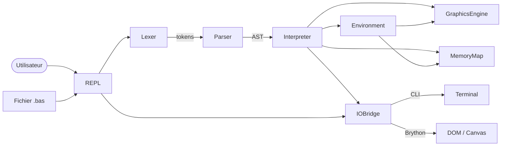
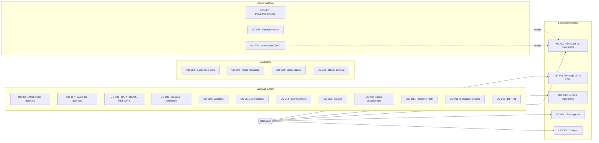
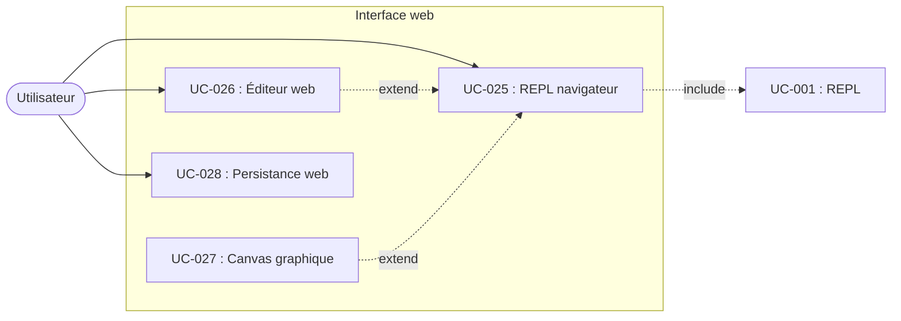

# AppleSoft BASIC Emulator — Spécification SDD (Cas d'utilisation)

Version : 2.0
Date : 2026-04-06
Auteur : Franz (Olaqin) / Claude (Anthropic)
Statut : Brouillon

## Changelog

| Version | Date | Auteur | Modifications |
|---|---|---|---|
| 2.0 | 2026-04-06 | Franz / Claude | Restructuration complète : passage d'une organisation par domaines/EXG à une organisation par cas d'utilisation (UC). Correction syntaxe LIST (tiret → virgule). 28 UC, 15 RG, 5 ENF. |
| 1.0 | 2026-02-14 | Franz / Claude | Version initiale (82 EXG par domaines techniques). |

## Contexte et objectifs

**Ce que le projet fait :** Un émulateur du langage Applesoft BASIC de l'Apple II, exécutable en ligne de commande Python puis dans un navigateur web via Brython.

**Pourquoi il existe :** C'est une application de démonstration à double vocation : offrir un émulateur fonctionnel pour les passionnés d'Apple II, et servir de cas d'usage concret pour valider la méthodologie Spec Driven Development (SDD) et le skill de rédaction de spécifications associé.

**Pour qui :** Les passionnés d'Apple II et de rétro-informatique, ainsi que les praticiens SDD souhaitant évaluer la qualité d'une spécification générée par le skill.

**Contraintes structurantes :**

- Python 3.10.12 minimum comme plateforme d'exécution.
- Brython comme runtime Python dans le navigateur (Phase 2) — le code doit rester compatible Python pur, sans dépendance C ou binaire.
- Pas de ROM Apple II disponible : les fonctionnalités dépendant du binaire de la ROM (PEEK/POKE sur des adresses ROM spécifiques, CALL vers des routines machine) doivent être émulées ou signalées comme non supportées.
- Respect des licences et de la propriété intellectuelle des documents de référence utilisés pour la grammaire et le comportement du langage.
- Aucune contrainte réglementaire ou normative.

**Acteurs identifiés :**

| Acteur | Rôle |
|---|---|
| Utilisateur | Personne qui interagit avec l'émulateur pour écrire, exécuter et déboguer des programmes Applesoft BASIC, en CLI (Phase 1) ou dans le navigateur (Phase 2). |

## Phases du projet

### Phase 1 — Interpréteur CLI Python

- **Périmètre :** Parseur et interpréteur Applesoft BASIC en Python, exécutable en ligne de commande. Inclut une boucle interactive (REPL) avec mode direct et mode différé, fidèle au comportement de l'Apple II. Couvre le cœur du langage (variables, expressions, structures de contrôle, entrées/sorties texte) et le graphisme (basse et haute résolution, rendu en mode texte ou export image). Les accès mémoire émulables (PEEK/POKE sur des adresses connues et documentées) sont inclus.
- **Livrable :** Un interpréteur Applesoft BASIC en Python exécutable en CLI, offrant un mode interactif (REPL) fidèle à l'expérience Apple II.
- **Dépendances :** Aucune.

### Phase 2 — Portage navigateur via Brython

- **Périmètre :** Adaptation de l'interpréteur Phase 1 pour exécution dans un navigateur web via Brython. Interface web intégrant un éditeur de code, une console de sortie texte et un canvas pour le rendu graphique.
- **Livrable :** Une application web statique (HTML + Brython) offrant la même expérience interactive que la Phase 1.
- **Dépendances :** Phase 1.

## Architecture

| Composant | Responsabilité |
|---|---|
| **REPL** | Boucle interactive fidèle au comportement Apple II. Affiche le prompt `]`, distingue le mode direct du mode différé. Gère les commandes système. |
| **Lexer** | Découpe le code source en tokens. Gère la correspondance gloutonne des mots réservés (RG-0002). |
| **Parser** | Construit un AST à partir des tokens. Valide la syntaxe selon GRAMMAR.md. |
| **Interpreter** | Parcourt l'AST et exécute les instructions. Gère l'état du programme. |
| **Environment** | Maintient l'état d'exécution : variables, tableaux, piles GOSUB/FOR, pointeur DATA, état graphique. |
| **GraphicsEngine** | Gère le rendu des modes graphiques basse et haute résolution. |
| **IOBridge** | Abstrait les entrées/sorties pour deux backends : CLI (stdin/stdout) et navigateur (DOM/canvas). |
| **MemoryMap** | Émule un sous-ensemble d'adresses mémoire Apple II pour PEEK, POKE et CALL (RG-0011). |

```mermaid
graph LR
    USER([Utilisateur]) --> REPL
    SRC[Fichier .bas] --> REPL
    REPL --> LEX[Lexer]
    LEX -->|tokens| PAR[Parser]
    PAR -->|AST| INT[Interpreter]
    INT --> ENV[Environment]
    INT --> GFX[GraphicsEngine]
    INT --> IO[IOBridge]
    INT --> MEM[MemoryMap]
    ENV --> GFX
    ENV --> MEM
    REPL --> IO
    IO -->|CLI| TERM[Terminal]
    IO -->|Brython| DOM[DOM / Canvas]
```

## Documents de référence

| Document | Description |
|---|---|
| GRAMMAR.md | Grammaire formelle du sous-ensemble Applesoft BASIC supporté, en notation EBNF. |

**Sources externes (propriété intellectuelle tierce) :**

| Source | Usage | Licence / Statut |
|---|---|---|
| *Applesoft II BASIC Programming Reference Manual* (Apple Computer, 1978) | Référence pour la sémantique des instructions. | Document historique Apple. |
| Joshua Bell — Applesoft BASIC in JavaScript (calormen.com/jsbasic) | Référence croisée pour la grammaire et le comportement. | MIT License. |
| dfgordon/tree-sitter-applesoft (GitHub) | Référence croisée pour la grammaire formelle. | MIT License. |

## Niveaux de support

### Supporté

| Fonctionnalité | Comportement | UC lié |
|---|---|---|
| Instructions BASIC complètes | Fidèle à l'original | UC-006 à UC-017 |
| Mode direct et mode différé (REPL) | Fidèle à l'original | UC-001 |
| Commandes système (RUN, LIST, NEW, DEL, CONT) | Fidèle à l'original | UC-002, UC-003 |
| Graphisme basse résolution | Fidèle à l'original | UC-018 |
| Graphisme haute résolution | Fidèle à l'original | UC-019 |
| Shape tables (DRAW, XDRAW, ROT=, SCALE=) | Fidèle à l'original | UC-020 |
| PEEK/POKE sur adresses documentées | Émulation via MemoryMap | UC-022 |
| CALL sur adresses connues | Émulation par fonctions Python | UC-022 |
| ONERR GOTO / RESUME | Fidèle à l'original | UC-023 |
| SAVE/LOAD | Adapté à chaque plateforme | UC-004, UC-005, UC-028 |
| Messages d'erreur (format et codes) | Fidèle à l'original | RG-0010 |

### Ignoré (no-op silencieux)

| Fonctionnalité | Raison |
|---|---|
| `POKE` sur adresses non documentées | Stocké en mémoire, pas d'effet de bord. Relisible par PEEK. |
| `POKE 49200,0` (clic speaker) | Le son est hors périmètre Phase 1. |
| `HIMEM:` / `LOMEM:` | Gestion mémoire bas niveau non pertinente sans vrai espace mémoire 6502. |
| `IN#` / `PR#` (périphériques de slot) | Pas de slots émulés. `PR#3` pourrait activer le mode 80 colonnes en Phase 2. |
| `WAIT` (attente sur adresse mémoire) | Dépend du bus hardware non émulé. |
| `CLEAR` | Réinitialise les variables — peut être implémentée trivialement mais non prioritaire. |

### Erreur explicite

| Fonctionnalité | Message d'erreur | Raison |
|---|---|---|
| `CALL` sur adresse non reconnue (mode strict) | `?ILLEGAL QUANTITY ERROR` | Pas de CPU 6502. |
| `PEEK` sur adresses ROM non émulées | Retourne 0 + avertissement optionnel | ROM non disponible. |
| `SHLOAD` | `?SYNTAX ERROR` | Pas d'émulation cassette. |
| `STORE` / `RECALL` | `?SYNTAX ERROR` | Pas d'émulation cassette. |

## Hors périmètre

- **Émulation du CPU 6502** — Pas d'exécution de code machine. Seules les adresses CALL documentées sont émulées.
- **Son** — Le speaker Apple II ($C030) n'est pas émulé.
- **Accès disque** — Les commandes DOS 3.3 et ProDOS ne sont pas supportées.
- **Émulation cassette** — SHLOAD, STORE, RECALL ne sont pas supportés.
- **Réseau et communication série** — Pas d'émulation de carte Super Serial ou modem.
- **Périphériques de slot** — Pas d'émulation des slots d'extension.
- **Copie conforme bit-à-bit de la mémoire Apple II** — Sous-ensemble documenté uniquement.
- **Double haute résolution** — Le mode DHGR (560×192, Apple IIe 128 Ko) n'est pas supporté.
- **Apple IIe étendu** — Mémoire auxiliaire, MouseText hors périmètre (sauf mode 80 colonnes pour l'affichage en Phase 2).
- **Internationalisation** — Messages d'erreur et interface en anglais uniquement.
- **Accessibilité** — Pas d'exigence WCAG en Phase 1.

## Arborescence des cas d'utilisation

| Package (niveau 2) | Package (niveau 1) | UC | Intitulé |
|---|---|---|---|
| Session interactive | Boucle REPL | UC-001 | Interagir via le REPL |
| | | UC-002 | Gérer le programme en mémoire |
| | | UC-003 | Exécuter un programme |
| | Persistance | UC-004 | Sauvegarder un programme |
| | | UC-005 | Charger un programme |
| Langage BASIC | Entrées/Sorties | UC-006 | Afficher des données |
| | | UC-007 | Saisir des données |
| | | UC-008 | Utiliser DATA / READ / RESTORE |
| | | UC-009 | Contrôler l'affichage |
| | Variables et expressions | UC-010 | Assigner et manipuler des variables |
| | | UC-011 | Évaluer des expressions |
| | Structures de contrôle | UC-012 | Brancher l'exécution |
| | | UC-013 | Boucler |
| | | UC-014 | Appeler des sous-programmes |
| | Fonctions | UC-015 | Utiliser les fonctions mathématiques |
| | | UC-016 | Utiliser les fonctions de chaînes |
| | | UC-017 | Définir une fonction utilisateur |
| Graphisme | Basse résolution | UC-018 | Dessiner en basse résolution |
| | Haute résolution | UC-019 | Dessiner en haute résolution |
| | | UC-020 | Utiliser les shape tables |
| | Rendu CLI | UC-021 | Rendre les graphiques en terminal |
| Accès système | Mémoire émulée | UC-022 | Lire/écrire la mémoire |
| | Gestion d'erreurs | UC-023 | Gérer les erreurs d'exécution |
| | | UC-024 | Interrompre l'exécution |
| Interface web (Phase 2) | Console et interface | UC-025 | Utiliser le REPL dans le navigateur |
| | | UC-026 | Éditer un programme dans l'éditeur web |
| | Rendu web | UC-027 | Afficher les graphiques sur canvas |
| | Persistance web | UC-028 | Sauvegarder/charger via le navigateur |

## Diagramme des cas d'utilisation — Phase 1

```mermaid
graph LR
    U([Utilisateur])

    subgraph "Session interactive"
        UC001[UC-001 : Interagir via le REPL]
        UC002[UC-002 : Gérer le programme]
        UC003[UC-003 : Exécuter un programme]
        UC004[UC-004 : Sauvegarder]
        UC005[UC-005 : Charger]
    end

    subgraph "Langage BASIC"
        UC006[UC-006 : Afficher des données]
        UC007[UC-007 : Saisir des données]
        UC008[UC-008 : DATA / READ / RESTORE]
        UC009[UC-009 : Contrôler l'affichage]
        UC010[UC-010 : Variables]
        UC011[UC-011 : Expressions]
        UC012[UC-012 : Branchements]
        UC013[UC-013 : Boucles]
        UC014[UC-014 : Sous-programmes]
        UC015[UC-015 : Fonctions math]
        UC016[UC-016 : Fonctions chaînes]
        UC017[UC-017 : DEF FN]
    end

    subgraph "Graphisme"
        UC018[UC-018 : Basse résolution]
        UC019[UC-019 : Haute résolution]
        UC020[UC-020 : Shape tables]
        UC021[UC-021 : Rendu terminal]
    end

    subgraph "Accès système"
        UC022[UC-022 : PEEK/POKE/CALL]
        UC023[UC-023 : Gestion erreurs]
        UC024[UC-024 : Interruption Ctrl+C]
    end

    U --> UC001
    U --> UC002
    U --> UC003
    U --> UC004
    U --> UC005
    UC024 -.->|extend| UC003
    UC023 -.->|extend| UC003
```

## Diagramme des cas d'utilisation — Phase 2

```mermaid
graph LR
    U([Utilisateur])

    subgraph "Interface web"
        UC025[UC-025 : REPL navigateur]
        UC026[UC-026 : Éditeur web]
        UC027[UC-027 : Canvas graphique]
        UC028[UC-028 : Persistance web]
    end

    U --> UC025
    U --> UC026
    U --> UC028
    UC025 -.->|include| UC001[UC-001 : REPL]
    UC026 -.->|extend| UC025
    UC027 -.->|extend| UC025
```

## Règles de gestion

Les règles de gestion ci-dessous s'appliquent transversalement aux cas d'utilisation. Chaque UC référence les RG pertinentes dans sa section dédiée.

### RG-0001 : Tokenisation du code source

Le lexer découpe une ligne de code source Applesoft BASIC en une séquence de tokens. Les catégories de tokens sont : numéro de ligne, mot réservé (keyword), identifiant de variable, littéral numérique (entier ou flottant), littéral chaîne (délimité par `"`), opérateur, séparateur (`:`, `;`, `,`), parenthèse, et fin de ligne. Les espaces en dehors des chaînes sont ignorés.

**Critères d'acceptation :**

- **CA-RG-0001-01 :** Soit la ligne `10 PRINT "HELLO"`, Quand le lexer la tokenize, Alors la séquence produite est : `[LINENUM:10, KEYWORD:PRINT, STRING:"HELLO"]`.
- **CA-RG-0001-02 :** Soit la ligne `A = 3.14 + B`, Quand le lexer la tokenize, Alors la séquence produite est : `[IDENT:A, OP:=, NUMBER:3.14, OP:+, IDENT:B]`.
- **CA-RG-0001-03 :** Soit la ligne `10 PRINT"HELLO"`, Quand le lexer la tokenize, Alors la séquence est identique à `10 PRINT "HELLO"` (les espaces sont optionnels entre un keyword et un littéral chaîne).
- **CA-RG-0001-04 :** Soit une ligne vide, Quand le lexer la tokenize, Alors il produit une séquence vide ou un unique token de fin de ligne.
- **CA-RG-0001-05 :** Soit la ligne `10 PRINT "HELLO` (chaîne non fermée), Quand le lexer la tokenize, Alors la chaîne se termine implicitement en fin de ligne (pas d'erreur, guillemet fermant optionnel).

### RG-0002 : Reconnaissance des mots réservés dans le flux de caractères

Applesoft BASIC ne requiert pas de séparateur entre les mots réservés et les identifiants. Le lexer reconnaît les mots réservés par correspondance gloutonne (longest match) directement dans le flux de caractères. Les mots réservés sont prioritaires sur les identifiants. Voir GRAMMAR.md pour la liste complète.

**Critères d'acceptation :**

- **CA-RG-0002-01 :** Soit la ligne `10 FORI=1TO10`, Quand le lexer la tokenize, Alors la séquence est : `[LINENUM:10, KEYWORD:FOR, IDENT:I, OP:=, NUMBER:1, KEYWORD:TO, NUMBER:10]`.
- **CA-RG-0002-02 :** Soit la ligne `10 IFATHENPRINT"OK"`, Quand le lexer la tokenize, Alors le tokenizer applique la correspondance gloutonne à chaque position : après `IF`, le mot réservé `AT` matche avant que `THEN` ne puisse être reconnu. Résultat : `[LINENUM:10, KEYWORD:IF, KEYWORD:AT, IDENT:HEN, KEYWORD:PRINT, STRING:"OK"]`.
- **CA-RG-0002-03 :** Soit la ligne `10 GOTO100`, Quand le lexer la tokenize, Alors la séquence est : `[LINENUM:10, KEYWORD:GOTO, NUMBER:100]`.
- **CA-RG-0002-04 :** Soit le mot `SCORE`, Quand le lexer le tokenize, Alors il produit `[IDENT:SC, KEYWORD:OR, IDENT:E]` (le mot réservé OR est détecté dans le flux).
- **CA-RG-0002-05 :** Soit le mot `NOTATION`, Quand le lexer le tokenize, Alors il applique la correspondance gloutonne caractère par caractère : `NOT` est reconnu en premier, puis `AT`, puis dans le reste `ION`, `I` ne matche aucun mot réservé, et `ON` est reconnu. Résultat : `[KEYWORD:NOT, KEYWORD:AT, IDENT:I, KEYWORD:ON]`.

### RG-0003 : Identifiants de variables — règle des deux caractères

Un identifiant de variable commence par une lettre (A-Z) et peut être suivi de lettres ou chiffres. Seuls les deux premiers caractères sont significatifs pour distinguer les variables : `LOW` et `LOSS` sont la même variable. Le suffixe `$` désigne une variable chaîne, le suffixe `%` une variable entière. Les suffixes font partie de l'identifiant : A, A$ et A% sont trois variables distinctes.

**Critères d'acceptation :**

- **CA-RG-0003-01 :** Soit le programme `10 LOW=5 : PRINT LOSS`, Quand exécuté, Alors `5` est affiché (LOW et LOSS sont la même variable).
- **CA-RG-0003-02 :** Soit le programme `10 A=1 : A$="X" : A%=2 : PRINT A;A$;A%`, Quand exécuté, Alors `1X2` est affiché.

### RG-0004 : Littéraux numériques

Le lexer reconnaît : entiers (`42`), flottants (`3.14`, `.5`, `10.`), notation scientifique (`1E3`, `2.5E-10`). Les nombres négatifs ne sont pas des littéraux : le signe `-` est un opérateur unaire.

**Critères d'acceptation :**

- **CA-RG-0004-01 :** Soit la ligne `X = 3.14`, Quand tokenizée, Alors un token NUMBER de valeur 3.14 est produit.
- **CA-RG-0004-02 :** Soit la ligne `X = 1E3`, Quand tokenizée, Alors un token NUMBER de valeur 1000 est produit.
- **CA-RG-0004-03 :** Soit la ligne `X = .5`, Quand tokenizée, Alors un token NUMBER de valeur 0.5 est produit.
- **CA-RG-0004-04 :** Soit `10.5.3`, Quand tokenizé, Alors le lexer produit `NUMBER:10.5` puis `NUMBER:.3` (deux littéraux distincts).

### RG-0005 : Littéraux chaîne

Un littéral chaîne commence par `"`. Il se termine par le prochain `"` ou par la fin de la ligne (guillemet fermant optionnel, fidèle à l'Apple II). Pas de mécanisme d'échappement. Les chaînes peuvent contenir n'importe quel caractère imprimable sauf `"`.

**Critères d'acceptation :**

- **CA-RG-0005-01 :** Soit `PRINT "HELLO WORLD"`, Quand tokenizé, Alors un token STRING de valeur `HELLO WORLD` est produit.
- **CA-RG-0005-02 :** Soit `PRINT "HELLO`, Quand tokenizé, Alors un token STRING de valeur `HELLO` est produit.
- **CA-RG-0005-03 :** Soit `""`, Quand tokenizé, Alors un token STRING de valeur vide est produit.

### RG-0006 : Types de données numériques

Applesoft BASIC utilise des flottants simple précision (émulés en double précision Python IEEE 754). Les variables suffixées `%` stockent des entiers signés 16 bits (-32768 à 32767). L'affichage suit les conventions Applesoft : pas de zéros inutiles, espace avant les nombres positifs, notation scientifique au-delà de 9 chiffres.

**Critères d'acceptation :**

- **CA-RG-0006-01 :** Soit `PRINT 3.14`, Quand exécuté, Alors ` 3.14` est affiché (espace pour le signe positif).
- **CA-RG-0006-02 :** Soit `PRINT -5`, Quand exécuté, Alors `-5` est affiché (pas d'espace avant le signe négatif).
- **CA-RG-0006-03 :** Soit `PRINT 1000000000`, Quand exécuté, Alors ` 1E+09` est affiché.
- **CA-RG-0006-04 :** Soit `X% = 32768`, Quand exécuté, Alors `?ILLEGAL QUANTITY ERROR`.
- **CA-RG-0006-05 :** Soit `X% = 3.7`, Quand exécuté, Alors la valeur est tronquée à `3` (pas d'arrondi).
- **CA-RG-0006-06 :** Soit `X = 1E39`, Quand exécuté, Alors `?OVERFLOW ERROR`.

### RG-0007 : Type chaîne de caractères

Les variables suffixées `$` stockent des chaînes de 255 caractères maximum. Concaténation par `+`. Variable chaîne non initialisée = `""`.

**Critères d'acceptation :**

- **CA-RG-0007-01 :** Soit `A$ = "HELLO" : B$ = " WORLD" : PRINT A$ + B$`, Quand exécuté, Alors `HELLO WORLD` est affiché.
- **CA-RG-0007-02 :** Soit une concaténation produisant plus de 255 caractères, Quand exécutée, Alors `?STRING TOO LONG ERROR`.
- **CA-RG-0007-03 :** Soit `A$ = 5`, Quand exécuté, Alors `?TYPE MISMATCH ERROR`.
- **CA-RG-0007-04 :** Soit `A = "TEXT"`, Quand exécuté, Alors `?TYPE MISMATCH ERROR`.

### RG-0008 : Instructions multi-commandes (séparateur `:`)

Plusieurs instructions peuvent apparaître sur une même ligne, séparées par `:`. Elles sont exécutées séquentiellement de gauche à droite.

**Critères d'acceptation :**

- **CA-RG-0008-01 :** Soit `PRINT "A" : PRINT "B"`, Quand exécuté, Alors `A` puis `B` sont affichés sur des lignes séparées.
- **CA-RG-0008-02 :** Soit `10 X=1 : Y=2 : PRINT X+Y`, Quand exécuté via RUN, Alors `3` est affiché.
- **CA-RG-0008-03 :** Soit `REM commentaire : PRINT "A"`, Quand exécuté, Alors rien n'est affiché (le `:` après REM fait partie du commentaire — voir RG-0009).
- **CA-RG-0008-04 :** Soit `PRINT "A:B"`, Quand exécuté, Alors `A:B` est affiché (le `:` dans une chaîne n'est pas un séparateur).

### RG-0009 : Instruction REM (commentaires)

`REM` introduit un commentaire. Tout le texte après `REM` jusqu'à la fin de la ligne physique est ignoré. Le séparateur `:` après `REM` ne délimite pas une nouvelle instruction.

**Critères d'acceptation :**

- **CA-RG-0009-01 :** Soit `10 REM CECI EST UN COMMENTAIRE` / `20 PRINT "OK"`, Quand exécuté via RUN, Alors seul `OK` est affiché.
- **CA-RG-0009-02 :** Soit `10 REM TEXTE : PRINT "CACHÉ"`, Quand exécuté via RUN, Alors rien n'est affiché.
- **CA-RG-0009-03 :** Soit `10 REM` sans texte, Quand exécuté, Alors aucun effet.
- **CA-RG-0009-04 :** Soit `LIST` sur un programme contenant des lignes REM, Quand exécuté, Alors les commentaires sont affichés intacts.

### RG-0010 : Messages d'erreur Applesoft

L'émulateur reproduit fidèlement les messages d'erreur Applesoft. Le format est `?MESSAGE ERROR [IN linenum]`. Le numéro de ligne est affiché uniquement quand l'erreur survient pendant l'exécution d'un programme (pas en mode direct).

| Code | Message |
|---|---|
| 0 | NEXT WITHOUT FOR |
| 16 | SYNTAX |
| 22 | RETURN WITHOUT GOSUB |
| 42 | OUT OF DATA |
| 53 | ILLEGAL QUANTITY |
| 69 | OVERFLOW |
| 77 | OUT OF MEMORY |
| 90 | UNDEF'D STATEMENT |
| 107 | BAD SUBSCRIPT |
| 120 | REDIM'D ARRAY |
| 133 | DIVISION BY ZERO |
| 163 | TYPE MISMATCH |
| 176 | STRING TOO LONG |
| 224 | UNDEF'D FUNCTION |
| 254 | CAN'T CONTINUE |
| 255 | FORMULA TOO COMPLEX |

**Critères d'acceptation :**

- **CA-RG-0010-01 :** Soit `10 X=1/0`, Quand exécuté via RUN, Alors `?DIVISION BY ZERO ERROR IN 10` est affiché.
- **CA-RG-0010-02 :** Soit `X=1/0` en mode direct, Quand exécuté, Alors `?DIVISION BY ZERO ERROR` est affiché (sans numéro de ligne).
- **CA-RG-0010-03 :** Soit `10 X=1 : Y=1/0 : Z=3`, Quand exécuté via RUN, Alors `?DIVISION BY ZERO ERROR IN 10` (numéro de la ligne entière, pas de la sous-instruction).

### RG-0011 : Table des adresses mémoire émulées

| Adresse | Nom | PEEK | POKE | Description |
|---|---|---|---|---|
| 222 | ERRNUM | Oui | — | Code de la dernière erreur |
| 218-219 | ERRLIN | Oui | — | Numéro de ligne de la dernière erreur |
| 49152 ($C000) | KBD | Oui | — | Dernière touche pressée (bit 7 = 1 si nouvelle) |
| 49168 ($C010) | KBDSTRB | Oui | Oui | Strobe clavier (réinitialise bit 7 de KBD) |
| 49200 ($C030) | SPKR | — | Oui | Clic speaker (émulé ou ignoré) |
| 48 ($30) | TXTMODE | Oui | — | Mode texte/graphique courant |
| 103-104 | TXTTAB | Oui | — | Adresse début programme (émulée) |

### RG-0012 : Police de caractères Apple II (Phase 2)

L'interface web utilise une police reproduisant le jeu de caractères Apple II (matrice 7×8 pixels, majuscules, glyphes anguleux). Deux modes : 40 colonnes (standard) et 80 colonnes (Apple IIe). L'affichage supporte les trois modes vidéo : NORMAL, INVERSE et FLASH (clignotement ~1.9 Hz).

### RG-0013 : Contraintes de code Python pour Brython (Phase 2)

Le code du cœur de l'interpréteur doit être du Python pur : pas de modules C natifs, pas d'accès filesystem direct, pas de threads. Seul l'IOBridge a deux implémentations distinctes.

### RG-0014 : Isolation Brython/DOM (Phase 2)

L'IOBridgeWeb est la seule couche du code Python dépendant de Brython. Le reste est du Python standard réutilisable en Phase 1.

### RG-0015 : Gestion asynchrone de l'exécution (Phase 2)

L'interpréteur exécute les instructions par tranches (time-slicing) pour ne pas bloquer le thread principal du navigateur. Les opérations bloquantes (INPUT, GET, SPEED=) sont gérées de manière asynchrone.

---

## Cas d'utilisation détaillés

---

**📦 Session interactive**

**Boucle REPL**

### **UC-001** : Interagir via le REPL

**Résumé :** L'utilisateur lance l'émulateur en mode interactif. Le REPL affiche le prompt `]` et attend une saisie. Chaque ligne est analysée : si elle commence par un numéro de ligne (mode différé), elle est stockée en mémoire programme ; sinon (mode direct), elle est exécutée immédiatement. Après chaque action, le prompt est réaffiché.

**Acteurs :** Utilisateur

**Fréquence d'utilisation :** À chaque interaction (continue)

**Priorité :** Critique

**État initial :** L'émulateur est lancé en mode interactif.

**État final :** L'utilisateur quitte l'émulateur (Ctrl+D ou commande de sortie).

**Relations :**
- Include : Aucune
- Extend : UC-024 — interruption par Ctrl+C
- Généralisation : Aucune

**Étapes (cas nominal) :**

| # | Direction | Description |
|---|---|---|
| 1a | → Utilisateur | Lance l'émulateur en mode interactif. |
| 1b | ← Système | Affiche le prompt `]` et attend une saisie. |
| 2a | → Utilisateur | Saisit une ligne de texte et appuie sur RETURN. |
| 2b | ← Système | Analyse la ligne (RG-0001, RG-0002). Si elle commence par un numéro de ligne valide (0-63999), stocke la ligne en mémoire programme triée par numéro croissant. Sinon, exécute la ligne immédiatement et affiche le résultat. Réaffiche le prompt `]`. Retour à 2a. |

**Exceptions :**

| Id étape | Condition | Réaction du système |
|---|---|---|
| 2a | L'utilisateur saisit une ligne vide (RETURN seul) | Le prompt est réaffiché sans erreur. Retour à 2a. |
| 2b | La ligne en mode direct contient une erreur de syntaxe | Le message d'erreur Applesoft est affiché (RG-0010), le prompt est réaffiché. Retour à 2a. |
| 2b | Le numéro de ligne est supérieur à 63999 | `?SYNTAX ERROR` est affiché. Retour à 2a. |
| 2b | La ligne numérotée ne contient qu'un numéro (ex: `10`) | La ligne correspondante est supprimée de la mémoire programme. Si elle n'existe pas, aucune erreur. Retour à 2a. |
| 2b | La ligne numérotée a le même numéro qu'une ligne existante | La ligne existante est remplacée. Retour à 2a. |
| 2b | La ligne dépasse 239 caractères | Tronquée à 239 caractères (fidèle Apple II). |

**Règles de gestion :**

| n° RG | Id étape | Énoncé |
|---|---|---|
| RG-0001 | 2b | Tokenisation du code source. |
| RG-0002 | 2b | Reconnaissance des mots réservés par correspondance gloutonne. |
| RG-0008 | 2b | Instructions multi-commandes séparées par `:`. |
| RG-0009 | 2b | REM introduit un commentaire jusqu'en fin de ligne. |

**IHM :** Terminal CLI — prompt `]`.

**Objets participants :** Programme en mémoire, ligne de programme, token.

**Contraintes non fonctionnelles :** Voir ENF-002 (temps de démarrage < 1s).

**Critères d'acceptation :**

- **CA-UC-001-01 :** Soit l'émulateur démarré en mode interactif, Quand aucune saisie n'a été faite, Alors le prompt `]` est affiché et l'émulateur attend une entrée.
- **CA-UC-001-02 :** Soit le prompt affiché, Quand l'utilisateur saisit `PRINT "HELLO"` (sans numéro de ligne), Alors `HELLO` est affiché et le prompt `]` est réaffiché.
- **CA-UC-001-03 :** Soit le prompt affiché, Quand l'utilisateur saisit `10 PRINT "HELLO"`, Alors la ligne est stockée en mémoire programme sans rien exécuter, et le prompt `]` est réaffiché.
- **CA-UC-001-04 :** Soit un programme vide en mémoire, Quand l'utilisateur saisit `20 PRINT "B"` puis `10 PRINT "A"`, Alors le programme contient les deux lignes dans l'ordre 10, 20.
- **CA-UC-001-05 :** Soit la ligne `10 PRINT "A"` en mémoire, Quand l'utilisateur saisit `10 PRINT "Z"`, Alors la ligne 10 contient désormais `PRINT "Z"`.
- **CA-UC-001-06 :** Soit la ligne `10 PRINT "A"` en mémoire, Quand l'utilisateur saisit `10` (numéro seul), Alors la ligne 10 est supprimée du programme.

---

### **UC-002** : Gérer le programme en mémoire

**Résumé :** L'utilisateur consulte, efface ou supprime partiellement le programme stocké en mémoire via les commandes LIST, NEW et DEL.

**Acteurs :** Utilisateur

**Fréquence d'utilisation :** Plusieurs fois par session

**Priorité :** Critique

**État initial :** Le REPL est actif (UC-001).

**État final :** Le programme en mémoire a été consulté ou modifié, le prompt est réaffiché.

**Relations :**
- Include : Aucune
- Extend : Aucune
- Généralisation : Aucune

**Étapes (cas nominal) :**

| # | Direction | Description |
|---|---|---|
| 1a | → Utilisateur | Saisit une commande de gestion (LIST, NEW, DEL). |
| 1b | ← Système | Exécute la commande et affiche le résultat. Réaffiche le prompt. |

**Exceptions :**

| Id étape | Condition | Réaction du système |
|---|---|---|
| 1b | `LIST` sans programme en mémoire | Rien n'est affiché, le prompt revient. |
| 1b | `LIST 99` alors que la ligne 99 n'existe pas | Rien n'est affiché, le prompt revient. |
| 1b | `NEW` alors que la mémoire est déjà vide | Aucune erreur, le prompt est réaffiché. |
| 1b | `DEL 50,60` sans ligne dans cette plage | Aucune erreur, le prompt est réaffiché. |
| 1b | `DEL` sans arguments | `?SYNTAX ERROR`. |

**Règles de gestion :**

| n° RG | Id étape | Énoncé |
|---|---|---|
| RG-0010 | 1b | Format des messages d'erreur. |

**IHM :** Terminal CLI.

**Objets participants :** Programme en mémoire.

**Contraintes non fonctionnelles :** Aucune spécifique.

**Critères d'acceptation :**

- **CA-UC-002-01 :** Soit le programme `10 PRINT "A"` / `20 PRINT "B"` / `30 PRINT "C"` en mémoire, Quand l'utilisateur saisit `LIST`, Alors les trois lignes sont affichées dans l'ordre.
- **CA-UC-002-02 :** Soit le même programme, Quand l'utilisateur saisit `LIST 20`, Alors seule la ligne `20 PRINT "B"` est affichée.
- **CA-UC-002-03 :** Soit le même programme, Quand l'utilisateur saisit `LIST 10,20`, Alors les lignes 10 à 20 sont affichées.
- **CA-UC-002-04 :** Soit le programme `10 PRINT "A"` en mémoire et la variable X=5 définie, Quand l'utilisateur saisit `NEW`, Alors `LIST` n'affiche rien et `PRINT X` affiche `0`.
- **CA-UC-002-05 :** Soit le programme `10 PRINT "A"` / `20 PRINT "B"` / `30 PRINT "C"` en mémoire, Quand l'utilisateur saisit `DEL 10,20`, Alors seule la ligne 30 reste en mémoire.
- **CA-UC-002-06 :** Soit le même programme, Quand l'utilisateur saisit `DEL 20,20`, Alors seule la ligne 20 est supprimée.

---

### **UC-003** : Exécuter un programme

**Résumé :** L'utilisateur lance l'exécution du programme en mémoire via RUN, ou reprend une exécution interrompue via CONT. Le programme s'exécute jusqu'à END, STOP, une erreur, ou la fin du code.

**Acteurs :** Utilisateur

**Fréquence d'utilisation :** Plusieurs fois par session

**Priorité :** Critique

**État initial :** Le REPL est actif et un programme est en mémoire.

**État final :** L'exécution est terminée (END, STOP, erreur, ou fin de programme), le prompt est réaffiché.

**Relations :**
- Include : Aucune
- Extend : UC-023 — gestion d'erreurs (ONERR GOTO), UC-024 — interruption Ctrl+C
- Généralisation : Aucune

**Étapes (cas nominal) :**

| # | Direction | Description |
|---|---|---|
| 1a | → Utilisateur | Saisit `RUN` (ou `RUN linenum`). |
| 1b | ← Système | Réinitialise toutes les variables. Commence l'exécution à la première ligne (ou à la ligne spécifiée). Exécute les instructions séquentiellement. |
| 2b | ← Système | À la fin du programme ou sur `END`, le contrôle revient au prompt. |

**Exceptions :**

| Id étape | Condition | Réaction du système |
|---|---|---|
| 1b | `RUN` sans programme en mémoire | Le prompt est réaffiché sans erreur. |
| 1b | `RUN 99` alors que la ligne 99 n'existe pas | `?UNDEF'D STATEMENT ERROR`. |
| 2b | L'instruction `STOP` est rencontrée | Affiche `BREAK IN linenum`, retour au prompt. `CONT` peut reprendre. |
| 2b | L'utilisateur saisit `CONT` après un STOP/END | L'exécution reprend à l'instruction suivant le point d'arrêt, les variables conservent leur état. |
| 2b | `CONT` sans programme interrompu | `?CAN'T CONTINUE ERROR`. |
| 2b | `CONT` après modification du programme | `?CAN'T CONTINUE ERROR`. |
| 2b | Le programme atteint sa dernière ligne sans END | Terminaison implicite, retour au prompt. |

**Règles de gestion :**

| n° RG | Id étape | Énoncé |
|---|---|---|
| RG-0008 | 1b | Instructions multi-commandes séparées par `:`. |
| RG-0010 | 2b | Format des messages d'erreur avec numéro de ligne. |

**IHM :** Terminal CLI.

**Objets participants :** Programme en mémoire, environnement d'exécution, pile d'appels.

**Contraintes non fonctionnelles :** Voir ENF-002 (boucle 10000 itérations < 2s).

**Critères d'acceptation :**

- **CA-UC-003-01 :** Soit le programme `10 PRINT "A"` / `20 PRINT "B"`, Quand l'utilisateur saisit `RUN`, Alors `A` puis `B` sont affichés, suivis du prompt.
- **CA-UC-003-02 :** Soit le même programme, Quand l'utilisateur saisit `RUN 20`, Alors seul `B` est affiché.
- **CA-UC-003-03 :** Soit `10 X=5` / `20 PRINT X`, Quand `RUN` est exécuté, Alors `5` est affiché.
- **CA-UC-003-04 :** Soit `10 PRINT "A" : END : PRINT "B"`, Quand `RUN` est exécuté, Alors seul `A` est affiché.
- **CA-UC-003-05 :** Soit `10 PRINT "A" : STOP : PRINT "B"`, Quand `RUN` est exécuté, Alors `A` est affiché, puis `BREAK IN 10`, puis le prompt. `CONT` affiche ensuite `B`.
- **CA-UC-003-06 :** Soit `10 X=1` / `20 STOP` / `30 PRINT X`, Quand `RUN` puis `X=99` puis `CONT`, Alors `99` est affiché (la variable modifiée en mode direct est conservée).

---

**Persistance**

### **UC-004** : Sauvegarder un programme

**Résumé :** L'utilisateur sauvegarde le programme en mémoire dans un fichier via la commande SAVE.

**Acteurs :** Utilisateur

**Fréquence d'utilisation :** À la demande

**Priorité :** Important

**État initial :** Le REPL est actif et un programme est en mémoire.

**État final :** Un fichier contenant le programme au format texte (format LIST) est créé.

**Relations :**
- Include : Aucune
- Extend : Aucune
- Généralisation : Aucune

**Étapes (cas nominal) :**

| # | Direction | Description |
|---|---|---|
| 1a | → Utilisateur | Saisit `SAVE "filename"`. |
| 1b | ← Système | Écrit le programme en mémoire dans le fichier spécifié au format texte. Réaffiche le prompt. |

**Exceptions :**

| Id étape | Condition | Réaction du système |
|---|---|---|
| 1a | `SAVE` sans nom de fichier | `?SYNTAX ERROR`. |
| 1b | Le fichier cible existe déjà | Il est écrasé sans avertissement (fidèle Apple II). |

**Règles de gestion :** Aucune spécifique.

**IHM :** Terminal CLI.

**Objets participants :** Programme en mémoire, fichier.

**Contraintes non fonctionnelles :** Aucune spécifique.

**Critères d'acceptation :**

- **CA-UC-004-01 :** Soit le programme `10 PRINT "A"` / `20 PRINT "B"` en mémoire, Quand l'utilisateur saisit `SAVE "TEST.BAS"`, Alors un fichier `TEST.BAS` est créé contenant les deux lignes au format texte.

---

### **UC-005** : Charger un programme

**Résumé :** L'utilisateur charge un programme depuis un fichier via la commande LOAD, remplaçant le programme actuel en mémoire.

**Acteurs :** Utilisateur

**Fréquence d'utilisation :** À la demande

**Priorité :** Important

**État initial :** Le REPL est actif.

**État final :** Le programme en mémoire est remplacé par le contenu du fichier, les variables sont réinitialisées.

**Relations :**
- Include : Aucune
- Extend : Aucune
- Généralisation : Aucune

**Étapes (cas nominal) :**

| # | Direction | Description |
|---|---|---|
| 1a | → Utilisateur | Saisit `LOAD "filename"`. |
| 1b | ← Système | Charge le fichier, remplace le programme en mémoire, réinitialise les variables. Réaffiche le prompt. |

**Exceptions :**

| Id étape | Condition | Réaction du système |
|---|---|---|
| 1a | `LOAD` sans nom de fichier | `?SYNTAX ERROR`. |
| 1b | Le fichier n'existe pas | `?FILE NOT FOUND`. |

**Règles de gestion :** Aucune spécifique.

**IHM :** Terminal CLI.

**Objets participants :** Programme en mémoire, fichier.

**Contraintes non fonctionnelles :** Aucune spécifique.

**Critères d'acceptation :**

- **CA-UC-005-01 :** Soit un fichier `TEST.BAS` contenant `10 PRINT "A"` / `20 PRINT "B"`, Quand l'utilisateur saisit `LOAD "TEST.BAS"`, Alors le programme en mémoire contient ces deux lignes et les variables précédentes sont effacées.
- **CA-UC-005-02 :** Soit un programme existant en mémoire, Quand l'utilisateur saisit `LOAD "TEST.BAS"`, Alors l'ancien programme est intégralement remplacé.

---

**📦 Langage BASIC**

**Entrées/Sorties**

### **UC-006** : Afficher des données

**Résumé :** Le programme affiche des expressions (numériques ou chaînes) sur la sortie via PRINT. Couvre les séparateurs `;` et `,`, l'alias `?`, les fonctions de positionnement SPC et TAB, et la fonction POS.

**Acteurs :** Utilisateur

**Fréquence d'utilisation :** Très fréquent (instruction la plus utilisée)

**Priorité :** Critique

**État initial :** Un programme est en cours d'exécution ou le REPL est en mode direct.

**État final :** Les données sont affichées sur la sortie.

**Relations :**
- Include : Aucune
- Extend : Aucune
- Généralisation : Aucune

**Étapes (cas nominal) :**

| # | Direction | Description |
|---|---|---|
| 1b | ← Système | Évalue chaque expression de la liste PRINT. Affiche les valeurs selon les séparateurs : `;` concatène sans espace, `,` avance au prochain tabulateur (colonnes 0, 16, 32). Sans séparateur final, ajoute un retour à la ligne. `;` en fin supprime le retour à la ligne. `PRINT` seul produit une ligne vide. |

**Exceptions :**

| Id étape | Condition | Réaction du système |
|---|---|---|
| 1b | `PRINT 1/0` | `?DIVISION BY ZERO ERROR`. |
| 1b | `SPC` ou `TAB` utilisé en dehors de PRINT | `?SYNTAX ERROR`. |
| 1b | `SPC(-1)` ou `TAB(0)` | `?ILLEGAL QUANTITY ERROR`. |

**Règles de gestion :**

| n° RG | Id étape | Énoncé |
|---|---|---|
| RG-0006 | 1b | Affichage des nombres : espace pour positif, notation scientifique > 9 chiffres. |

**IHM :** Terminal CLI.

**Objets participants :** Sortie texte, position du curseur.

**Contraintes non fonctionnelles :** Aucune spécifique.

**Critères d'acceptation :**

- **CA-UC-006-01 :** Soit `10 PRINT "HELLO"`, Quand exécuté, Alors `HELLO` est affiché suivi d'un retour à la ligne.
- **CA-UC-006-02 :** Soit `10 PRINT "A";"B"`, Quand exécuté, Alors `AB` est affiché.
- **CA-UC-006-03 :** Soit `10 PRINT "A","B"`, Quand exécuté, Alors `A` est affiché suivi d'espaces jusqu'à la colonne 16, puis `B`.
- **CA-UC-006-04 :** Soit `10 PRINT "A"; : 20 PRINT "B"`, Quand exécuté, Alors `AB` est affiché sur une seule ligne.
- **CA-UC-006-05 :** Soit `10 PRINT`, Quand exécuté, Alors une ligne vide est affichée.
- **CA-UC-006-06 :** Soit `? "HELLO"`, Quand exécuté, Alors `HELLO` est affiché (`?` = alias PRINT).
- **CA-UC-006-07 :** Soit `10 PRINT SPC(5);"X"`, Quand exécuté, Alors `X` est précédé de 5 espaces.
- **CA-UC-006-08 :** Soit `10 PRINT TAB(10);"X"`, Quand exécuté, Alors `X` est affiché en colonne 10.
- **CA-UC-006-09 :** Soit `10 PRINT "ABCDEFGHIJ";TAB(5);"X"`, Quand exécuté, Alors le curseur étant en colonne 11, TAB(5) passe à la ligne suivante et place `X` en colonne 5.
- **CA-UC-006-10 :** Soit `10 PRINT "ABC"; : PRINT POS(0)`, Quand exécuté, Alors `3` est affiché (curseur en colonne 3 après 3 caractères).

---

### **UC-007** : Saisir des données

**Résumé :** Le programme lit des données depuis l'entrée utilisateur via INPUT (avec invite et validation de type) ou GET (un seul caractère sans écho ni RETURN).

**Acteurs :** Utilisateur

**Fréquence d'utilisation :** Fréquent

**Priorité :** Critique

**État initial :** Un programme est en cours d'exécution.

**État final :** Les variables ont reçu les valeurs saisies.

**Relations :**
- Include : Aucune
- Extend : Aucune
- Généralisation : Aucune

**Étapes (cas nominal) — INPUT :**

| # | Direction | Description |
|---|---|---|
| 1b | ← Système | Affiche l'invite (`?` par défaut, ou le texte spécifié par `INPUT "prompt";var`). |
| 2a | → Utilisateur | Saisit la ou les valeurs et appuie sur RETURN. |
| 2b | ← Système | Assigne les valeurs aux variables correspondantes. |

**Étapes (cas nominal) — GET :**

| # | Direction | Description |
|---|---|---|
| 1b | ← Système | Attend une touche sans afficher d'invite. |
| 2a | → Utilisateur | Appuie sur une touche. |
| 2b | ← Système | Assigne le caractère à la variable, sans écho à l'écran. |

**Exceptions :**

| Id étape | Condition | Réaction du système |
|---|---|---|
| 2b (INPUT) | Nombre de valeurs saisies insuffisant | `??` est affiché pour demander les valeurs manquantes. |
| 2b (INPUT) | Trop de valeurs saisies | La première valeur est assignée, `?EXTRA IGNORED` est affiché. |
| 2b (INPUT) | Variable numérique et saisie non numérique | `?REENTER` est affiché et la saisie est redemandée. |
| 2b (GET) | `GET A` (variable numérique) et touche non numérique | `?TYPE MISMATCH ERROR`. |

**Règles de gestion :** Aucune spécifique.

**IHM :** Terminal CLI.

**Objets participants :** Variables, entrée utilisateur.

**Contraintes non fonctionnelles :** Aucune spécifique.

**Critères d'acceptation :**

- **CA-UC-007-01 :** Soit `10 INPUT A$ : 20 PRINT A$`, Quand l'utilisateur entre `HELLO`, Alors `HELLO` est affiché.
- **CA-UC-007-02 :** Soit `10 INPUT "NAME";N$`, Quand exécuté, Alors `NAME?` est affiché comme invite.
- **CA-UC-007-03 :** Soit `10 INPUT A,B : 20 PRINT A+B`, Quand l'utilisateur entre `3,7`, Alors `10` est affiché.
- **CA-UC-007-04 :** Soit `10 GET A$ : 20 PRINT A$`, Quand l'utilisateur appuie sur `X`, Alors `X` est affiché sans écho préalable.

---

### **UC-008** : Utiliser DATA / READ / RESTORE

**Résumé :** Le programme lit des valeurs littérales prédéfinies par DATA via READ. RESTORE remet le pointeur DATA au début.

**Acteurs :** Utilisateur

**Fréquence d'utilisation :** Modéré

**Priorité :** Critique

**État initial :** Un programme contenant des instructions DATA est en cours d'exécution.

**État final :** Les variables ont reçu les valeurs lues depuis les DATA.

**Relations :**
- Include : Aucune
- Extend : Aucune
- Généralisation : Aucune

**Étapes (cas nominal) :**

| # | Direction | Description |
|---|---|---|
| 1b | ← Système | À chaque `READ`, le pointeur DATA global avance et la valeur suivante est assignée à la variable. Les DATA sont parcourues dans l'ordre des numéros de ligne. `RESTORE` remet le pointeur au début. |

**Exceptions :**

| Id étape | Condition | Réaction du système |
|---|---|---|
| 1b | `READ` alors que toutes les données sont consommées | `?OUT OF DATA ERROR`. |
| 1b | `READ A` (numérique) et la donnée est une chaîne non numérique | `?TYPE MISMATCH ERROR`. |

**Règles de gestion :** Aucune spécifique.

**IHM :** Aucune.

**Objets participants :** Pointeur DATA, variables.

**Contraintes non fonctionnelles :** Aucune spécifique.

**Critères d'acceptation :**

- **CA-UC-008-01 :** Soit `10 DATA 1,2,3` / `20 READ A,B,C` / `30 PRINT A+B+C`, Quand exécuté, Alors `6` est affiché.
- **CA-UC-008-02 :** Soit `10 READ A$` / `20 PRINT A$` / `30 DATA HELLO`, Quand exécuté, Alors `HELLO` est affiché (position du DATA sans importance).
- **CA-UC-008-03 :** Soit `10 DATA 1,2` / `20 READ A` / `30 RESTORE` / `40 READ B` / `50 PRINT A;B`, Quand exécuté, Alors `1 1` est affiché.

---

### **UC-009** : Contrôler l'affichage

**Résumé :** Le programme positionne le curseur (HTAB, VTAB), efface l'écran (HOME), change le mode d'affichage (NORMAL, INVERSE, FLASH), ou contrôle la vitesse d'affichage (SPEED=).

**Acteurs :** Utilisateur

**Fréquence d'utilisation :** Modéré

**Priorité :** Important (SPEED= : Souhaité)

**État initial :** Un programme est en cours d'exécution ou le REPL est en mode direct.

**État final :** L'état d'affichage (position curseur, mode vidéo, vitesse) a été modifié.

**Relations :**
- Include : Aucune
- Extend : Aucune
- Généralisation : Aucune

**Étapes (cas nominal) :**

| # | Direction | Description |
|---|---|---|
| 1b | ← Système | Exécute la commande d'affichage : `HTAB n` positionne en colonne n (1-40), `VTAB n` positionne en ligne n (1-24), `HOME` efface l'écran et positionne en (1,1), `NORMAL`/`INVERSE`/`FLASH` change le mode vidéo, `SPEED= n` (0-255) contrôle la vitesse d'affichage. |

**Exceptions :**

| Id étape | Condition | Réaction du système |
|---|---|---|
| 1b | `HTAB 0` ou `HTAB 41` | `?ILLEGAL QUANTITY ERROR`. |
| 1b | `VTAB 0` ou `VTAB 25` | `?ILLEGAL QUANTITY ERROR`. |
| 1b | `SPEED= -1` ou `SPEED= 256` | `?ILLEGAL QUANTITY ERROR`. |

**Règles de gestion :** Aucune spécifique.

**IHM :** Terminal CLI.

**Objets participants :** Position curseur, mode vidéo, vitesse d'affichage.

**Contraintes non fonctionnelles :** Aucune spécifique.

**Critères d'acceptation :**

- **CA-UC-009-01 :** Soit `10 HTAB 10 : PRINT "X"`, Quand exécuté, Alors `X` est affiché en colonne 10.
- **CA-UC-009-02 :** Soit `10 VTAB 12 : HTAB 20 : PRINT "X"`, Quand exécuté, Alors `X` est affiché en ligne 12, colonne 20.
- **CA-UC-009-03 :** Soit du texte affiché, Quand `HOME` est exécuté, Alors l'écran est vidé et le curseur est en (1,1).
- **CA-UC-009-04 :** Soit `10 INVERSE : PRINT "INV" : NORMAL : PRINT "NOR"`, Quand exécuté, Alors `INV` est en mode inversé et `NOR` en mode normal.
- **CA-UC-009-05 :** Soit `10 FLASH : PRINT "BLINK"`, Quand exécuté, Alors `BLINK` est affiché avec l'attribut clignotant.
- **CA-UC-009-06 :** Soit `10 SPEED=100 : PRINT "SLOW"`, Quand exécuté, Alors `SLOW` est affiché caractère par caractère avec un délai visible.

---

**Variables et expressions**

### **UC-010** : Assigner et manipuler des variables

**Résumé :** L'utilisateur assigne des valeurs à des variables (LET, implicite), déclare des tableaux (DIM), et utilise des variables dans les expressions. Les variables non initialisées valent 0 (numériques) ou "" (chaînes).

**Acteurs :** Utilisateur

**Fréquence d'utilisation :** Très fréquent

**Priorité :** Critique

**État initial :** Un programme est en cours d'exécution ou le REPL est en mode direct.

**État final :** Les variables et tableaux sont créés ou mis à jour.

**Relations :**
- Include : Aucune
- Extend : Aucune
- Généralisation : Aucune

**Étapes (cas nominal) :**

| # | Direction | Description |
|---|---|---|
| 1b | ← Système | Évalue l'expression à droite de `=` et assigne la valeur à la variable (RG-0003 pour la résolution du nom). Pour DIM, alloue le tableau avec les dimensions spécifiées. Les indices commencent à 0 : `DIM A(10)` crée 11 éléments. Un tableau non déclaré est automatiquement dimensionné à 10 lors du premier accès. |

**Exceptions :**

| Id étape | Condition | Réaction du système |
|---|---|---|
| 1b | `LET` sans variable ni expression | `?SYNTAX ERROR`. |
| 1b | `A(11) = 1` sans DIM préalable | `?BAD SUBSCRIPT ERROR` (dimension par défaut 10, indice max = 10). |
| 1b | `DIM A(5)` exécuté deux fois | `?REDIM'D ARRAY ERROR`. |
| 1b | `DIM A(-1)` | `?ILLEGAL QUANTITY ERROR`. |

**Règles de gestion :**

| n° RG | Id étape | Énoncé |
|---|---|---|
| RG-0003 | 1b | Seuls les deux premiers caractères sont significatifs. |
| RG-0006 | 1b | Types numériques : flottant ou entier 16 bits (suffixe %). |
| RG-0007 | 1b | Type chaîne : suffixe $, 255 caractères max. |

**IHM :** Aucune.

**Objets participants :** Variables, tableaux, environnement d'exécution.

**Contraintes non fonctionnelles :** Aucune spécifique.

**Critères d'acceptation :**

- **CA-UC-010-01 :** Soit `10 LET A = 5 : PRINT A`, Quand exécuté, Alors `5` est affiché.
- **CA-UC-010-02 :** Soit `10 A = 5 : PRINT A`, Quand exécuté, Alors `5` est affiché (LET implicite).
- **CA-UC-010-03 :** Soit `10 PRINT X`, Quand exécuté, Alors `0` est affiché (variable non initialisée).
- **CA-UC-010-04 :** Soit `10 DIM A(5)` / `20 A(3) = 42` / `30 PRINT A(3)`, Quand exécuté, Alors `42` est affiché.
- **CA-UC-010-05 :** Soit `10 DIM B(2,3)` / `20 B(1,2) = 7` / `30 PRINT B(1,2)`, Quand exécuté, Alors `7` est affiché.
- **CA-UC-010-06 :** Soit `10 A(3) = 5 : PRINT A(3)` (sans DIM), Quand exécuté, Alors `5` est affiché (auto-dimensionnement à 10).

---

### **UC-011** : Évaluer des expressions

**Résumé :** Le système évalue des expressions arithmétiques, de comparaison et logiques selon les règles de précédence Applesoft BASIC.

**Acteurs :** Utilisateur

**Fréquence d'utilisation :** Très fréquent (dans toute expression)

**Priorité :** Critique

**État initial :** Une expression est rencontrée dans le code.

**État final :** La valeur de l'expression est calculée.

**Relations :**
- Include : Aucune
- Extend : Aucune
- Généralisation : Aucune

**Étapes (cas nominal) :**

| # | Direction | Description |
|---|---|---|
| 1b | ← Système | Évalue l'expression selon la précédence (du plus fort au plus faible) : unaire `-`/`+`, `^` (associatif à droite), `*`/`/`, `+`/`-`, `=`/`<>`/`<`/`>`/`<=`/`>=` (et variantes `><`/`=<`/`=>`), `NOT`, `AND`, `OR`. Les parenthèses forcent la précédence. Les opérateurs logiques opèrent au niveau bit sur des entiers. |

**Exceptions :**

| Id étape | Condition | Réaction du système |
|---|---|---|
| 1b | Division par zéro | `?DIVISION BY ZERO ERROR`. |
| 1b | Comparaison entre types incompatibles (ex: `5 > "A"`) | `?TYPE MISMATCH ERROR`. |

**Règles de gestion :**

| n° RG | Id étape | Énoncé |
|---|---|---|
| RG-0006 | 1b | Arithmétique flottante, conventions d'affichage. |

**IHM :** Aucune.

**Objets participants :** Expressions, opérateurs, valeurs.

**Contraintes non fonctionnelles :** Aucune spécifique.

**Critères d'acceptation :**

- **CA-UC-011-01 :** Soit `PRINT 2 + 3 * 4`, Quand exécuté, Alors `14` est affiché.
- **CA-UC-011-02 :** Soit `PRINT (2 + 3) * 4`, Quand exécuté, Alors `20` est affiché.
- **CA-UC-011-03 :** Soit `PRINT 2 ^ 3 ^ 2`, Quand exécuté, Alors `512` est affiché (2^(3^2), associativité à droite).
- **CA-UC-011-04 :** Soit `PRINT 10 - 3 - 2`, Quand exécuté, Alors `5` est affiché (associativité à gauche).
- **CA-UC-011-05 :** Soit `PRINT 5 > 3`, Quand exécuté, Alors `1` est affiché.
- **CA-UC-011-06 :** Soit `PRINT 5 = 3`, Quand exécuté, Alors `0` est affiché.
- **CA-UC-011-07 :** Soit `PRINT "B" > "A"`, Quand exécuté, Alors `1` est affiché (comparaison lexicographique).
- **CA-UC-011-08 :** Soit `PRINT 1 AND 0`, Quand exécuté, Alors `0` est affiché.
- **CA-UC-011-09 :** Soit `PRINT 1 OR 0`, Quand exécuté, Alors `1` est affiché.
- **CA-UC-011-10 :** Soit `PRINT NOT 0`, Quand exécuté, Alors `1` est affiché.
- **CA-UC-011-11 :** Soit `PRINT 5 > 3 AND 2 < 4`, Quand exécuté, Alors `1` est affiché.
- **CA-UC-011-12 :** Soit `PRINT 12 AND 10`, Quand exécuté, Alors `8` est affiché (bit à bit : 1100 AND 1010 = 1000).
- **CA-UC-011-13 :** Soit `PRINT 0^0`, Quand exécuté, Alors `1` est affiché (convention Applesoft).
- **CA-UC-011-14 :** Soit `PRINT -2^2`, Quand exécuté, Alors `4` est affiché (unaire `-` a précédence plus élevée que `^` : `(-2)^2`).
- **CA-UC-011-15 :** Soit `PRINT 5 =< 5`, Quand exécuté, Alors `1` est affiché (`=<` synonyme de `<=`).

---

**Structures de contrôle**

### **UC-012** : Brancher l'exécution

**Résumé :** Le programme transfère le flux d'exécution via GOTO, IF/THEN/ELSE, ou ON...GOTO/ON...GOSUB.

**Acteurs :** Utilisateur

**Fréquence d'utilisation :** Très fréquent

**Priorité :** Critique

**État initial :** Un programme est en cours d'exécution.

**État final :** L'exécution se poursuit à la ligne cible.

**Relations :**
- Include : Aucune
- Extend : Aucune
- Généralisation : Aucune

**Étapes (cas nominal) :**

| # | Direction | Description |
|---|---|---|
| 1b | ← Système | **GOTO linenum** : transfère l'exécution à la ligne spécifiée. **IF expr THEN action [ELSE action]** : si l'expression est non nulle, exécute le bloc THEN ; sinon le bloc ELSE. L'action peut être un numéro de ligne (= GOTO implicite), une instruction ou plusieurs instructions séparées par `:`. ELSE appartient au IF le plus récent sur la même ligne. **ON expr GOTO/GOSUB line1,line2,...** : évalue l'expression, va à la n-ième ligne (base 1). Si hors plage, continue à l'instruction suivante. |

**Exceptions :**

| Id étape | Condition | Réaction du système |
|---|---|---|
| 1b | `GOTO 999` alors que la ligne n'existe pas | `?UNDEF'D STATEMENT ERROR`. |
| 1b | `GOTO` sans numéro de ligne | `?SYNTAX ERROR`. |
| 1b | `IF "HELLO" THEN PRINT "YES"` (expression non numérique) | `?TYPE MISMATCH ERROR`. |
| 1b | `ON 0 GOTO 100,200` (valeur hors plage) | L'exécution continue à l'instruction suivante. |
| 1b | `ON -1 GOTO 100` (valeur négative) | `?ILLEGAL QUANTITY ERROR`. |

**Règles de gestion :** Aucune spécifique.

**IHM :** Aucune.

**Objets participants :** Programme en mémoire, compteur d'instructions.

**Contraintes non fonctionnelles :** Aucune spécifique.

**Critères d'acceptation :**

- **CA-UC-012-01 :** Soit `10 GOTO 30` / `20 PRINT "SKIP"` / `30 PRINT "OK"`, Quand exécuté, Alors seul `OK` est affiché.
- **CA-UC-012-02 :** Soit `10 X=5 : IF X>3 THEN PRINT "YES"`, Quand exécuté, Alors `YES` est affiché.
- **CA-UC-012-03 :** Soit `10 X=1 : IF X>3 THEN PRINT "YES" : PRINT "ALSO"`, Quand exécuté, Alors rien n'est affiché (les deux PRINT sont dans le bloc THEN non exécuté).
- **CA-UC-012-04 :** Soit `10 X=1 : IF X>3 THEN PRINT "BIG" ELSE PRINT "SMALL"`, Quand exécuté, Alors `SMALL` est affiché.
- **CA-UC-012-05 :** Soit `10 X=5 : IF X>3 THEN 100` / `100 PRINT "YES"`, Quand exécuté, Alors `YES` est affiché (THEN + numéro = GOTO).
- **CA-UC-012-06 :** Soit `10 X=2 : ON X GOTO 100,200,300` / `200 PRINT "B" : END`, Quand exécuté, Alors `B` est affiché.
- **CA-UC-012-07 :** Soit `IF 0 THEN PRINT "A" ELSE IF 1 THEN PRINT "B" ELSE PRINT "C"`, Quand exécuté, Alors `B` est affiché (IF imbriqués).

---

### **UC-013** : Boucler

**Résumé :** Le programme exécute un bloc d'instructions en boucle via FOR/NEXT avec un pas optionnel.

**Acteurs :** Utilisateur

**Fréquence d'utilisation :** Très fréquent

**Priorité :** Critique

**État initial :** Un programme est en cours d'exécution.

**État final :** La boucle est terminée, la variable de contrôle contient la dernière valeur.

**Relations :**
- Include : Aucune
- Extend : Aucune
- Généralisation : Aucune

**Étapes (cas nominal) :**

| # | Direction | Description |
|---|---|---|
| 1b | ← Système | `FOR var = start TO end [STEP step]` initialise la boucle. `NEXT [var]` incrémente du pas (défaut 1) et revient au FOR tant que la condition n'est pas atteinte. STEP positif : continue tant que `var <= end`. STEP négatif : continue tant que `var >= end`. `NEXT I,J` = `NEXT I : NEXT J`. `NEXT` sans variable utilise la boucle la plus récente. |

**Exceptions :**

| Id étape | Condition | Réaction du système |
|---|---|---|
| 1b | `FOR I=1 TO 0` (start > end, STEP positif) | Le corps est exécuté une fois (test après exécution, fidèle Apple II). |
| 1b | `NEXT J` alors que la boucle active est `FOR I` | `?NEXT WITHOUT FOR ERROR`. |
| 1b | `FOR I=1 TO 3 STEP 0` | Boucle infinie (pas d'erreur). |
| 1b | `NEXT` sans `FOR` correspondant | `?NEXT WITHOUT FOR ERROR`. |

**Règles de gestion :** Aucune spécifique.

**IHM :** Aucune.

**Objets participants :** Variable de boucle, pile FOR.

**Contraintes non fonctionnelles :** Voir ENF-002 (boucle 10000 itérations < 2s).

**Critères d'acceptation :**

- **CA-UC-013-01 :** Soit `10 FOR I=1 TO 3 : PRINT I : NEXT I`, Quand exécuté, Alors `1`, `2`, `3` sont affichés.
- **CA-UC-013-02 :** Soit `10 FOR I=1 TO 10 STEP 3 : PRINT I : NEXT`, Quand exécuté, Alors `1`, `4`, `7`, `10` sont affichés.
- **CA-UC-013-03 :** Soit `10 FOR I=5 TO 1 STEP -1 : PRINT I : NEXT`, Quand exécuté, Alors `5`, `4`, `3`, `2`, `1` sont affichés.
- **CA-UC-013-04 :** Soit `10 FOR I=1 TO 2 : FOR J=1 TO 2 : PRINT I;J : NEXT J,I`, Quand exécuté, Alors `1 1`, `1 2`, `2 1`, `2 2` sont affichés.

---

### **UC-014** : Appeler des sous-programmes

**Résumé :** Le programme appelle des sous-programmes via GOSUB (empile l'adresse de retour) et revient via RETURN. POP permet de supprimer une adresse de retour de la pile.

**Acteurs :** Utilisateur

**Fréquence d'utilisation :** Fréquent

**Priorité :** Critique

**État initial :** Un programme est en cours d'exécution.

**État final :** Le sous-programme a été exécuté et le contrôle est revenu à l'appelant.

**Relations :**
- Include : Aucune
- Extend : Aucune
- Généralisation : Aucune

**Étapes (cas nominal) :**

| # | Direction | Description |
|---|---|---|
| 1b | ← Système | `GOSUB linenum` empile l'adresse de retour et transfère l'exécution. `RETURN` dépile et reprend après le GOSUB. Les appels peuvent être imbriqués. `POP` supprime l'adresse de retour la plus récente sans revenir. |

**Exceptions :**

| Id étape | Condition | Réaction du système |
|---|---|---|
| 1b | `RETURN` sans `GOSUB` préalable | `?RETURN WITHOUT GOSUB ERROR`. |
| 1b | `GOSUB 999` alors que la ligne n'existe pas | `?UNDEF'D STATEMENT ERROR`. |
| 1b | `POP` avec pile GOSUB vide | `?RETURN WITHOUT GOSUB ERROR`. |

**Règles de gestion :** Aucune spécifique.

**IHM :** Aucune.

**Objets participants :** Pile GOSUB, compteur d'instructions.

**Contraintes non fonctionnelles :** Aucune spécifique.

**Critères d'acceptation :**

- **CA-UC-014-01 :** Soit `10 GOSUB 100` / `20 PRINT "BACK"` / `30 END` / `100 PRINT "SUB"` / `110 RETURN`, Quand exécuté, Alors `SUB` puis `BACK` sont affichés.
- **CA-UC-014-02 :** Soit `10 GOSUB 100` / `20 END` / `100 GOSUB 200` / `110 RETURN` / `200 PRINT "DEEP"` / `210 RETURN`, Quand exécuté, Alors `DEEP` est affiché (imbrication).
- **CA-UC-014-03 :** Soit `10 GOSUB 100` / `20 PRINT "BACK"` / `30 END` / `100 POP` / `110 GOTO 20`, Quand exécuté, Alors `BACK` est affiché (POP + GOTO au lieu de RETURN).
- **CA-UC-014-04 :** Soit `10 X=2 : ON X GOSUB 100,200` / `20 PRINT "BACK" : END` / `200 PRINT "B" : RETURN`, Quand exécuté, Alors `B` puis `BACK` sont affichés.

---

**Fonctions**

### **UC-015** : Utiliser les fonctions mathématiques

**Résumé :** Le programme utilise les fonctions mathématiques intégrées et le générateur pseudo-aléatoire RND.

**Acteurs :** Utilisateur

**Fréquence d'utilisation :** Fréquent

**Priorité :** Critique (RND : Important)

**État initial :** Une expression contenant un appel de fonction est évaluée.

**État final :** La valeur de la fonction est retournée.

**Relations :**
- Include : Aucune
- Extend : Aucune
- Généralisation : Aucune

**Étapes (cas nominal) :**

| # | Direction | Description |
|---|---|---|
| 1b | ← Système | Évalue la fonction : `ABS(n)`, `INT(n)` (arrondi vers le bas), `SGN(n)`, `SQR(n)`, `LOG(n)`, `EXP(n)`, `SIN(n)`, `COS(n)`, `TAN(n)`, `ATN(n)` (radians), `RND(n)`. Pour RND : n>0 → nouveau nombre [0,1) ; n=0 → répète le dernier ; n<0 → réinitialise la graine. |

**Exceptions :**

| Id étape | Condition | Réaction du système |
|---|---|---|
| 1b | `SQR(-1)` | `?ILLEGAL QUANTITY ERROR`. |
| 1b | `LOG(0)` ou `LOG(-1)` | `?ILLEGAL QUANTITY ERROR`. |

**Règles de gestion :** Aucune spécifique.

**IHM :** Aucune.

**Objets participants :** Valeurs numériques, état du générateur aléatoire.

**Contraintes non fonctionnelles :** Aucune spécifique.

**Critères d'acceptation :**

- **CA-UC-015-01 :** Soit `PRINT ABS(-5)`, Quand exécuté, Alors `5` est affiché.
- **CA-UC-015-02 :** Soit `PRINT INT(3.7)`, Quand exécuté, Alors `3` est affiché.
- **CA-UC-015-03 :** Soit `PRINT INT(-3.7)`, Quand exécuté, Alors `-4` est affiché (arrondi vers le bas).
- **CA-UC-015-04 :** Soit `PRINT SQR(16)`, Quand exécuté, Alors `4` est affiché.
- **CA-UC-015-05 :** Soit `PRINT SGN(-42)`, Quand exécuté, Alors `-1` est affiché.
- **CA-UC-015-06 :** Soit `10 PRINT RND(1)` exécuté deux fois, Alors deux valeurs différentes sont produites (entre 0 et 1).
- **CA-UC-015-07 :** Soit `10 X = RND(-5) : PRINT RND(1)` exécuté deux fois, Alors la même valeur est affichée (graine déterministe).
- **CA-UC-015-08 :** Soit `10 X = RND(1) : PRINT RND(0)`, Quand exécuté, Alors la même valeur que X est affichée.

---

### **UC-016** : Utiliser les fonctions de chaînes

**Résumé :** Le programme utilise les fonctions de manipulation de chaînes intégrées.

**Acteurs :** Utilisateur

**Fréquence d'utilisation :** Fréquent

**Priorité :** Critique

**État initial :** Une expression contenant un appel de fonction de chaîne est évaluée.

**État final :** La valeur de la fonction est retournée.

**Relations :**
- Include : Aucune
- Extend : Aucune
- Généralisation : Aucune

**Étapes (cas nominal) :**

| # | Direction | Description |
|---|---|---|
| 1b | ← Système | Évalue la fonction : `LEN(s$)`, `LEFT$(s$,n)`, `RIGHT$(s$,n)`, `MID$(s$,pos[,len])` (base 1), `ASC(s$)`, `CHR$(n)`, `STR$(n)`, `VAL(s$)`. |

**Exceptions :**

| Id étape | Condition | Réaction du système |
|---|---|---|
| 1b | `ASC("")` (chaîne vide) | `?ILLEGAL QUANTITY ERROR`. |
| 1b | `CHR$(256)` | `?ILLEGAL QUANTITY ERROR`. |
| 1b | `LEFT$("HI",-1)` | `?ILLEGAL QUANTITY ERROR`. |

**Règles de gestion :** Aucune spécifique.

**IHM :** Aucune.

**Objets participants :** Chaînes, valeurs numériques.

**Contraintes non fonctionnelles :** Aucune spécifique.

**Critères d'acceptation :**

- **CA-UC-016-01 :** Soit `PRINT LEN("HELLO")`, Quand exécuté, Alors `5` est affiché.
- **CA-UC-016-02 :** Soit `PRINT LEFT$("HELLO",3)`, Quand exécuté, Alors `HEL` est affiché.
- **CA-UC-016-03 :** Soit `PRINT RIGHT$("HELLO",3)`, Quand exécuté, Alors `LLO` est affiché.
- **CA-UC-016-04 :** Soit `PRINT MID$("HELLO",2,3)`, Quand exécuté, Alors `ELL` est affiché.
- **CA-UC-016-05 :** Soit `PRINT ASC("A")`, Quand exécuté, Alors `65` est affiché.
- **CA-UC-016-06 :** Soit `PRINT CHR$(65)`, Quand exécuté, Alors `A` est affiché.
- **CA-UC-016-07 :** Soit `PRINT VAL("3.14")`, Quand exécuté, Alors `3.14` est affiché.
- **CA-UC-016-08 :** Soit `PRINT STR$(42)`, Quand exécuté, Alors la chaîne `" 42"` est retournée.
- **CA-UC-016-09 :** Soit `MID$("AB",5,1)`, Quand exécuté, Alors retourne la chaîne vide.
- **CA-UC-016-10 :** Soit `VAL("HELLO")`, Quand exécuté, Alors retourne `0`.
- **CA-UC-016-11 :** Soit `VAL("3ABC")`, Quand exécuté, Alors retourne `3`.

---

### **UC-017** : Définir une fonction utilisateur

**Résumé :** L'utilisateur définit des fonctions à un paramètre via DEF FN et les appelle via FN.

**Acteurs :** Utilisateur

**Fréquence d'utilisation :** Occasionnel

**Priorité :** Important

**État initial :** Un programme est en cours d'exécution.

**État final :** La fonction est définie et utilisable, ou sa valeur est retournée.

**Relations :**
- Include : Aucune
- Extend : Aucune
- Généralisation : Aucune

**Étapes (cas nominal) :**

| # | Direction | Description |
|---|---|---|
| 1b | ← Système | `DEF FN name(param) = expression` définit la fonction. Le nom commence par FN suivi d'un nom de variable. L'expression peut référencer le paramètre et les variables globales. L'appel `FN name(value)` évalue l'expression avec la valeur fournie. |

**Exceptions :**

| Id étape | Condition | Réaction du système |
|---|---|---|
| 1b | `FN DOUBLE(5)` sans DEF FN préalable | `?UNDEF'D FUNCTION ERROR`. |
| 1b | DEF FN avec expression contenant une erreur | L'erreur est détectée à l'appel, pas à la définition. |

**Règles de gestion :** Aucune spécifique.

**IHM :** Aucune.

**Objets participants :** Définitions de fonctions, variables globales.

**Contraintes non fonctionnelles :** Aucune spécifique.

**Critères d'acceptation :**

- **CA-UC-017-01 :** Soit `10 DEF FN DOUBLE(X) = X * 2` / `20 PRINT FN DOUBLE(5)`, Quand exécuté, Alors `10` est affiché.
- **CA-UC-017-02 :** Soit `10 Y = 10` / `20 DEF FN ADD(X) = X + Y` / `30 PRINT FN ADD(5)`, Quand exécuté, Alors `15` est affiché.

---

**📦 Graphisme**

**Basse résolution**

### **UC-018** : Dessiner en basse résolution

**Résumé :** L'utilisateur active le mode graphique basse résolution (GR), définit une couleur (COLOR=), dessine des points et des lignes (PLOT, HLIN, VLIN), lit l'écran (SCRN), et revient au mode texte (TEXT).

**Acteurs :** Utilisateur

**Fréquence d'utilisation :** Modéré

**Priorité :** Critique

**État initial :** L'émulateur est en mode texte ou en mode graphique.

**État final :** Des éléments graphiques sont affichés à l'écran basse résolution.

**Relations :**
- Include : Aucune
- Extend : Aucune
- Généralisation : Aucune

**Étapes (cas nominal) :**

| # | Direction | Description |
|---|---|---|
| 1b | ← Système | `GR` active le mode basse résolution (40×48, mode mixte 40×40 + 4 lignes texte). L'écran est effacé en noir. Couleur initiale = 0. |
| 2b | ← Système | `COLOR= n` (0-15) définit la couleur de dessin. Palette Apple II : 0=noir, 1=magenta, 2=bleu foncé, ..., 15=blanc. |
| 3b | ← Système | `PLOT x,y` dessine un bloc. `HLIN x1,x2 AT y` trace une ligne horizontale. `VLIN y1,y2 AT x` trace une ligne verticale. Si x1>x2 ou y1>y2, les bornes sont inversées. |
| 4b | ← Système | `SCRN(x,y)` retourne le code couleur (0-15) du bloc à la position donnée. |
| 5b | ← Système | `TEXT` revient au mode texte plein écran (40×24). L'écran n'est pas effacé. |

**Exceptions :**

| Id étape | Condition | Réaction du système |
|---|---|---|
| 2b | `COLOR= -1` ou `COLOR= 16` | `?ILLEGAL QUANTITY ERROR`. |
| 2b | `COLOR= 5.9` | Tronqué à 5. |
| 3b | `PLOT 40,0` (x hors limites) | `?ILLEGAL QUANTITY ERROR`. |
| 3b | `PLOT 0,48` (y hors limites) | `?ILLEGAL QUANTITY ERROR`. |
| 3b | `HLIN 0,39 AT 48` | `?ILLEGAL QUANTITY ERROR`. |
| 3b | `VLIN 0,47 AT 40` | `?ILLEGAL QUANTITY ERROR`. |
| 4b | `SCRN(40,0)` ou `SCRN(0,48)` | `?ILLEGAL QUANTITY ERROR`. |

**Règles de gestion :** Aucune spécifique.

**IHM :** Écran graphique basse résolution.

**Objets participants :** Buffer graphique, état graphique (couleur, mode).

**Contraintes non fonctionnelles :** Aucune spécifique.

**Critères d'acceptation :**

- **CA-UC-018-01 :** Soit `10 GR`, Quand exécuté, Alors le mode basse résolution est activé et l'écran est effacé en noir.
- **CA-UC-018-02 :** Soit `10 GR : COLOR=1 : PLOT 5,5`, Quand exécuté, Alors un bloc magenta est affiché en (5,5).
- **CA-UC-018-03 :** Soit `10 GR : COLOR=4 : HLIN 0,39 AT 20`, Quand exécuté, Alors une ligne horizontale verte est tracée.
- **CA-UC-018-04 :** Soit `10 GR : COLOR=1 : HLIN 30,10 AT 5`, Quand exécuté, Alors la ligne est tracée de x=10 à x=30 (inversion des bornes).
- **CA-UC-018-05 :** Soit `10 GR : COLOR=9 : PLOT 5,5 : PRINT SCRN(5,5)`, Quand exécuté, Alors `9` est affiché.
- **CA-UC-018-06 :** Soit `10 GR : COLOR=1 : PLOT 5,5 : TEXT : PRINT "BACK"`, Quand exécuté, Alors le mode texte est restauré et `BACK` est affiché.

---

**Haute résolution**

### **UC-019** : Dessiner en haute résolution

**Résumé :** L'utilisateur active le mode haute résolution (HGR/HGR2), définit une couleur (HCOLOR=) et trace des points et des lignes (HPLOT).

**Acteurs :** Utilisateur

**Fréquence d'utilisation :** Modéré

**Priorité :** Critique

**État initial :** L'émulateur est en mode texte ou graphique.

**État final :** Des éléments graphiques sont affichés à l'écran haute résolution.

**Relations :**
- Include : Aucune
- Extend : Aucune
- Généralisation : Aucune

**Étapes (cas nominal) :**

| # | Direction | Description |
|---|---|---|
| 1b | ← Système | `HGR` active la page 1 haute résolution (280×192, mode mixte 280×160 + 4 lignes texte). `HGR2` active la page 2 plein écran (280×192). L'écran est effacé en noir. |
| 2b | ← Système | `HCOLOR= n` (0-7) définit la couleur. Palette : 0=noir1, 1=vert, 2=violet, 3=blanc1, 4=noir2, 5=orange, 6=bleu, 7=blanc2. |
| 3b | ← Système | `HPLOT x,y` dessine un point. `HPLOT x1,y1 TO x2,y2` trace une ligne. Segments enchaînables : `HPLOT x1,y1 TO x2,y2 TO x3,y3`. `HPLOT TO x,y` trace depuis la dernière position. Coordonnées : x 0-279, y 0-191. |

**Exceptions :**

| Id étape | Condition | Réaction du système |
|---|---|---|
| 2b | `HCOLOR= -1` ou `HCOLOR= 8` | `?ILLEGAL QUANTITY ERROR`. |
| 3b | `HPLOT 280,0` | `?ILLEGAL QUANTITY ERROR`. |
| 3b | `HPLOT 0,192` | `?ILLEGAL QUANTITY ERROR`. |
| 3b | `HPLOT TO 50,50` sans HPLOT préalable | La dernière position est (0,0) par défaut. |

**Règles de gestion :** Aucune spécifique.

**IHM :** Écran graphique haute résolution.

**Objets participants :** Buffer graphique HR, état graphique (couleur, dernière position).

**Contraintes non fonctionnelles :** Aucune spécifique.

**Critères d'acceptation :**

- **CA-UC-019-01 :** Soit `10 HGR`, Quand exécuté, Alors le mode haute résolution page 1 est activé, l'écran est noir, 4 lignes de texte disponibles en bas.
- **CA-UC-019-02 :** Soit `10 HGR2`, Quand exécuté, Alors le mode haute résolution page 2 plein écran est activé.
- **CA-UC-019-03 :** Soit `10 HGR : HCOLOR=1 : HPLOT 0,0 TO 279,191`, Quand exécuté, Alors une diagonale verte traverse l'écran.
- **CA-UC-019-04 :** Soit `10 HGR : HCOLOR=3 : HPLOT 0,0 TO 100,0 TO 100,100 TO 0,100 TO 0,0`, Quand exécuté, Alors un carré blanc est tracé.
- **CA-UC-019-05 :** Soit `10 HGR : HCOLOR=3 : HPLOT 50,50 : HPLOT TO 100,100`, Quand exécuté, Alors un point et une ligne sont dessinés.

---

### **UC-020** : Utiliser les shape tables

**Résumé :** Le programme dessine des formes vectorielles via DRAW/XDRAW avec rotation (ROT=) et échelle (SCALE=).

**Acteurs :** Utilisateur

**Fréquence d'utilisation :** Occasionnel

**Priorité :** Souhaité

**État initial :** Le mode haute résolution est actif et une shape table est chargée.

**État final :** La forme est dessinée ou effacée sur l'écran.

**Relations :**
- Include : Aucune
- Extend : Aucune
- Généralisation : Aucune

**Étapes (cas nominal) :**

| # | Direction | Description |
|---|---|---|
| 1b | ← Système | `ROT= n` (0-255) définit la rotation (0=0°, 16=90°, 32=180°, 48=270°). `SCALE= n` (1-255) définit l'échelle (1=originale). `DRAW n AT x,y` dessine la forme n. `XDRAW n AT x,y` dessine en XOR (effacement par re-dessin). |

**Exceptions :**

| Id étape | Condition | Réaction du système |
|---|---|---|
| 1b | `DRAW 1 AT 140,80` sans shape table chargée | `?ILLEGAL QUANTITY ERROR`. |
| 1b | `DRAW 0 AT 140,80` (forme 0 invalide) | `?ILLEGAL QUANTITY ERROR`. |
| 1b | `ROT= -1` ou `ROT= 256` | `?ILLEGAL QUANTITY ERROR`. |
| 1b | `SCALE= 0` | La forme est invisible (aucun pixel tracé), pas d'erreur. |
| 1b | `SCALE= 256` | `?ILLEGAL QUANTITY ERROR`. |

**Règles de gestion :** Aucune spécifique.

**IHM :** Écran graphique haute résolution.

**Objets participants :** Shape table, buffer graphique HR.

**Contraintes non fonctionnelles :** Aucune spécifique.

**Critères d'acceptation :**

- **CA-UC-020-01 :** Soit une shape table chargée, Quand `DRAW 1 AT 140,80` est exécuté, Alors la forme est dessinée au centre de l'écran.
- **CA-UC-020-02 :** Soit une forme dessinée par DRAW, Quand `XDRAW 1 AT 140,80` est exécuté à la même position, Alors la forme est effacée.
- **CA-UC-020-03 :** Soit `ROT=16 : SCALE=2 : DRAW 1 AT 140,80`, Quand exécuté, Alors la forme est dessinée avec rotation 90° et échelle 2.

---

**Rendu CLI**

### **UC-021** : Rendre les graphiques en terminal

**Résumé :** En Phase 1, le moteur graphique produit un rendu adapté au terminal (caractères blocs Unicode + couleurs ANSI) et/ou un export en fichier image (PNG).

**Acteurs :** Utilisateur

**Fréquence d'utilisation :** À chaque programme graphique

**Priorité :** Important

**État initial :** Un programme graphique a été exécuté (GR, HGR).

**État final :** Le rendu est visible dans le terminal ou exporté en fichier.

**Relations :**
- Include : Aucune
- Extend : Aucune
- Généralisation : Aucune

**Étapes (cas nominal) :**

| # | Direction | Description |
|---|---|---|
| 1b | ← Système | Le moteur graphique rend le buffer interne dans le terminal via des caractères blocs Unicode (▀▄█) avec codes couleur ANSI, ou exporte en PNG. Le mode de rendu est configurable. Pour la haute résolution, les demi-blocs Unicode sont utilisés pour approximer les 280×192 pixels. |

**Exceptions :**

| Id étape | Condition | Réaction du système |
|---|---|---|
| 1b | Terminal ne supportant pas les codes ANSI | Rendu dégradé sans couleur, ou export image comme alternative. |
| 1b | Résolution du terminal insuffisante (haute résolution) | Le rendu est mis à l'échelle ou tronqué avec avertissement. |

**Règles de gestion :** Aucune spécifique.

**IHM :** Terminal CLI.

**Objets participants :** Buffer graphique, terminal.

**Contraintes non fonctionnelles :** Aucune spécifique.

**Critères d'acceptation :**

- **CA-UC-021-01 :** Soit un programme dessinant un rectangle coloré en basse résolution, Quand exécuté en CLI, Alors le rendu est visible dans le terminal ou exporté en fichier image.
- **CA-UC-021-02 :** Soit un programme traçant des lignes en haute résolution, Quand exécuté en CLI, Alors le rendu est visible dans le terminal ou exporté en fichier image.

---

**📦 Accès système**

**Mémoire émulée**

### **UC-022** : Lire/écrire la mémoire

**Résumé :** Le programme accède à la mémoire émulée via PEEK (lecture), POKE (écriture) et CALL (appel de routine émulée).

**Acteurs :** Utilisateur

**Fréquence d'utilisation :** Modéré

**Priorité :** Important

**État initial :** Un programme est en cours d'exécution.

**État final :** La mémoire a été lue ou modifiée, ou une routine a été exécutée.

**Relations :**
- Include : Aucune
- Extend : Aucune
- Généralisation : Aucune

**Étapes (cas nominal) :**

| # | Direction | Description |
|---|---|---|
| 1b | ← Système | `PEEK(address)` retourne la valeur (0-255) à l'adresse. `POKE address, value` écrit la valeur (0-255). Certaines adresses ont des effets de bord (RG-0011). `CALL address` exécute une routine émulée : `CALL -936` (HOME), `CALL -958` (CLREOL), `CALL -868` (CLREOP), `CALL 62450` (SETINV), `CALL 62454` (SETNORM). Les adresses non interceptées sont stockées dans la carte mémoire. |

**Exceptions :**

| Id étape | Condition | Réaction du système |
|---|---|---|
| 1b | `PEEK(65536)` ou `PEEK(-1)` | `?ILLEGAL QUANTITY ERROR`. |
| 1b | `POKE 768,256` ou `POKE 768,-1` | `?ILLEGAL QUANTITY ERROR`. |
| 1b | `POKE 65536,0` | `?ILLEGAL QUANTITY ERROR`. |
| 1b | `CALL 65536` | `?ILLEGAL QUANTITY ERROR`. |
| 1b | `CALL` sans argument | `?SYNTAX ERROR`. |
| 1b | `CALL 12345` (adresse non émulée, mode strict) | Avertissement ou erreur configurable. |
| 1b | PEEK sur adresse ROM non émulée | Retourne 0, avertissement optionnel. |

**Règles de gestion :**

| n° RG | Id étape | Énoncé |
|---|---|---|
| RG-0011 | 1b | Table des adresses mémoire émulées. |

**IHM :** Aucune.

**Objets participants :** Carte mémoire (MemoryMap), environnement.

**Contraintes non fonctionnelles :** Aucune spécifique.

**Critères d'acceptation :**

- **CA-UC-022-01 :** Soit `10 ONERR GOTO 100` / `20 X=1/0` / `100 PRINT PEEK(222)`, Quand exécuté, Alors `133` est affiché (code DIVISION BY ZERO).
- **CA-UC-022-02 :** Soit `10 POKE 768,42 : PRINT PEEK(768)`, Quand exécuté, Alors `42` est affiché.
- **CA-UC-022-03 :** Soit `10 CALL -936`, Quand exécuté, Alors l'écran est effacé (= HOME).
- **CA-UC-022-04 :** Soit `10 GET A$ : PRINT PEEK(49152)`, Quand l'utilisateur appuie sur `A`, Alors une valeur ≥ 193 est affichée (65 + 128).
- **CA-UC-022-05 :** Soit `10 POKE 49168,0 : PRINT PEEK(49152)`, Quand exécuté sans touche pressée, Alors la valeur a le bit 7 à 0 (< 128).

---

**Gestion d'erreurs**

### **UC-023** : Gérer les erreurs d'exécution

**Résumé :** Le programme installe un gestionnaire d'erreurs via ONERR GOTO et reprend l'exécution via RESUME.

**Acteurs :** Utilisateur

**Fréquence d'utilisation :** Occasionnel

**Priorité :** Important

**État initial :** Un programme est en cours d'exécution.

**État final :** L'erreur a été interceptée et l'exécution a repris ou le gestionnaire a été désactivé.

**Relations :**
- Extend : UC-003 — intercepte les erreurs pendant l'exécution
- Include : Aucune
- Généralisation : Aucune

**Étapes (cas nominal) :**

| # | Direction | Description |
|---|---|---|
| 1b | ← Système | `ONERR GOTO linenum` installe le gestionnaire. Sur erreur d'exécution, l'exécution saute à la ligne spécifiée. Le code d'erreur est accessible via `PEEK(222)`. `ONERR GOTO 0` désactive le gestionnaire. `RESUME` reprend l'exécution à l'instruction qui a provoqué l'erreur. |

**Exceptions :**

| Id étape | Condition | Réaction du système |
|---|---|---|
| 1b | `ONERR GOTO 999` et la ligne 999 n'existe pas | Pas d'erreur à la déclaration. `?UNDEF'D STATEMENT ERROR` au moment du transfert. |
| 1b | Erreur dans le gestionnaire lui-même | L'émulateur évite la boucle infinie, affiche l'erreur et revient au prompt. |
| 1b | `RESUME` sans `ONERR GOTO` actif | `?SYNTAX ERROR`, retour au prompt. |

**Règles de gestion :**

| n° RG | Id étape | Énoncé |
|---|---|---|
| RG-0010 | 1b | Codes d'erreur et format des messages. |

**IHM :** Aucune.

**Objets participants :** Gestionnaire d'erreurs, adresse PEEK(222).

**Contraintes non fonctionnelles :** Aucune spécifique.

**Critères d'acceptation :**

- **CA-UC-023-01 :** Soit `10 ONERR GOTO 100` / `20 X = 1/0` / `30 END` / `100 PRINT "ERREUR";PEEK(222)`, Quand exécuté, Alors `ERREUR 133` est affiché.
- **CA-UC-023-02 :** Soit `10 ONERR GOTO 100` / `20 ONERR GOTO 0` / `30 X = 1/0`, Quand exécuté, Alors `?DIVISION BY ZERO ERROR IN 30` (gestionnaire désactivé).
- **CA-UC-023-03 :** Soit `5 ONERR GOTO 100` / `10 INPUT "NUM";A` / `20 PRINT A*2` / `30 END` / `100 PRINT "ERREUR, RECOMMENCEZ"` / `110 RESUME`, Quand l'utilisateur entre du texte non numérique, Alors le message d'erreur est affiché et l'INPUT est redemandé.

---

### **UC-024** : Interrompre l'exécution

**Résumé :** L'utilisateur interrompt un programme en cours d'exécution via Ctrl+C.

**Acteurs :** Utilisateur

**Fréquence d'utilisation :** À la demande

**Priorité :** Important

**État initial :** Un programme est en cours d'exécution.

**État final :** L'exécution est interrompue, le contrôle revient au prompt.

**Relations :**
- Extend : UC-003 — interrompt l'exécution en cours
- Include : Aucune
- Généralisation : Aucune

**Étapes (cas nominal) :**

| # | Direction | Description |
|---|---|---|
| 1a | → Utilisateur | Appuie sur Ctrl+C pendant l'exécution. |
| 1b | ← Système | Interrompt l'exécution, affiche `BREAK IN linenum`, retour au prompt. Les variables sont conservées. `CONT` peut reprendre. |

**Exceptions :**

| Id étape | Condition | Réaction du système |
|---|---|---|
| 1a | Ctrl+C pendant INPUT ou GET | L'entrée est annulée, `BREAK` est affiché, retour au prompt. |

**Règles de gestion :** Aucune spécifique.

**IHM :** Terminal CLI.

**Objets participants :** Programme en cours, signal d'interruption.

**Contraintes non fonctionnelles :** Voir ENF-002 (interruption < 500ms).

**Critères d'acceptation :**

- **CA-UC-024-01 :** Soit `10 GOTO 10` (boucle infinie), Quand Ctrl+C est pressé, Alors `BREAK IN 10` est affiché et le prompt réapparaît.
- **CA-UC-024-02 :** Soit le programme interrompu par Ctrl+C, Quand `CONT` est saisi, Alors l'exécution reprend à l'instruction suivante.

---

**📦 Interface web (Phase 2)**

**Console et interface**

### **UC-025** : Utiliser le REPL dans le navigateur

**Résumé :** L'utilisateur interagit avec l'émulateur via une interface web comprenant une console REPL, une barre d'outils et un système de gestion du clavier. Le comportement du REPL est identique à UC-001 mais rendu dans le DOM.

**Acteurs :** Utilisateur

**Fréquence d'utilisation :** Continue

**Priorité :** Critique

**État initial :** La page web est chargée et Brython est initialisé.

**État final :** L'utilisateur interagit avec le REPL dans le navigateur.

**Relations :**
- Include : UC-001 — même comportement REPL
- Extend : Aucune
- Généralisation : Aucune

**Étapes (cas nominal) :**

| # | Direction | Description |
|---|---|---|
| 1b | ← Système | L'interface affiche quatre zones : éditeur de code, console de sortie, canvas graphique (masqué par défaut), barre d'outils (RUN, STOP, RESET, LIST, SAVE, LOAD). Le layout est responsive (empilé en vertical sur tablette). La console affiche le prompt `]`. Esthétique Apple II : fond noir, police Apple II (RG-0012). |
| 2a | → Utilisateur | Tape une commande dans la console et appuie sur RETURN. |
| 2b | ← Système | L'IOBridgeWeb redirige les E/S vers le DOM (RG-0014). PRINT écrit dans la console DOM, INPUT affiche un champ de saisie, GET capture un événement clavier (RETURN = validation, Ctrl+C = interruption, touches convertis en codes ASCII Apple II). Le time-slicing maintient la réactivité de l'UI (RG-0015). |

**Exceptions :**

| Id étape | Condition | Réaction du système |
|---|---|---|
| 1b | Navigateur ne supportant pas Brython | Message explicite indiquant les navigateurs supportés. |
| 1b | Erreur pendant l'initialisation Brython | Message affiché dans la page (pas seulement en console développeur). |
| 1b | Navigateur ne supportant pas les web fonts | Fallback sur police monospace système, avertissement discret. |
| 2a | Console sans le focus | Les événements clavier ne sont pas capturés. Indicateur visuel pour cliquer. |
| 2b | Programme en boucle infinie | Le bouton STOP et Ctrl+C restent fonctionnels grâce au time-slicing. |
| 2b | Clic sur RUN pendant une exécution | Le programme en cours est interrompu avant de relancer. |
| 2b | Clic sur STOP sans programme en cours | Aucun effet. |

**Règles de gestion :**

| n° RG | Id étape | Énoncé |
|---|---|---|
| RG-0012 | 1b | Police Apple II, modes 40/80 colonnes, NORMAL/INVERSE/FLASH. |
| RG-0013 | 2b | Code Python pur compatible Brython. |
| RG-0014 | 2b | IOBridgeWeb seule couche Brython-dépendante. |
| RG-0015 | 2b | Time-slicing (contrôle rendu au navigateur toutes les 50ms). |

**IHM :** Interface web (éditeur, console, canvas, barre d'outils).

**Objets participants :** Console DOM, IOBridgeWeb, barre d'outils.

**Contraintes non fonctionnelles :** Voir ENF-003 (chargement < 5s, UI toujours réactive).

**Critères d'acceptation :**

- **CA-UC-025-01 :** Soit la page web chargée, Quand Brython est initialisé, Alors la console affiche le prompt `]` et est prête.
- **CA-UC-025-02 :** Soit la console affichée, Quand `PRINT "HELLO"` est tapé et RETURN pressé, Alors `HELLO` apparaît dans la console DOM.
- **CA-UC-025-03 :** Soit un programme en boucle infinie, Quand Ctrl+C est pressé, Alors l'exécution est interrompue et `BREAK` est affiché.
- **CA-UC-025-04 :** Soit la fenêtre redimensionnée à 768px, Quand le layout se réorganise, Alors les panneaux s'empilent verticalement.
- **CA-UC-025-05 :** Soit `10 FOR I=1 TO 100000 : NEXT`, Quand exécuté, Alors le bouton STOP reste cliquable (UI non bloquée).
- **CA-UC-025-06 :** Soit un indicateur de chargement, Quand la page se charge, Alors un spinner est visible jusqu'à l'initialisation complète.
- **CA-UC-025-07 :** Soit le mode 40 colonnes actif, Quand la console est examinée, Alors exactement 40 caractères tiennent sur une ligne en police Apple II.
- **CA-UC-025-08 :** Soit le mode 80 colonnes activé, Quand la console est examinée, Alors exactement 80 caractères tiennent sur une ligne.
- **CA-UC-025-09 :** Soit `10 GET A$ : PRINT ASC(A$)`, Quand l'utilisateur appuie sur `A`, Alors `65` est affiché.
- **CA-UC-025-10 :** Soit le code du Lexer, Parser et Interpreter, Quand inspecté, Alors aucune référence directe au module `browser` n'est présente.

---

### **UC-026** : Éditer un programme dans l'éditeur web

**Résumé :** L'utilisateur édite un programme dans un éditeur de code dédié avec coloration syntaxique, synchronisé avec le REPL.

**Acteurs :** Utilisateur

**Fréquence d'utilisation :** Fréquent

**Priorité :** Critique (éditeur), Important (synchronisation)

**État initial :** L'interface web est chargée.

**État final :** Le code est saisi/modifié dans l'éditeur et synchronisé avec la mémoire programme.

**Relations :**
- Extend : UC-025 — l'éditeur complète la console
- Include : Aucune
- Généralisation : Aucune

**Étapes (cas nominal) :**

| # | Direction | Description |
|---|---|---|
| 1a | → Utilisateur | Saisit ou modifie du code dans l'éditeur. |
| 1b | ← Système | L'éditeur affiche la numérotation des lignes en marge et colore les mots-clés Applesoft. Supporte couper/copier/coller et Ctrl+Z (annuler). |
| 2a | → Utilisateur | Clique sur RUN. |
| 2b | ← Système | Le contenu de l'éditeur remplace le programme en mémoire, qui est exécuté. La sortie apparaît dans la console. |

**Exceptions :**

| Id étape | Condition | Réaction du système |
|---|---|---|
| 2b | Conflit éditeur/REPL (modifications des deux côtés) | La dernière action (RUN ou saisie console) prévaut. Avertissement visuel de désynchronisation. |

**Règles de gestion :** Aucune spécifique.

**IHM :** Éditeur de code web.

**Objets participants :** Éditeur, programme en mémoire.

**Contraintes non fonctionnelles :** Aucune spécifique.

**Critères d'acceptation :**

- **CA-UC-026-01 :** Soit l'éditeur ouvert, Quand du code Applesoft est saisi, Alors les mots-clés sont colorés différemment des identifiants et littéraux.
- **CA-UC-026-02 :** Soit du code dans l'éditeur, Quand RUN est cliqué, Alors le code est exécuté et la sortie apparaît dans la console.
- **CA-UC-026-03 :** Soit une modification dans l'éditeur, Quand Ctrl+Z est pressé, Alors la dernière modification est annulée.
- **CA-UC-026-04 :** Soit `10 PRINT "A"` saisi dans la console, Quand l'éditeur est consulté, Alors la ligne est visible dans l'éditeur.

---

**Rendu web**

### **UC-027** : Afficher les graphiques sur canvas

**Résumé :** Les graphiques basse et haute résolution sont rendus sur un canvas HTML5 dans le navigateur, avec performance optimisée.

**Acteurs :** Utilisateur

**Fréquence d'utilisation :** À chaque programme graphique

**Priorité :** Critique

**État initial :** Un programme graphique est en cours d'exécution dans le navigateur.

**État final :** Les graphiques sont visibles sur le canvas.

**Relations :**
- Extend : UC-025 — le canvas apparaît quand GR/HGR est exécuté
- Include : Aucune
- Généralisation : Aucune

**Étapes (cas nominal) :**

| # | Direction | Description |
|---|---|---|
| 1b | ← Système | Basse résolution : canvas `<canvas>` rendant la grille 40×48 avec palette Apple II 16 couleurs. Haute résolution : canvas 280×192 pixels logiques, palette 8 couleurs, upscale par nombre entier sans anti-aliasing. Le canvas apparaît automatiquement à `GR`/`HGR`/`HGR2`. En mode mixte, 4 lignes de texte en bas. Les mises à jour sont bufferisées et rafraîchies par `requestAnimationFrame` (cible 60 FPS). |

**Exceptions :**

| Id étape | Condition | Réaction du système |
|---|---|---|
| 1b | Redimensionnement de la fenêtre | Le canvas est mis à l'échelle sans perte du contenu. |
| 1b | Passage de HGR à GR dans le même programme | Le canvas est recréé avec les dimensions appropriées. |
| 1b | `TEXT` après HGR/HGR2 | Le canvas est masqué, la console retrouve sa taille plein écran. |
| 1b | Programme redessinant tout l'écran HGR à chaque frame | Le rendu peut ralentir (limité par le time-slicing). |

**Règles de gestion :** Aucune spécifique.

**IHM :** Canvas HTML5.

**Objets participants :** Canvas, buffer graphique interne.

**Contraintes non fonctionnelles :** Voir ENF-003 (UI réactive).

**Critères d'acceptation :**

- **CA-UC-027-01 :** Soit `10 GR : COLOR=9 : HLIN 0,39 AT 20`, Quand exécuté dans le navigateur, Alors une ligne horizontale orange est visible sur le canvas.
- **CA-UC-027-02 :** Soit `10 GR : FOR I=0 TO 15 : COLOR=I : VLIN 0,39 AT I*2 : NEXT`, Quand exécuté, Alors les 16 couleurs sont visibles.
- **CA-UC-027-03 :** Soit `10 HGR : HCOLOR=3 : HPLOT 0,0 TO 279,159`, Quand exécuté, Alors une diagonale blanche traverse le canvas.
- **CA-UC-027-04 :** Soit `10 GR : COLOR=1 : PLOT 5,5 : PRINT SCRN(5,5)`, Quand exécuté, Alors `1` est affiché (buffer interne cohérent).

---

**Persistance web**

### **UC-028** : Sauvegarder/charger via le navigateur

**Résumé :** L'utilisateur sauvegarde et charge des programmes via le localStorage du navigateur et/ou par import/export de fichiers.

**Acteurs :** Utilisateur

**Fréquence d'utilisation :** À la demande

**Priorité :** Important

**État initial :** L'interface web est chargée et un programme est en mémoire.

**État final :** Le programme est persisté dans le localStorage ou exporté/importé en fichier.

**Relations :**
- Include : Aucune
- Extend : Aucune
- Généralisation : Aucune

**Étapes (cas nominal) — localStorage :**

| # | Direction | Description |
|---|---|---|
| 1a | → Utilisateur | Exécute `SAVE "DEMO"` dans la console. |
| 1b | ← Système | Stocke le programme dans le localStorage sous la clé `DEMO` au format texte. |
| 2a | → Utilisateur | Exécute `LOAD "DEMO"`. |
| 2b | ← Système | Charge le programme depuis le localStorage, remplace la mémoire programme, synchronise l'éditeur. |

**Étapes (cas nominal) — Import/Export fichier :**

| # | Direction | Description |
|---|---|---|
| 3a | → Utilisateur | Clique sur le bouton SAVE (export) ou LOAD (import), ou glisse un fichier `.bas` sur l'éditeur. |
| 3b | ← Système | Export : génère un fichier `.bas` téléchargeable. Import : charge le contenu du fichier dans l'éditeur et la mémoire programme. |

**Exceptions :**

| Id étape | Condition | Réaction du système |
|---|---|---|
| 1b | localStorage plein | `?OUT OF MEMORY ERROR`. |
| 1b | localStorage désactivé (navigation privée) | Avertissement, SAVE/LOAD échouent avec message explicite. |
| 3b | Fichier importé avec encodage non-ASCII | Caractères remplacés ou erreur signalée. |
| 3b | Fichier importé vide | Programme effacé (= NEW). |

**Règles de gestion :** Aucune spécifique.

**IHM :** Barre d'outils, panneau de gestion des programmes.

**Objets participants :** localStorage, fichiers .bas.

**Contraintes non fonctionnelles :** Aucune spécifique.

**Critères d'acceptation :**

- **CA-UC-028-01 :** Soit `10 PRINT "HELLO"`, Quand `SAVE "DEMO"` est exécuté, Alors le programme est stocké dans le localStorage.
- **CA-UC-028-02 :** Soit un programme `DEMO` sauvegardé, Quand `LOAD "DEMO"` est exécuté, Alors le programme est chargé et visible dans l'éditeur.
- **CA-UC-028-03 :** Soit la liste des programmes consultée, Quand le panneau est ouvert, Alors tous les programmes sauvegardés sont listés avec nom et date.
- **CA-UC-028-04 :** Soit un fichier `.bas` sélectionné via le bouton LOAD, Quand importé, Alors le contenu est chargé dans l'éditeur et la mémoire.
- **CA-UC-028-05 :** Soit un programme en mémoire, Quand le bouton SAVE (export) est cliqué, Alors un fichier `.bas` est téléchargé.
- **CA-UC-028-06 :** Soit un fichier `.bas` glissé sur l'éditeur, Quand déposé, Alors le contenu est chargé.

---

## Exigences non fonctionnelles

#### ENF-001 : Portabilité Python / Brython

**Priorité :** Critique

**Description :** Le code du cœur de l'interpréteur (lexer, parser, interpreter, environment, memory map, graphics engine) doit être du Python pur compatible CPython 3.10.12+ et Brython. Aucun import de module C natif, aucun accès filesystem direct ni threading dans le cœur. Seul l'IOBridge a deux implémentations distinctes.

**Critères d'acceptation :**

- **CA-ENF-001-01 :** Soit le code source du cœur (hors IOBridge), Quand analysé par un script de vérification des imports, Alors aucun module interdit (ctypes, numpy, threading, multiprocessing, os.path, subprocess) n'est détecté.
- **CA-ENF-001-02 :** Soit le jeu de tests unitaires du cœur, Quand exécuté sous CPython 3.10 puis sous Brython, Alors le même nombre de tests passe.

#### ENF-002 : Performance d'exécution Phase 1 (CLI)

**Priorité :** Important

**Description :** L'interpréteur CLI doit exécuter les programmes à une vitesse perceptivement instantanée pour les programmes typiques (< 1000 lignes). Le temps de démarrage du REPL est inférieur à 1 seconde.

**Critères d'acceptation :**

- **CA-ENF-002-01 :** Soit `10 FOR I=1 TO 10000 : NEXT`, Quand exécuté en CLI, Alors l'exécution se termine en moins de 2 secondes.
- **CA-ENF-002-02 :** Soit le lancement de l'interpréteur, Quand exécuté, Alors le prompt `]` apparaît en moins de 1 seconde.
- **CA-ENF-002-03 :** Soit un programme en boucle infinie, Quand Ctrl+C est pressé, Alors l'interruption intervient en moins de 500ms.

#### ENF-003 : Performance d'exécution Phase 2 (Navigateur)

**Priorité :** Important

**Description :** L'interpréteur navigateur maintient la réactivité de l'interface. Le time-slicing rend le contrôle au navigateur toutes les 50ms. Le chargement initial est inférieur à 5 secondes.

**Critères d'acceptation :**

- **CA-ENF-003-01 :** Soit `10 FOR I=1 TO 100000 : NEXT`, Quand exécuté dans le navigateur, Alors le bouton STOP reste cliquable.
- **CA-ENF-003-02 :** Soit la page ouverte avec cache vide, Quand mesurée, Alors le temps jusqu'au prompt `]` interactif est inférieur à 5 secondes.

#### ENF-004 : Fidélité numérique

**Priorité :** Important

**Description :** L'émulateur utilise les flottants IEEE 754 double précision de Python. Les résultats peuvent différer légèrement de l'Apple II au-delà de 9 chiffres significatifs. L'affichage reproduit les conventions Applesoft (9 chiffres max, notation scientifique, espace pour le signe positif).

**Critères d'acceptation :**

- **CA-ENF-004-01 :** Soit `PRINT 1/3`, Quand exécuté, Alors le résultat est affiché avec au maximum 9 chiffres significatifs.
- **CA-ENF-004-02 :** Soit `PRINT 10000000000`, Quand exécuté, Alors `1E+10` est affiché.

#### ENF-005 : Testabilité

**Priorité :** Important

**Description :** Chaque composant (Lexer, Parser, Interpreter, Environment, MemoryMap, GraphicsEngine, IOBridge) est testable unitairement de manière isolée. L'IOBridge est injectable pour les tests sans I/O réelle.

**Critères d'acceptation :**

- **CA-ENF-005-01 :** Soit le composant Lexer, Quand instancié sans dépendance externe, Alors il peut tokenizer une ligne et retourner des tokens vérifiables.
- **CA-ENF-005-02 :** Soit le composant Interpreter avec un IOBridge mock, Quand un programme est exécuté, Alors toutes les sorties sont capturables sans terminal réel.

## Glossaire projet

| Terme | Définition |
|---|---|
| **Applesoft BASIC** | Dialecte du langage BASIC intégré en ROM dans l'Apple II à partir de 1978, développé par Microsoft. |
| **Apple II** | Micro-ordinateur 8 bits produit par Apple de 1977 à 1993, basé sur le processeur MOS 6502. |
| **Brython** | Implémentation de Python 3 en JavaScript, permettant d'exécuter du code Python dans un navigateur web. |
| **Mode direct** | Mode d'exécution où une instruction sans numéro de ligne est exécutée immédiatement par le REPL. |
| **Mode différé** | Mode où une ligne numérotée est stockée en mémoire pour exécution ultérieure par RUN. |
| **REPL** | Read-Eval-Print Loop — Boucle interactive qui lit une commande, l'évalue et affiche le résultat. |
| **Shape table** | Structure de données vectorielle de l'Apple II définissant des formes par des séquences de déplacements, utilisée par DRAW/XDRAW. |
| **Soft-switch** | Adresse mémoire de l'Apple II dont la lecture ou l'écriture déclenche un changement d'état matériel. |
| **IOBridge** | Composant d'abstraction des entrées/sorties permettant au moteur d'exécution de fonctionner en CLI ou dans le navigateur. |
| **MemoryMap** | Composant simulant l'espace mémoire 64 Ko de l'Apple II pour les accès PEEK/POKE/CALL. |
| **Token** | Unité lexicale produite par le lexer : mot-clé, identifiant, nombre, chaîne, opérateur ou séparateur. |
| **AST** | Abstract Syntax Tree — Arbre syntaxique abstrait produit par le parser, représentant la structure du programme. |
| **Longest match** | Stratégie de tokenization qui choisit le mot réservé le plus long possible quand plusieurs correspondent au début du flux. |
| **Time-slicing** | Technique découpant l'exécution en tranches courtes pour rendre périodiquement le contrôle au navigateur. |
| **NTSC** | Norme de signal vidéo analogique utilisée par l'Apple II, responsable des artefacts de couleur en haute résolution. |

## Glossaire SDD

| Terme | Définition |
|---|---|
| **Spec** | Document qui décrit exactement ce que le logiciel doit faire. Point de vérité unique du projet. |
| **Cas d'utilisation (UC)** | Scénario complet décrivant l'interaction entre un acteur et le système pour atteindre un objectif. Granularité principale de la spec. |
| **Acteur** | Type d'utilisateur (profil) qui modifie l'état interne du système. Peut être humain ou système. |
| **Cas nominal** | Scénario principal d'un UC où tout se passe bien, sans erreur ni exception. |
| **Exception** | Situation anormale survenant à une étape d'un UC. Mène à un traitement local, un branchement ou un renvoi vers un autre UC. |
| **Règle de gestion (RG)** | Contrainte métier rattachée à une étape d'un UC. Identifiée par RG-XXXX. |
| **Critère d'acceptation** | Condition vérifiable prouvant qu'un UC est satisfait. Formulé en Soit/Quand/Alors. |
| **Hors périmètre** | Ce que le logiciel ne fait explicitement pas. Aussi important que ce qu'il fait. |
| **Niveau de support** | Degré de prise en charge d'une fonctionnalité : **Supporté** (implémenté), **Ignoré** (no-op silencieux), **Erreur** (rejeté avec message explicite). |
| **Package** | Regroupement de cas d'utilisation. Deux niveaux : niveau 2 (≈ Epic), niveau 1 (≈ Feature). |
| **Include** | Relation entre UC : un UC inclut obligatoirement un autre UC. |
| **Extend** | Relation entre UC : un UC étend optionnellement un autre UC sous condition. |
| **Généralisation** | Relation entre UC : un UC hérite d'un UC parent et le spécialise. Peu fréquent. |
| **Traçabilité** | Lien vérifiable entre un UC et son implémentation. Chaque UC a un identifiant unique référencé dans le code. |
| **Reproductibilité** | Capacité à obtenir le même résultat à partir de la même spec, quel que soit l'agent qui implémente. |
| **Critique** | Priorité : le logiciel ne fonctionne pas sans. Bloque la livraison. |
| **Important** | Priorité : nécessaire en production, mais non bloquant pour un premier livrable. |
| **Souhaité** | Priorité : amélioration reportable sans compromettre la viabilité. |
